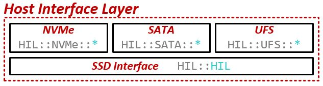
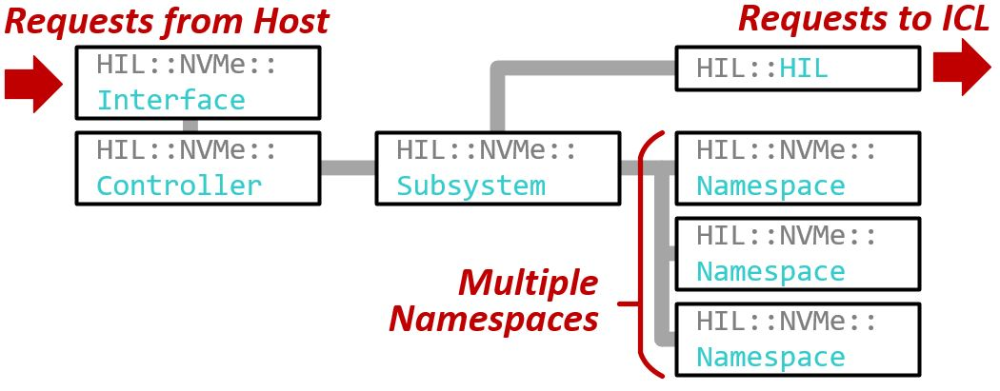
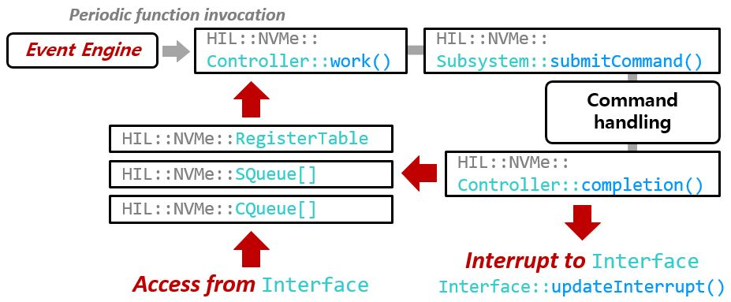
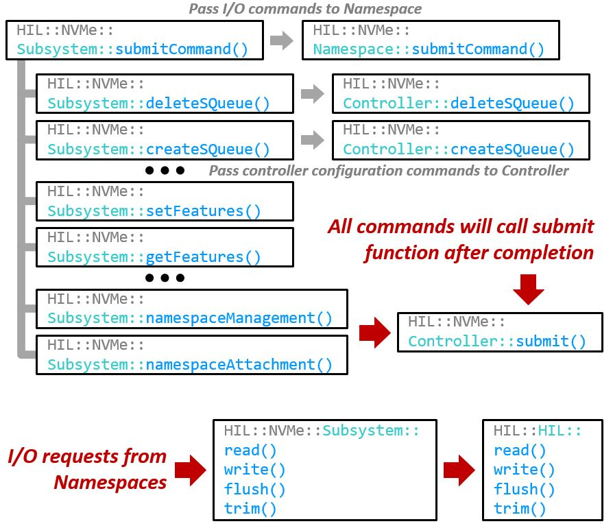
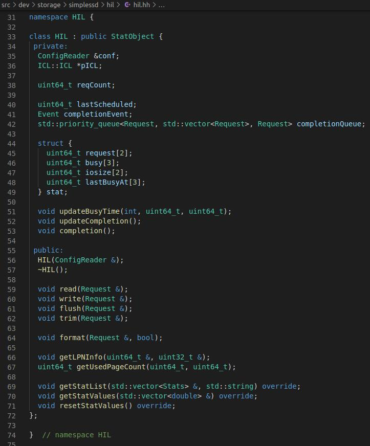
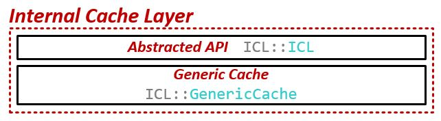
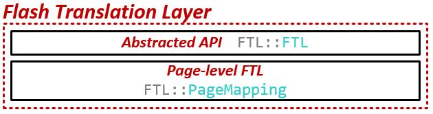
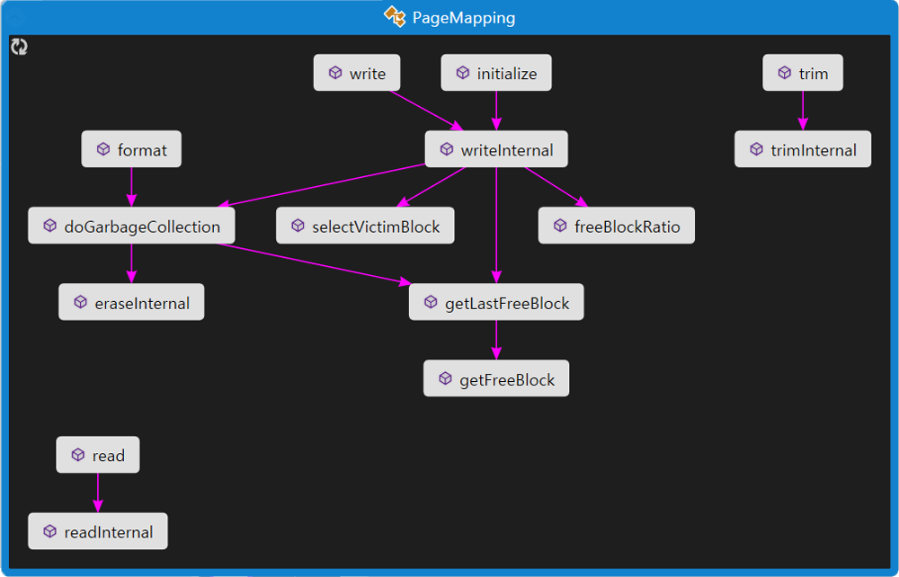

# SimpleSSD-固件模型

## 1. HIL

HIL : Host Interface Layer  

在HIL中，SimpleSSD实现了三种主机控制器模型——NVMe、SATA、UFS。另外有继承自NVMe的OpenChannel SSD，以下仅说明NVMe。  
NVMe控制模型如下，其中包含接收上层命令的Interface以及内部的Controller、Subsystem、Namespace等模块。  

### 1.1 Host Interface

定义主机接口层的抽象类`SimpleSSD::HIL::NVMe::Interface`位于文件`hil/nvme/interface.hh`中，提供了对仿真器的一般API，其具体实现可以在`src/dev/storage/nvme_interface.hh`中的`NVMeInterface`类里查看。  

`SimpleSSD::HIL::NVMe::Interface`继承自`SimpleSSD::DMAInterface`，DMAInterface是为了DMA而设计的抽象类，其中包含DMA读写的接口函数：  
- void dmaRead(uint64_t, uint64_t, uint8_t *, DMAFunction &, void * = nullptr)
- void dmaWrite(uint64_t, uint64_t, uint8_t *, DMAFunction &, void * = nullptr)

### 1.2 Controller

SimpleSSD用三个组件设计了NVMe控制器/固件：Controller、Subsystem、Namespace。Controller处理所有队列操作：从SQ读取请求，向CQ写入响应并发送中断；Subsystem处理所有NVMe Admin命令，管理Namespace，并向下层的SSD接口发出I/O；Namespace处理所有NVMe I/O命令。图为Controller的运行逻辑。

一个事件引擎会周期性（通过WorkPeriod参数配置）调用`Controller::work`函数，该函数会通过函数`Controller::collectSQueue`收集所有提交队列，其中新的请求会被插入到内部的一个FIFO队列（`Controller::lSQFIFO`）。新的请求会调用请求处理函数`Controller::handleRequest`，之后调用`AbstractSubsystem::submitCommand`（实际上是`Subsystem::submitCommand`）。在submitCommand函数中会判别请求的类型，如果是Admin命令则转移到Subsystem的相应函数中去处理，如果是I/O命令则会移交给`Namespace::submitCommand`函数。  

处理完成后，会依次调用`Controller::reserveCompletion`、`Controller::completion`函数，completion函数会将完成的请求写入CQ并调用函数`Controller::updateInterrupt`（实际是`Interface::updateInterrupt`）向host发送中断。

### 1.3 Subsystem

`SimpleSSD::HIL::NVMe::Subsystem`处理Admin commands，其定义位于文件`hil/nvme/subsystem.hh`。Subsystem类继承自抽象类`SimpleSSD::HIL::NVMe::AbstractSubsystem`。  

图中为Subsystem的工作方式。

Subsystem有两个部分，一部分用于命令的处理，另一部分用于I/O请求的处理。

### 1.4 Namespace

`SimpleSSD::HIL::NVMe::Namespace`用于处理I/O命令，其定义位于`hil/nvme/namespace.hh`。Namespace的结构与Subsystem类似，I/O命令到来时，会调用其中对应的处理函数。

### 1.5 SSD Interface

HIL下层是ICL，其交互的接口位于文件`hil/hil.cc`中，定义为类`SimpleSSD::HIL::HIL`。  

## 2. ICL

ICL ： Internal Cache Layer

ICL是SimpleSSD实现的I/O缓存层，相当于一个data cache。默认的实现是`icl/generic_cache.hh`中的类`SimpleSSD::ICL::GenericCache`，内部是一个组相连Cache。可以通过参数EnableReadCache和EnableWriteCache决定是否使用读和写Cache。

|选项|描述|
|:-:|:-|
|CacheSize|缓存大小。|
|CacheWaySize|缓存相联度。|
|EnableReadCache|使读Cache有效。|
|EnableReadPrefetch|使read-ahead和prefetch有效。|
|ReadPrefetchMode|指定read-ahead和prefetch的数据大小|
|ReadPrefetchCount|指定多少次I/O产生一次read-ahead/prefetch。|
|ReadPrefetchRatio|指定多少数据量产生一次read-ahead/prefetch。|
|EnableWriteCache|使写Cache有效。|
|EvictPolicy|指定逐出算法。|
|EvictMode|指定Cache满时逐出多少数据量。|
|CacheLatency|指定Cache元数据访问延迟。|
|||

## 3. FTL

FTL ： Flash Translation Layer

FTL的具体实现在文件`ftl/page_mapping.cc`的类`SimpleSSD::FTL::PageMapping`中，其中包括I/O命令的处理函数、垃圾回收函数doGarbageCollection、负载均衡函数getFreeBlock等。`PageMapping::table`存储了LPN到PPN的映射表，`FTL::Block`存储了块元信息以及反向映射表。

读函数最终会到达`PageMapping::readInternal`函数，写函数会到达`PageMapping::writeInternal`函数。

