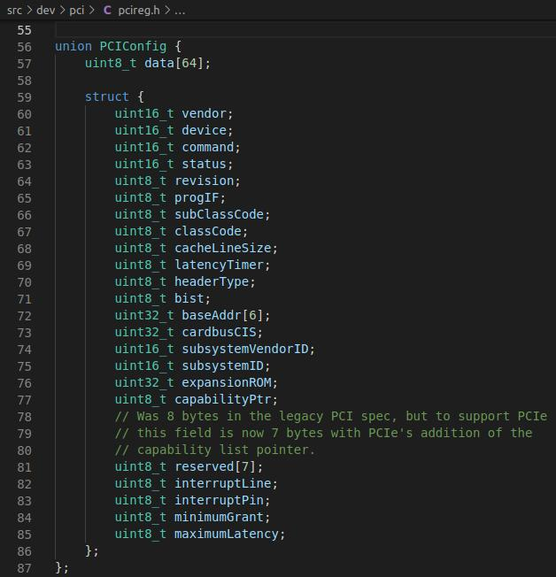
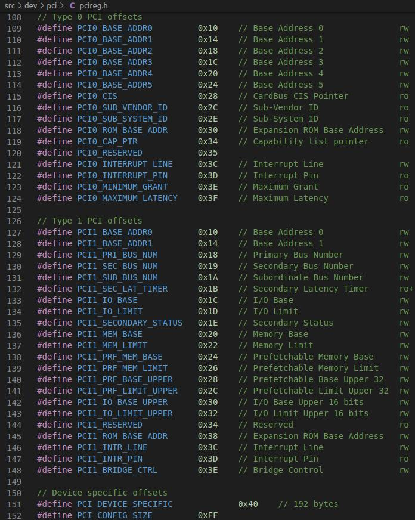
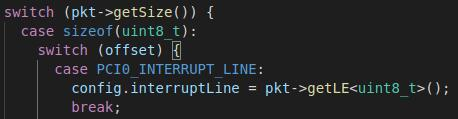

# SimpleSSD-BAR

## 1. BAR是什么

BAR（Base Address Register），是终端PCI设备所拥有的寄存器，可用于保存设备使用的内存地址或端口地址的偏移量。通常，内存地址BAR需要放置在物理内存中，而I/O空间BAR可以位于任何内存地址（甚至超出物理内存）。  

内存空间BAR的类型字段指定基址寄存器的大小以及可以在内存中映射的位置。如果其值为0x00，则BAR为32位宽，可以映射到32位存储空间中的任何位置。值为0x02意味着BAR为64位宽，并且可以映射到64位存储器空间中的任何位置（64位消耗2个可用的BAR）。 从PCI本地总线规范的修订版3.0开始，存在保留值0x01供开发者使用。在早期版本中，它用于支持1MB以下的存储空间（16位宽的基址寄存器可以映射到16位存储空间中的任何位置）。  

当检索BAR的实际基地址时，需要屏蔽低位。对于16位内存空间BAR，需要计算（BAR [x]＆0xFFF0）；对于32位内存空间BAR，需要计算（BAR [x]＆0xFFFFFFF0）；对于64位内存空间BAR，可以计算（（BAR [x]＆0xFFFFFFF0）+（（（BAR [x + 1]＆0xFFFFFFFF）<< 32））；对于I/O空间BAR，可以计算（BAR [x] ＆0xFFFFFFFC）。  

要确定PCI设备所需的地址空间量，必须保存BAR的原始值，将全1的值写入寄存器，然后再读回。然后可以通过屏蔽信息位，执行按位NOT并将值增加1来确定内存量。然后应恢复BAR的原始值。BAR寄存器自然对齐，因此只能修改设置的位。例如，如果设备使用16 MB，则BAR0将填充0xFF000000（解码后为0x01000000），并且只能修改高8位。    

## 2. SimpleSSD中的BAR

### 2.1 BAR定义

SimpleSSD中BAR的定义位于文件`src/dev/pci/pcireg.h`中，该文件内定义了PCI所用的寄存器以及偏移量。  

  

  

### 2.2 配置空间读写函数

SimpleSSD配置空间操作的函数位于文件`src/dev/pci/device.cc`中，其读写函数为readConfig以及writeConfig。

- readConfig函数：
  - 获取配置空间内读取的偏移（取低8位）// int offset = pkt->getAddr() & PCI_CONFIG_SIZE;
  - 然后会根据偏移以及要读取的数据大小，将config的一部分data读到pkt中

- writeConfig函数：
  - 同readConfig获取偏移
  - 若偏移位于配置空间的未实现区域（40-FF），跳过
  - 根据pkt的大小以及偏移，决定写数据的位置，如第一个：
    - 

    - 其意义为pkt要写的数据大小为8位，且偏移为PCI0_INTERRUPT_LINE（0x3C），因此将pkt的data的低8位赋值给config对象的interruptLine属性。
  - 若pkt的偏移位于BAR，则有所不同，待添加。

## 3. 参考

[维基百科-PCI configuration space](https://en.wikipedia.org/wiki/PCI_configuration_space)  
[OSDev维基-PCI-#Base Address Registers](https://wiki.osdev.org/PCI#Base_Address_Registers)  
[PCIe扫盲——基地址寄存器（BAR）详解](http://blog.chinaaet.com/justlxy/p/5100053320)  
[PCIe实践之路：BAR空间和TLP](https://blog.csdn.net/abcamus/article/details/74157026)  
