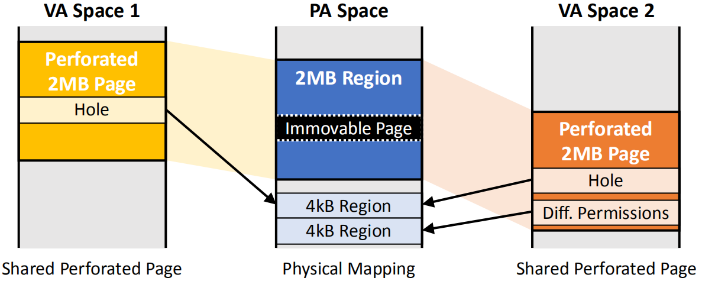
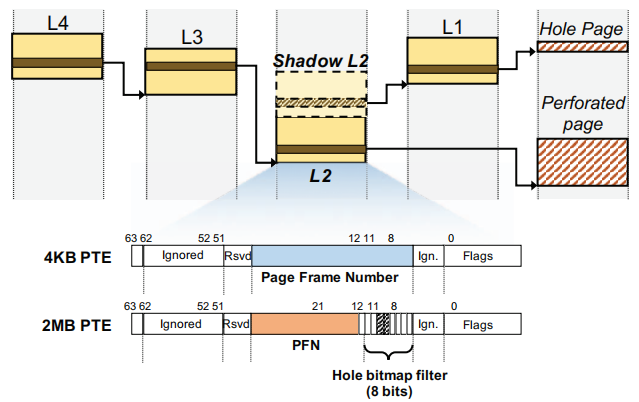
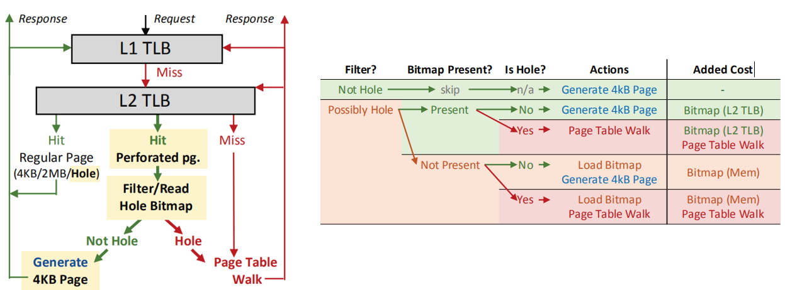

# [Perforated Page: Supporting Fragmented Memory Allocation for Large Pages]() 

本文提出perforated page以解决传统机制无法生成物理大页的情况。

## 背景和问题：

当应用使用大段连续内存空间的时候，使用大页映射能够减少映射条目，提高TLB命中率，从而有效降低地址转换开销，但是**问题在于**，物理大页会因一些情况而无法生成：1.内存碎片化，2.连续的物理区域中存在不可移动的4KB页，3.连续的物理区域中的4KB页的访问许可不同；从而导致地址转换开销增加。

## 设计：

**设计思想**：如图1所示，左右两侧是两段虚拟内存空间，中间是物理内存空间，黄色，橙色，蓝色的区域都是2MB大小，并且用一个大页映射条目记录。可以看到，这两段虚拟内存空间共享同一个物理空间，而且物理内存空间被一个不可移动的页隔断了，因此在物理空间中用上面一个4KB内存页替换不可以动的页。 橙色区域模拟的是COPY on write导致一个内存页的权限改变，因此需要另一个物理内存页替换原有页。可以看到这样做，在物理内存碎片化，或者存在不可移动或者访问权限不同的页时都可以构建大页映射，并且当应用只使用一部分物理内存空间时，可以将大页映射中未使用的物理空间映射到其他应用的虚拟内存空间中，减少内存浪费。

图 1 设计思想

 

**设计实现**：

为了实现上述功能，需要为图1中的hole page额外维护元数据以记录一段2MB的物理内存中哪些是hole page（bitmap），以及这些hole page的物理地址（shadow L2 PTE）：

1.*bitmap*

本文使用512位bitmap追踪2MB范围内每一个4KB，如果直接将这个bitmap存放在PTE中，会导致TLB所需容量和L2 PTE大小增加8倍，因此本文提出将所有的bitmap单独存放在一个物理内存块中，也就是整个物理内存按4KB划分，每一个4KB对应bitmap的一位。由于bitmap是连续存放的，因此可以通过某个4KB页在2MB物理内存的偏移计算出这个页锁对应的bit。

本设计在访问一个2MB的虚拟内存空间(可能只访问一部分，也可能访问完整的2MB区域)的时候会首先访问其对应的bitmap，检查当前访问的区域是否存在hole page，如果存在，那么就会去页表中查询Shadow L2 PTE以获得hole page的物理地址。

此外，为了加速hole page的查询，引入了Hole bitmap filter，如图2 2MB PTE的橙色字段右侧所示，filter中的每一位对应连续的256KB的内存空间，如果这段空间对应的bit为0，就不需要进一步查询bitmap了。

2.*shadow L2 PTE*

如图2所示，Shadow L2 PTE与原始的L2 PTE相邻，也就是说Shadow L2 PTE的物理地址只要在原始L2节点的地址上加4KB就计算出来了，这样做简化了Shadow L2 PTE的地址计算，从而减少了额外的元数据；
原始的L2 PTE存放的是2MB大页映射的物理地址，而Shadow L2 PTE存放的是指针，指向下一级L1 PTE，而这个L1 PTE中的某个条目存放的就是hole page的物理地址。

当操作系统分配原始L2 PTE时，就会同时分配一个连续的的页存放Shadow L2 PTE。这种相邻的分配方式不需要对内核做额外修改，由现有的内存buddy allocator支持。

图 2 页表修改

 

图 3 MMU地址转换过程

 

3.*其他设计*

为了加速bitmap的查询速度，本设计将被访问的区域以及其对应的bitmap缓存在L2 TLB中，并采用特殊的格式记录以减少TLB的空间开销。

4.*MMU地址转换过程*

如图3左侧所示，L1 TLB只存放常规的大页和4KB映射，以及穿孔的4KB页（hole page）。
图中绿色箭头表示常规页映射的查询路径；红色表示穿孔的大页（perforated page）映射查询路径。
当访问一个穿孔的大页映射时，会在L1 TLB发生miss，然后查询L2 TLB，如果命中，首先会查询TLB entry中的filter,如果被访问的区域不存在hole page，那么会被分解成4KB映射，并缓存到L1 TLB中，这对应图3右侧第一行。

如图3右侧所示，
如果L2 PTE中的Hole bitmap filter显示被访问的区域可能存在hole page，需要查询对应区域的bitmap。如果查询结果显示访问区域确实存在hole page，就需要去内存中访问相应的Shadow L2 PTE，获取hole page 的物理地址，最后将hole page 的PTE缓存在L1和L2 TLB中。

## 实验：

GEM5 SE模式，单核系统

由于SE模式没有仿真TLB未命中的延时，本文额外添加了多级TLB，page-walker-cache的模块以及与TLB未命中相关的所有延迟。