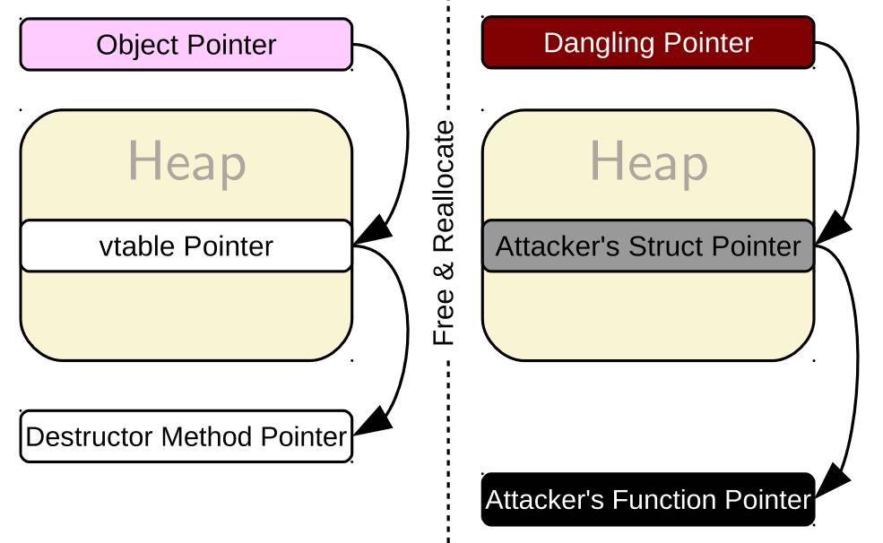
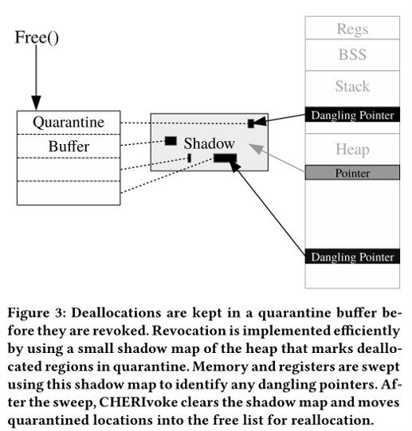
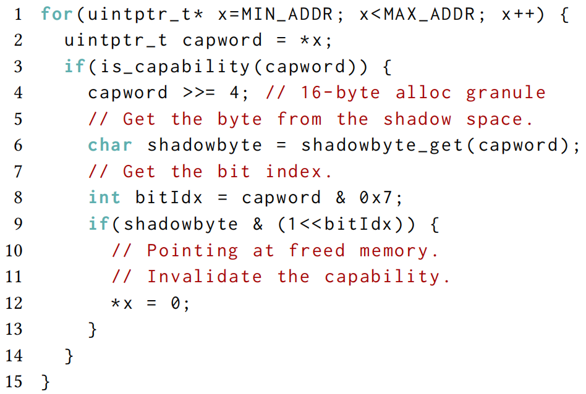
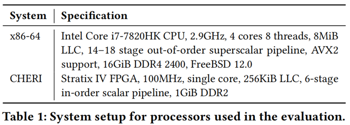
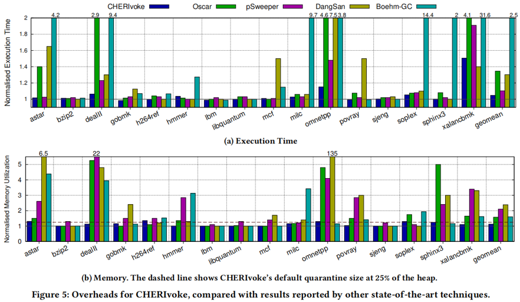
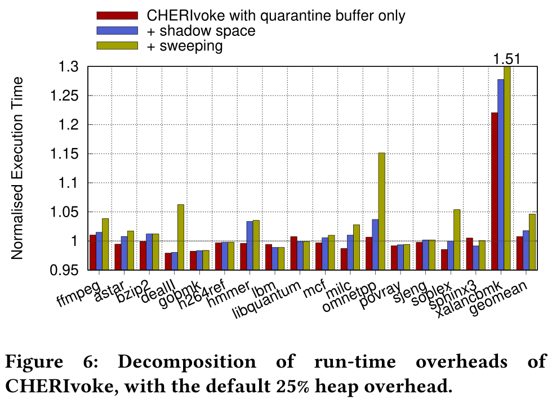

# [CHERIvoke: Characterising Pointer Revocation using CHERI Capabilities for Temporal Memory Safety](https://www.cl.cam.ac.uk/~tmj32/papers/docs/xia19-micro.pdf) ([Poster](https://www.cl.cam.ac.uk/~sa614/posters/cherivoke.pdf))

本文在新兴的CHERI体系结构扩展上，以低开销实现内存时间安全。  

## 1. 背景

### 1.1 时间安全漏洞

- 内存块被释放后，其对应的指针没有被设置为NULL，这个指针就被悬空了，形成了悬空指针（Dangling Pointer）。在它下一次使用之前，有其它代码对这块内存行了修改，那么当程序再次使用这块内存时，就很有可能会出现安全性问题。
- 

- 为了避免出现悬空指针，需要在释放内存时将指针置为NULL。访问指针变量前，先判断是否为NULL，可以避免出现上述安全漏洞。但是当多个指针指向同一个内存块，就需要将所有指针变量的值都置为NULL。这就需要维护相应的元数据，开销会非常大。

### 1.2 CHERI指令集扩展

[CHERI](https://murdoch.is/papers/cl14cheriisa.pdf) (Capability Hardware Enhanced RISC Instructions) 是一种新的体系结构扩展，其中指针被扩展为原来的两倍大小(称为Capability)，扩展部分用于记录引用地址范围及权限等。

## 2 设计

### 2.1 关键

- 延迟所释放内存的重分配，直到完全清理其引用。
- 

### 2.2 软件优化

- 隔离缓冲区：缓存将被释放的内存地址，在清理过程中真正被释放。
- 影子映射：表示堆内存(64位机器中，映射的每1bit表示堆的128位)。

### 2.3 硬件优化

- CloadTags新指令：快速加载缓存行标签位，以判断是否为CHERI指针。
- 页表PTE CapDirty位：表示某页是否含有CHERI指针，若清理过程中为0则可跳过该页。

### 2.4 清理流程

- 清理过程中，先扫描隔离缓冲区，将每个条目所对应的影子映射表位设置为一。然后按双字大小（64位机器中为128位）扫描堆内存，检查其（1）是否为CHERI指针；（2）所指向地址的影子映射位是否为一。均为是就将该CHERI指针置零。
- 

## 3 实验

### 3.1 实验设置

- 系统参数：   

- 分配器：dlmalloc_cherivoke。
- 工作负载：dealII、omnetpp、xalancbmk（分配操作多）;
    SPEC CPU2006（通用）。

### 3.2 实验结果

#### 3.2.1 整体评估

- 

- CHERIvoke使用了平均4.7%执行时间、12.5%内存空间的开销，最大51%执行时间、35%内存空间的开销，远远优于其他同等设计。

#### 3.2.2 开销细分

- 

- 通常情况下，隔离缓冲区占了大部分开销。
- 一些异常情况：
  - xalancbmk的隔离缓冲区开销令执行时间增加22%。这是因为该负载下，分配粒度小，吞吐量大，且分配的生命周期大。
  - dealII、omnetpp、soplex、xalancbmk的清理时间开销很大。这是因为释放操作的频率和流量高，且指针密度高。

## 4 相关工作

### 4.1 撤销技术

- 不使用硬件功能的撤销技术包括[DangSan](https://dl.acm.org/doi/pdf/10.1145/3064176.3064211)、[DangNull](https://www.cs.ucr.edu/~csong/ndss15-dangnull.pdf)、[FreeSentry](https://www.ndss-symposium.org/wp-content/uploads/2017/09/03_4_2.pdf)和[PSweeper](https://dl.acm.org/doi/pdf/10.1145/3243734.3243826)。它们使用编译器来消除指针与数据之间的歧义，每次创建指针时添加代码以插入指针到分配列表，并在数据释放时取消所有条目。但是，这种分配列表对性能和存储非常敏感，使得这些技术不适用于分配量大的工作负载。另外，指针可以被隐藏，所以这种技术不能保证时间安全性。
- 使用CHERI，通过使用1位标签元数据，我们可以在运行时消除指针的歧义，而不需要任何额外的元数据。这意味着我们可以遍历内存以置空任何悬浮指针，从而避免与这种复杂元数据相关的内存、性能开销。它还意味着不需要涉及编译器:惟一需要做的更改是让free方法添加隔离列表。CHERI还天生防止隐藏指针，因此可以保证时间安全。
- 像CHERIvoke一样，[BOGO](https://dl.acm.org/doi/pdf/10.1145/3297858.3304017)在通过Intel MPX空间安全的基础上构建了时间安全。由于缺乏用于批处理的隔离缓冲区以及复杂的MPX表结构，BOGO的开销明显高于CHERIvoke:在SPEC CPU2006上，CHERIvoke的平均开销为4.7%，最坏情况为50%，而BOGO的平均开销为60%，最坏情况为1616%。

### 4.2 页表技术

- 通过在页表的粒度上进行保护，可以通过释放空闲的内存区域来防止使用悬挂指针。Dhurjati和Adve扩展了[这项技术](http://llvm.org/pubs/2006-DSN-DanglingPointers.pdf)，允许重用底层物理地址。Dang等人提供了[Oscar](https://www.usenix.org/system/files/conference/usenixsecurity17/sec17-dang.pdf)，它更好地支持并发常见的工作负载。
- 当分配很大时，页面粒度可以实现较低的开销。然而，频繁的小内存分配会导致性能和内存开销大幅增加，因为每个分配都必须有自己的虚拟页，同时增加TLB压力，导致显著的速度下降。

### 4.3 标记内存

- CHERI只是使用标记内存来作为改进系统安全性或调试特性的一种方法。标记内存的其他用途包括注释地址有效性、版本号、对象类型和所有权。虽然CHERI仅对每个CHERI指针对齐的区域使用一个位，但其他技术可能使用多个位来提供内存版本控制，包括[SPARC ADI](https://www.oracle.com/technetwork/server-storage/sun-sparc-enterprise/documentation/sparc-t7-m7-server-architecture-2702877.pdf)和[Arm MTE](https://community.arm.com/developer/ip-products/processors/b/processors-ip-blog/posts/arm-a-profile-architecture-2018-developments-armv85a)。
- [CETS](https://dl.acm.org/doi/pdf/10.1145/1837855.1806657)使用等字长的唯一标签进行内存访问，因此，如果标签与分配的区域不匹配，则内存访问将失败。这意味着其指针大小与CHERI的一样大，但是同时由于指针隐藏会遭受较大的假阳性率。与CHERI不同，CETS不能保证空间安全，而且它没有硬件支持，这会导致严重的性能损失。[Watchdog](https://www.cis.upenn.edu/~stevez/papers/NMZ12.pdf)使用唯一的指针和分配标识符来提供硬件的时间安全性，对于Watchdog和CHERIvoke之间的共同基准，Watchdog支付的平均开销为17％，而CHERIvoke支付的开销不到1％。