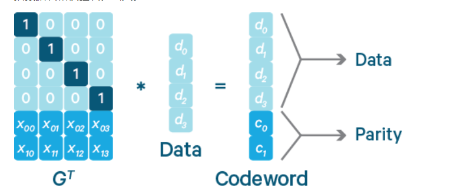
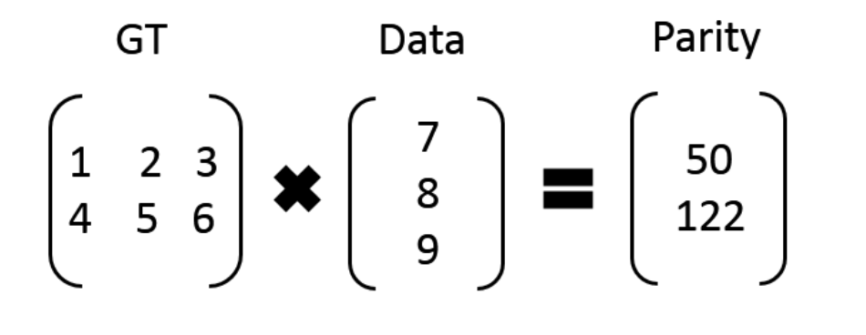
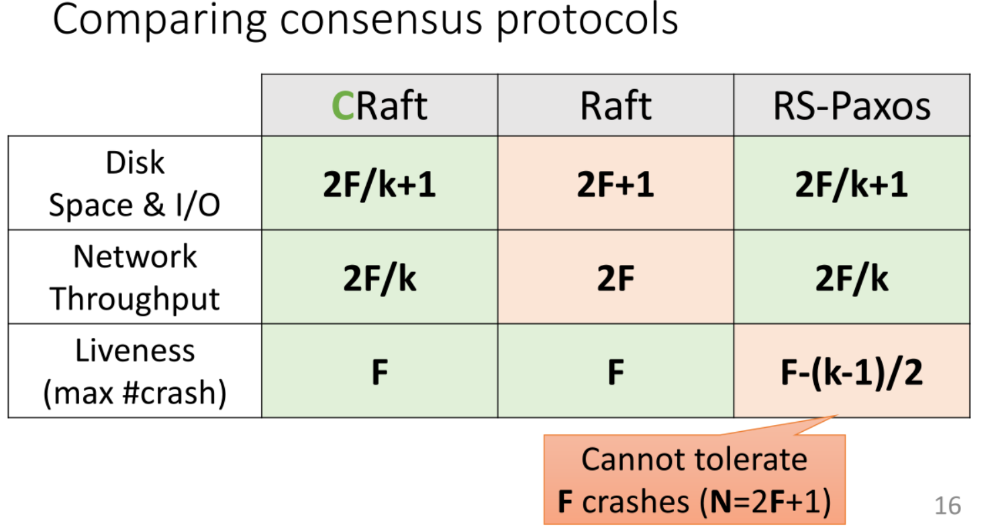
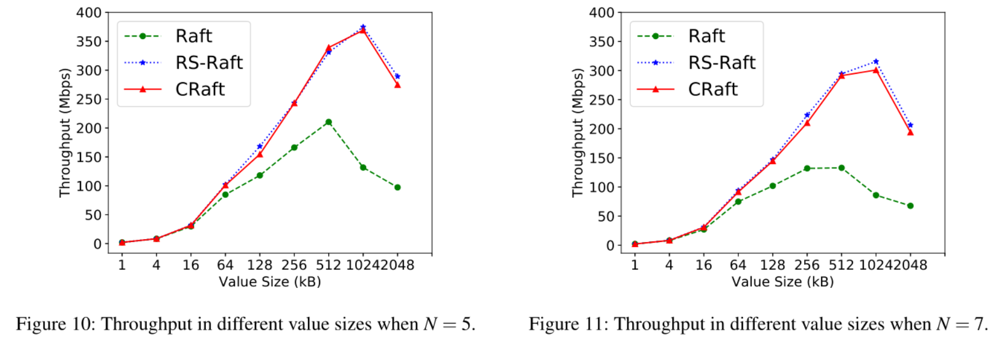
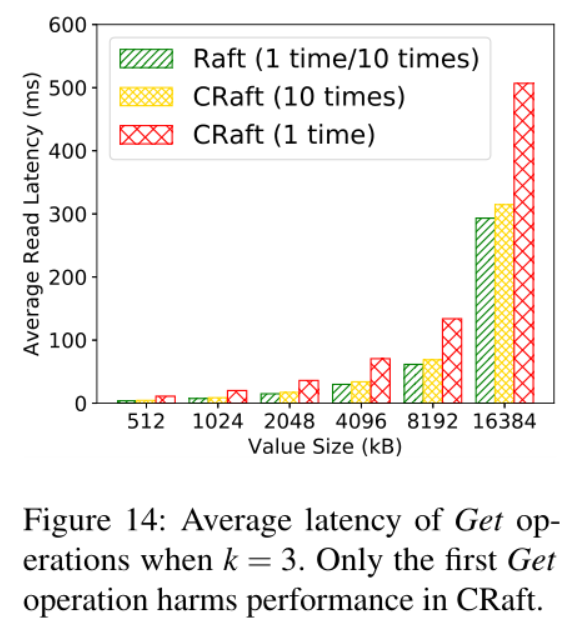

传统的共识协议(consensus protocol)，如Raft，在分布式服务中提供了高可靠性和可用性。 但在这些协议中，日志条目会被完全复制到所有服务器。这种完整的复制会增加存储和网络成本，从而对性能产生不利影响。因此，本文提出了一种新的分布式共识协议CRaft。CRaft保持了和Raft相同的活性，同时将纠删码技术(erasure code)应用到Raft协议中，降低了存储和网络成本。

文章来源：[CRaft: An Erasure-coding-supported Version of Raft for Reducing Storage Cost and Network Cost](https://www.usenix.org/conference/fast20/presentation/wang-zizhong)



#### 2. Erasure code原理

**定义：**erasure code是一种技术，它可以将k份原始数据，增加m份数据(用来存储erasure编码)，并能通过k+m份中的任意k份数据，还原为原始数据。其中这k+m份数据大小均为原始数据的k分之一。定义中包含了encode和decode两个过程，将原始的k份数据变为k+m份是encode，之后这k+m份数据可存放在不同的device上，如果有任意小于m份的数据失效，仍然能通过剩下的数据还原出来。也就是说，通常k+m的erasure编码，能容m块数据故障的场景，这时候的存储成本是1+m/k，通常m<k。因此，通过erasure编码，我们能够把副本数降到1.X。

参考资料：

- [Erasure Code原理](https://blog.csdn.net/sinat_27186785/article/details/52034588)
- [Erasure-Code(纠删码) 最佳实践](https://zhuanlan.zhihu.com/p/106096265?utm_source=wechat_session)

**纠删码（Erasure Code)**本身是一种编码容错技术，最早是在通信行业解决部分数据在传输中损耗的问题，它的基本原理是把传输的信号分段，加入一定的校验再让各段间发生一定的联系，即使在传输过程中丢失掉部分信号，接收端仍然能通过算法把完整的信息计算出来。纠删码常见的有三类，Reed-Solomen（RS码）类，级联低密度纠删码和数字喷泉码。

在分布式共识协议中，我们主要运用的为RS码技术。

RS码：它有两个参数**k**和**m**，记为RS(k，m)

如下图所示，k个数据块组成一个向量被乘上一个生成矩阵（Generator Matrix）GT从而得到一个码字（codeword）向量，该向量由k个数据块和m个校验块构成。如果一个数据块丢失，可以用(GT)-1乘以码字向量来恢复出丢失的数据块。RS(k，m)最多可容忍m个块（包括数据块和校验块）丢失。

比如：我们有 7、8、9 三个原始数据，通过矩阵乘法，计算出来两个校验数据 50、122。这时原始数据加上校验数据，一共五个数据：7、8、9、50、122，可以任意丢两个，然后通过算法进行恢复。

数据可以被分成k+m个片段，每个占用原先1/k的空间大小

example：1GB的data通过RS码，令k=3，m=2，可以分为5个不同的片段，每个数据片段占1/3的GB大小。如果丢失了其中两个片段，我们可以用剩余其他3个片段恢复原始数据（任意k个片段）。

基于Erasure code技术，我们可以将原始数据分段处理，使分布式系统中的每台server通过存储fragment来代替存储full copies，从而减少存储空间、节省网络吞吐。

#### 3.RS-Paxos分布式共识协议简介

纠删码（erasure code）技术是一种在保持容错能力的同时降低存储和网络成本的常用技术。如果用erasure code代替日志条目的完全复制，则可以大大降低存储和网络成本。在此前，已经有RS-Paxos共识协议将其应用到Paxos协议中。但在RS-Paxos共识协议中存在活性的问题。 

RS-Paxos采用了Paxos共识机制和RS码的技术，并利用Qw+Qr-N>=k的约束条件（Qw代表write quorum ，Qr代表read quorum，k为RS码中选取的值）限定了任意写入操作和读取操作至少有k个server是共同的，从而能够通过fragment恢复数据。

**不足：RS-Paxos存在活性问题。不能用N=2F+1个server容忍F个crash。**

#### 4.CRaft实现机制

**<u>总体采用（Raft+RS码）的机制进行空间及网络开销的节省。</u>**

​	选取适当的k与m，使N=2F+1=k+m（F—能够承受的server发生crash的最大值）。

​	Leader选举机制同Raft。

​	Leader通过Heartbeat检测分布式系统中是否有存在**（F+k）**个健康的server存活，当有超过F+k个健康的server存活时，leader发送fragment代替full copies以节省存储及网络开销。当有至少F+k个server存储了fragment时，视为此条data被committed。当系统中没有F+k个健康的server存活时，leader发送full copies，committed的情况与Raft相同以保证CRaft的活性。

**当选举新的Leader时，首先进行复原操作如下：**

​	对于被已经被committed的数据：新Leader会向其他server索要fragment恢复data并存储。

​	对于没有被committed的数据：进行LeaderPre操作，新Leader会试图向其他server索要fragment恢复data，如果恢复失败则会将此条entry及以后的所有entry丢弃。

**CRaft、Raft、RS-Paxos的相关性能比较如下：**

#### 5.实验证明

**实验环境：**

**	使用K-V键值存储的形式，进行三个操作：Set、Append、Get**

**作者采用RS-Raft代替RS-Paxos共识机制**

**	（1）使用5台服务器容忍2个错误（RS-Raft：Qr=Qw=4，CRaft：k=3，m=2）**

**	（2）使用7台服务器容忍3个错误（RS-Raft：Qr=Qw=5，CRaft：k=3，m=4）**

**吞吐量实验比较结果：**

​	在吞吐量实验中，为了避免活性问题，在进行比较时应选择同等Value Size的5台服务器下的CRaft（左图示意）和7台服务器下的RS-Raft（右图示意）比较吞吐量。

**活性实验比较结果：**

**延迟实验比较结果：**

#### 6.阅读疑惑

Q1.当old leader发生crash时，如果此时已经有大量的data被committed，产生新leader后恢复data的延迟问题？

Q2.在设计比较CRaft、Raft、RS-Paxos的活性问题实验过程中，当整个系统中只有小于6台server正常运行时，为何CRaft的Throughput仍比Raft高出很多？
