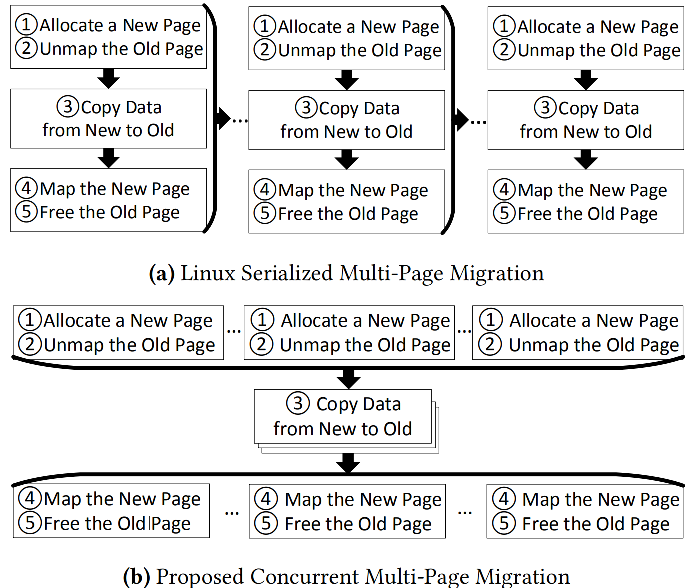

# [Nimble Page Management for Tiered Memory Systems](http://www.cs.yale.edu/homes/abhishek/ziyan-asplos19.pdf)

本文实现了在异构内存系统中并发迁移物理大页的机制。 

## 背景和问题：

现代内存系统结合了新兴技术的最佳特性，这些技术可以针对延迟、带宽、容量或成本进行优化，使得基于操作系统换页机制的异构内存系统能够有效提升性能并降低成本。
如图1所示，这是一个异构内存系统的抽像图，由一个计算节点（包含CPU,GPU等）连接到不同性能和容量的内存节点。为了达到最佳的性能通常需要将热数据放到快速内存节点，冷数据放到慢速内存节点。
因此，操作系统需要完成关键的数据迁移功能，即页管理和迁移。

**问题在于**，由内核管理的的页迁移过程延迟很高，而已有相关研究在实验评估或者设计上忽略了操作系统（内核）对系统性能的影响。

## 研究动机：

本文分析了内核内存管理机制，如图2所示，内存管理策略可能受到内核，设备驱动，应用程序等的影响，而执行页迁移的功能则只由内核管理（通过系统调用）。页迁移可以细分为右边框图中的5个步骤，1245步用来保证正确性和安全性，只有第3步实际执行页迁移/拷贝。

本文发现现有页迁移过程效率较低的原因在于：
1.现有Linux操作系统依赖于昂贵的内存下线获取内存页的访问信息，并依靠内存和磁盘之间的页交换来完成异构内存系统中的冷热数据迁移。2.此外，大页映射的物理页也不能直接迁移，而是需要分解成4KB基础页再进行迁移，导致频繁的TLB shootdown；3.而且现有内存管理机制中如页拷贝等过程是单线程的，意味着无法充分利用硬件带宽。

本文的**研究动机**在于优化上述限制页迁移性能的机制。

图 1 未来异构内存系统

 

图 2 页迁移过程分解 

 

## 设计：

根据上述对页迁移过程的问题分析，本文提出了相应的设计：

- Native THP Migration : 通过修改内核对大页在不同内存节点间的（THP）迁移提供支持，减少TLB shootdown的次数，并提升单次页迁移的带宽利用率。

- parallized THP Migration : 当前Linux页迁移是单线程的并且每次页迁移的数据量被限制在4KB，为了解决这一限制，本文修改了move_pages()系统调用， 实现了多线程并发大页迁移机制。

- Concurrent Multi-page Nigration : 如图3（a）所示，现有Linux在迁移多个页时实现需要串行化页拷贝，无法充分利用硬件带宽并且造成较高延时。如图3（b）所示，本文提出将图2中的第三步第三步独立出来，并用多个内核线程并发的完成page copy以实现并行页迁移。

- symmetric exchange of pages : 当迁移热页到低延迟内存节点时可能需要将冷的页交换到高延迟内存节点，如图4（a）所示，现有Linux页交换机制需要分两步分别将热页和冷页进行迁移，这回带来较高的开销。为了解决这一问题，本文提出，将中间数据暂存在CPU寄存器中，从而实现了单步页交换，并且完全消除了物理内存的分配和释放。

图 3 并发页拷贝

 

图 4 单步页交换

 

## 实验： 
基于现有Linux内核实现

[源码链接](https://github.com/ysarch-lab/nimble_page_management_asplos_2019)

