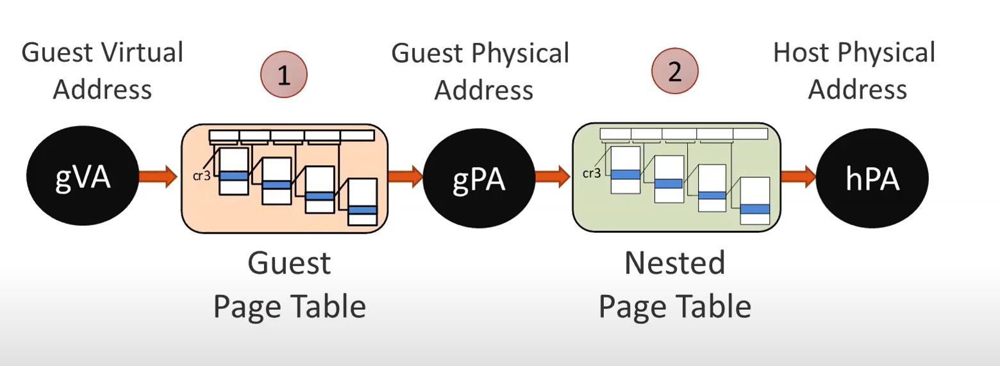
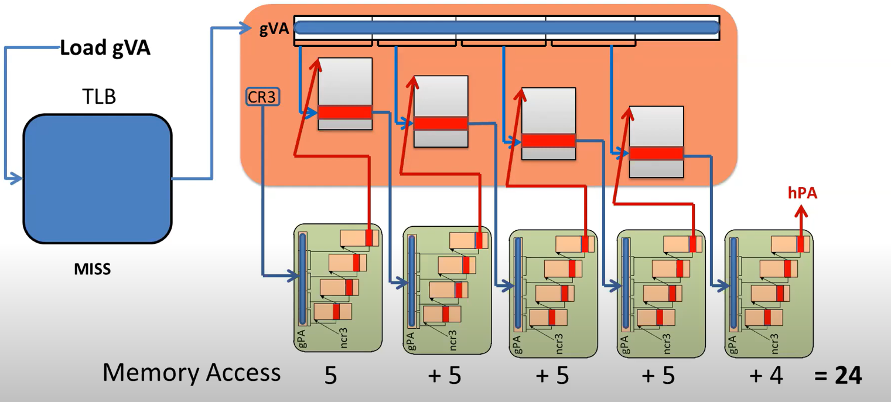

# [Enhancing and Exploiting Contiguity for Fast Memory Virtualization](https://conferences.computer.org/isca/pdfs/ISCA2020-4QlDegUf3fKiwUXfV0KdCm/466100a515/466100a515.pdf) 

本文研究了在虚拟机场景下的内存地址转换的开销问题

## 背景和问题：
随着计算机内存容量的增加，有限大小的TLB缓存会更频繁地发生miss，一旦TLB miss，就需要通过MMU硬件去内存访问多级页表，这会带来很高的延迟。
而在虚拟化场景下，需要两层地址转换，导致内存地址转换开销高达本地执行的6倍。
图1是在虚拟化场景下的地址转换示意图，客机操作系统的虚拟内存地址要通过客机操作系统的页表转换成客机物理地址，然后再通过hypervisor的页表转换成主机的物理地址。

图 1  虚拟化场景下的内存地址转换

每当TLB miss时，需要查询页表，获取物理地址。这一问题在虚拟化场景中更为严重。
以图2为例，要查询每一级客机操作系统的页表，都需要先去主机页表进行一次页表遍历，获取那一级客机页表的起始地址，然后用gVA找到相应的条目，这样算下来，对于一共需要访问24次内存。

图 2  虚拟化场景下的页表遍历

本文旨在降低虚拟化场景下的内存地址转换开销。

## 设计：

## 实验：

基于Linux kernel 4.19修改， 用QEMU/KVM 2.1.2实现虚拟化环境，并用badgetrap来仿真硬件设计

[源码链接](https://github.com/cslab-ntua/contiguity-isca2020.git)