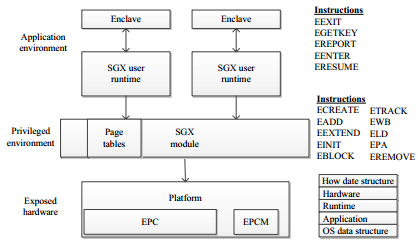
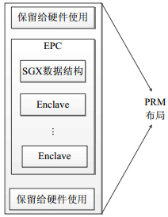
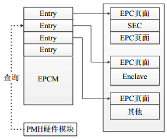
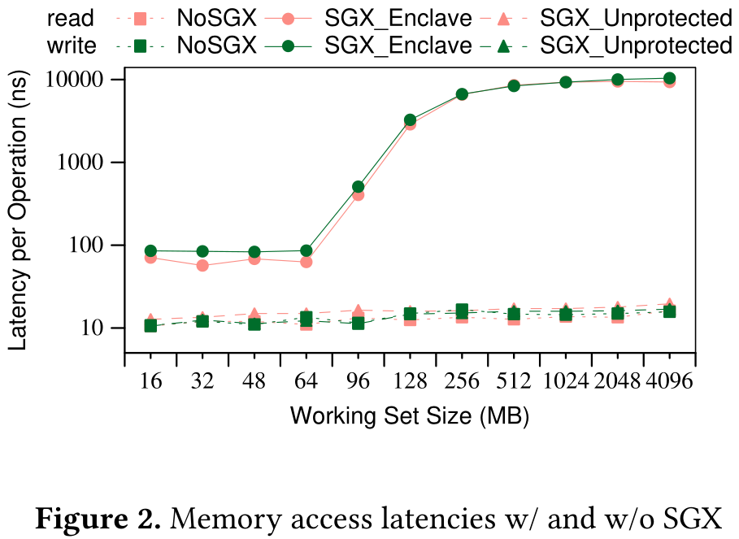
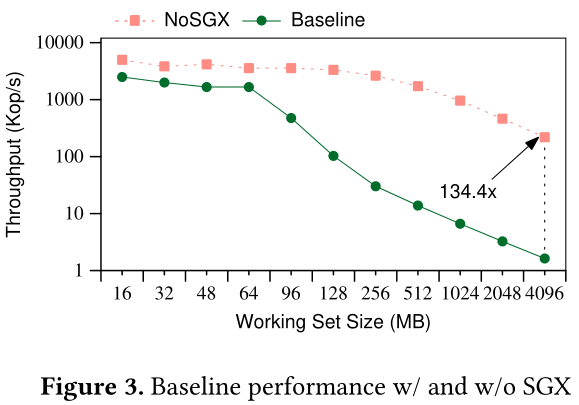
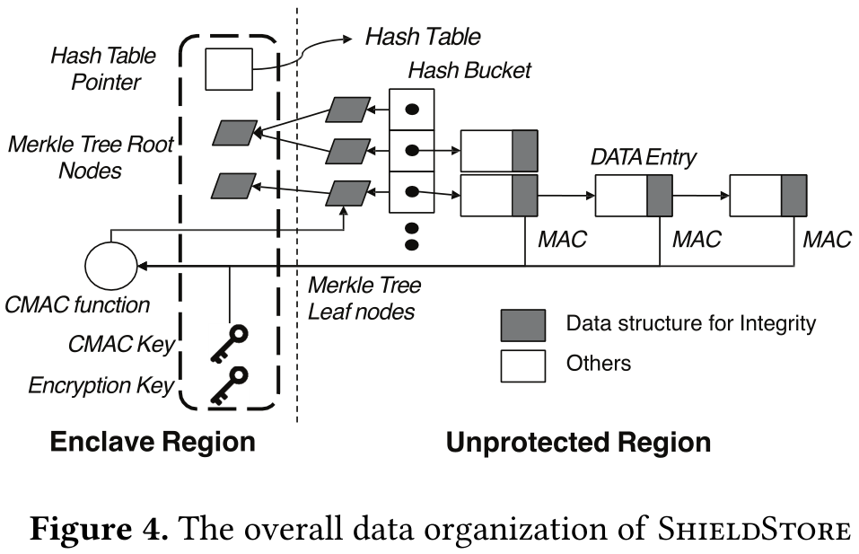
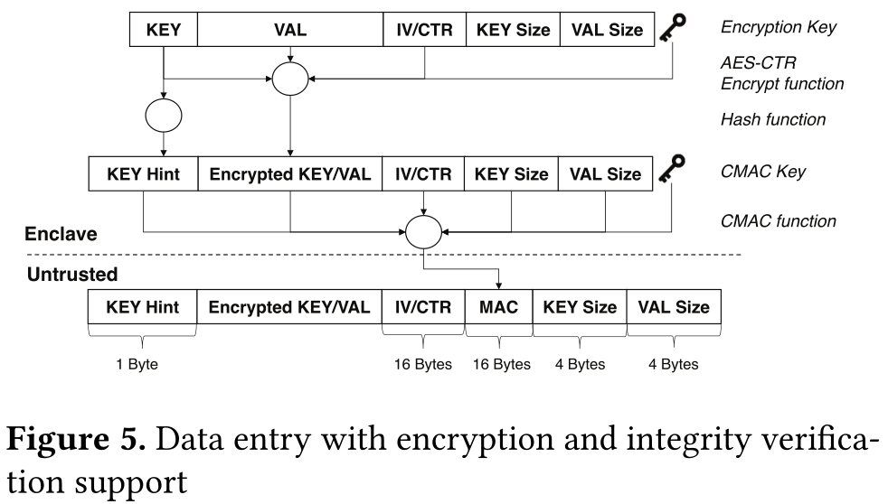
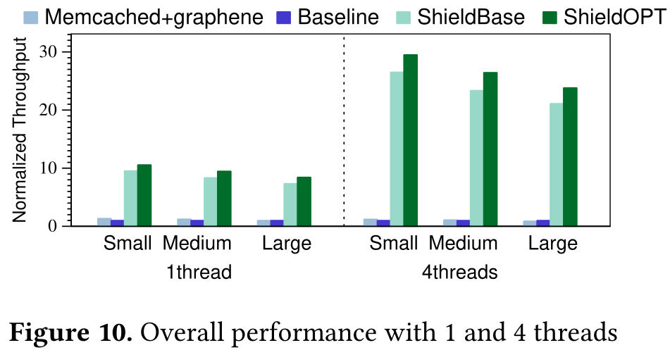

# [ShieldStore: Shielded In-memory Key-value Storage with SGX](http://calab.kaist.ac.kr:8080/~jhuh/papers/kim_eurosys19_shieldst.pdf)

在使用SGX的内存数据库中存在受SGX硬件保护区远小于数据库容量的问题，简单的paging机制会导致高额的开销。转而将主要数据加密后存放在非保护区域，加密元数据存放在保护区域。  

## 1. 背景

### 1.1 SGX

#### 1.1.1 SGX概述

- Intel SGX(Software Guard Extensions)是Intel架构新的扩展, 在原有架构上增加了一组新的指令集和内存访问机制。这些扩展允许应用程序实现一个被称为Enclave（安全区）的容器, 在应用程序的地址空间中划分出一块被保护的区域, 为容器内的代码和数据提供机密性和完整性的保护, 免受拥有特殊权限的恶意软件的破坏。  
- 

#### 1.1.2 SGX关键技术

- ① Enclave容器：
  - Enclave是一个被保护的内容容器, 用于存放应用程序敏感数据和代码。当应用程序需要保护的部分加载到Enclave后, SGX保护它们不被外部软件所访问。Enclave可以向远程认证者证明自己的身份, 并提供必需的功能结构用于安全地提供密钥。用户也可以请求独有的密钥, 这个密钥通过结合Enclave身份和平台的身份做到独一无二, 可以用来保护存储在enclave之外的密钥或数据。
  - 所有的Enclave都驻留在EPC(enclave page cache)中, 这是系统内一块被保护的物理内存区域, 用来存放Enclave和SGX数据结构。EPC布局由平台具体实现决定, 如果CPU支持SGX架构并在加密保护的DRAM中实现EPC, 那么它也支持BIOS保留一段叫PRM(processor reserved memory)的内存范围。
  - 
- ② Enclave保护机制
  - （1）内存访问语义：内存保护机制需要在物理上锁住EPC区域，将外部访问请求视为引用不存在的内存。要成功访问EPC区域的某个Enclave，需要满足四个条件：1.处理器运行在Enclave Mode中；2.访问地址在Enclave地址空间；3.物理地址在EPC中；4.满足EPCM（Enclave Page Cache Map）检查，即访问的页属于正在运行的Enclave。总结来说，Enclave外部的应用程序不能访问Enclave内存；Enclave内部的代码在EPC范围内只能访问属于自己的内存区域, 不能访问其他Enclave内存；对于PRM以外的内存, 则按照系统中其他的保护机制进行访问。这样的内存保护机制, 防止了Enclave内部运行的程序被其他恶意软件盗取隐私信息和篡改。
  - （2）地址映射保护：EPC内存以页为单位进行管理, 页的控制信息保存在硬件结构EPCM里, 一个页面对应一个EPCM表项, 类似于操作系统内的页表, 管理着EPC页面的基本信息, 包括页面是否已被使用、该页的拥有者、页面类型、地址映射和权限属性等。EPCM结构在CPU地址映射过程中用于执行enclave页面的访问控制, 逻辑上而言, 它在保护模式的段保护和页保护机制的基础上增加了一层安全的访问控制。
  - 
  - （3）机密完整性保护：SGX会对申请创建Enclave中的每个添加的页面内容进行度量, 最终得到一个创建序列的度量结果, 保存在Enclave的控制结构中。然后, SGX通过一条初始化指令将这个结果与Enclave所有者签名的证书中的完整性值进行比较：如果匹配, 则将证书中的所有者公钥进行哈希, 作为密封身份保存在Enclave控制结构中；如果不匹配, 则说明创建过程存在问题, 指令返回失败结果。
- ③ SGX认证
  - 主要包含两种身份认证方式，一种是平台内部Enclave间的认证，另一种是平台间的远程认证。

### 1.2 SGX的限制

#### 1.2.1 EPC大小限制

- 硬件加/解密逻辑在缓存行粒度上有效地处理从安全区所有者对EPC的内存访问。当将缓存行从EPC拷贝到处理器时，将对该缓存行进行解密。此外，硬件逻辑计算缓存行的键值哈希值，并根据存储的地址哈希值验证它。完整性哈希值组织为Merkle树的变体，以允许安全地驱逐子树。但在目前的SGX中，相比服务器系统的大主存容量，EPC大小被限制在相对较小的128MB。由于EPC以缓存行粒度存储和处理安全元数据，EPC容量不太可能显著增加。例如，在缓存行粒度上为几十或几百GB的主内存创建一个巨大的Merkle树将增加不可容忍的完整性验证延迟。
- 为了量化在安全区内存大小超过EPC限制时访问安全区内存页的性能下降，评估了随工作集大小的增加而出现的内存访问延迟。
- 

#### 1.2.2 跨Enclave成本

- Enclave内不能发出系统调用，因此任何系统服务调用都需要退出Enclave。而进出Enclave需要一些硬件操作，比如对TLB条目的刷新，不仅会直接消耗CPU时间，而且会将页表的缓存项置无效，间接影响了之后的数据访问，加剧了请求分页的成本。
- 有研究显示，Enclave的退出大约需要8000个时钟周期。

### 1.3 基于SGX的内存KV存储

- 为了评估SGX的内存扩展开销对KV存储的性能影响，文章实现了一种简单的基于哈希的键值存储，它将整个哈希表存储在安全区内存中。主哈希表存储在安全区内存中，远远大于EPC限制。由于EPC区域只能覆盖整个数据库大小的一小部分，因此数据访问可能导致页面回收，并要求在EPC页面和非EPC页面之间进行请求分页。
- 图中展示了随着数据库容量的增加时，KV存储性能的变化。当数据库大小小于64MB时，性能接近于不安全的KV存储。尽管安全版本的性能比不安全版本降低了60%，但它们之间的差异仍然很小。但是，当数据库工作集增加到96MB时，总体吞吐量显著降低。当大小为4GB时，它比不安全的运行速度慢134倍。由于有限的安全区内存，简单地采用SGX的键值存储的性能非常差。
- 

## 2 设计

### 2.1 Overview

- 

- 将主要数据存放在不受保护的内存区域，当访问key时，将从未受保护的内存区域搜索对应的键值对。由于主数据结构不受SGX硬件的保护，所以每个数据条目都必须通过安全区内的ShieldStore加密，并写到主哈希表中
- 舍弃了对EPC分页的依赖，本文的设计提供了运行在安全区中的代码所支持的细粒度键值保护。

### 2.2 键值加密

- 

- ShieldStore使用AESCTR计数器模式加密。

### 2.3 完整性验证

- 使用修改后的Merkle树进行完整性验证，叶子节点是每个哈希桶内所有MAC进行计算后获得的值。

### 2.4 持久化支持

- ShieldStore使用默认60s一次的快照机制将数据持久化，类似Redis，利用了fork中子进程对父进程的CoW（写时复制）机制。

### 2.5 一些优化

- ① 额外的堆分配器：从Enclave内分配非Enclave区域的内存。
- ② MAC桶：合并哈希桶内条目的MAC字段，避免指针遍历数据条目的开销。
- ③ Key Hint：暴露Key的一字节便于搜索。

## 3 实验

### 3.1 实验设置

- 机器配置：4-core Intel i7-7700，32KB instruction and data cache、256KB L2 cache、8MB L3 cache，2× memory channels、4× 16GB DIMM modules，Ubuntu 16.04.5 LTS 64bit，linux-4.13.0-36，SGX1.8。
- 工作负载：Uniform、Zipfian。
- 读写比例：50:50、92:5、100:0。
- 键值大小：32B、144B、528B。

### 3.2 实验结果

- 

- 等等...

## 4 限制及相关工作

### 4.1 限制

- SGX的漏洞：Foreshadow攻击、Spectre攻击，通过投机性执行提取机密。期望未来的硬件修复。
- 使用服务器端加密的基于哈希的键值存储的限制：不支持范围查询操作。可以采用使用平衡树或跳表的替代设计，但需要修改整个系统。
- 弱持久性支持：支持周期性快照的持久性。如果发生崩溃，那么在最后一个快照之后，ShieldStore将丢失所有更改。如果使用细粒度的每操作的日志，对硬件计数器的频繁调用会导致性能问题。
- 不受信任的元数据：如果攻击者更改了指向enclave地址的哈希链指针，那么当写入新条目或数据字段时，ShieldStore可能会覆盖enclave区域中的关键数据。

### 4.2 相关工作

- 基于SGX的可信执行：
  - [Haven](https://www.usenix.org/system/files/conference/osdi14/osdi14-paper-baumann.pdf)、[Graphene-SGX](https://www.usenix.org/system/files/conference/atc17/atc17-tsai.pdf)、[PANOPLY](https://www.microsoft.com/en-us/research/uploads/prod/2019/03/panoply_ndss17.pdf)：在安全区内添加lib OS，通过自己的内存管理和文件系统提供来自未修改应用程序的系统调用api。
  - [VC3](https://www.microsoft.com/en-us/research/wp-content/uploads/2016/02/vc3-oakland2015.pdf)、[M2R](https://www.usenix.org/system/files/conference/usenixsecurity15/sec15-paper-dinh.pdf)：在MapReduce中使用SGX。

- 缓解SGX的限制：
  - [Hotcall](http://www.ofirweisse.com/ISCA17_Ofir_Weisse.pdf)、[Eleos](https://dl.acm.org/doi/pdf/10.1145/3064176.3064219)：减少使用内存大小、跨区成本。
  - [SGXBOUND](http://homepages.inf.ed.ac.uk/pbhatoti/papers/SGXBounds-EuroSys-2017.pdf)：减少内存安全应用程序的内存使用。
  - [HardIDX](https://arxiv.org/pdf/1703.04583.pdf)：安全的B树索引，构造在不可信区域。

- 安全数据库：
  - [EnclaveDB](https://ieeexplore.ieee.org/stamp/stamp.jsp?tp=&arnumber=8418608)：假设SGX支持大小几百G的安全区。
  - [SPEICHER](https://www.usenix.org/system/files/fast19-bailleu.pdf)：主要为持久性存储设计。

- 基于硬件的可信执行：
  - [AEGIS](http://www.scs.stanford.edu/nyu/05sp/sched/readings/aegis.pdf)：反模式加密和Merkle树。

[返回博客列表](https://haslab.org/blog/)