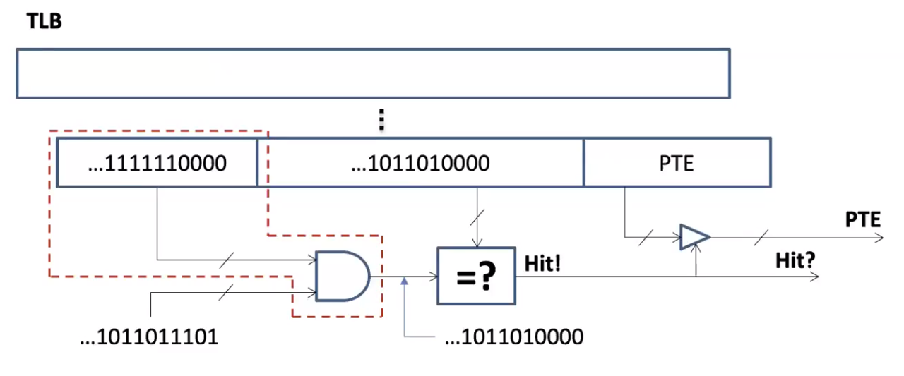

# Tailored Page Sizes

[文章来源](https://ieeexplore.ieee.org/stamp/stamp.jsp?tp=&arnumber=9138990) 

本文通过修改PTE格式和TLB硬件缓存实现了任意大小($\geq$ 4KB)的内存页映射

## 背景和问题：
Linux虚拟内存机制将虚拟地址到物理地址的映射信息以PTE的形式记录在页表中，TLB会缓存一部分热的PTE以加速地址转换过程。在执行内存地址转换时，若TLB缓存未命中，则需要读取内存中的多级页表，以获取相应的PTE中的物理地址。此外，TLB一般分为两级，一级TLB加速的效果明显高于二级，但是一级TLB的容量相对较小。

随着系统物理内存容量的增加，映射条目（PTE）急剧增加，而TLB缓存大小由于成本等问题而受到限制，导致TLB缓存命中率降低，地址转换过程需要频繁的访问内存，带来高额的延时，一些应用甚至有50%的执行时间都花在查询内存页表上。图1描述了在不同负载下应用访问内存页表占应用总执行时间的比例。

**问题在于**，虽然大页映射可以减少总的PTE数量，从而缓解TLB命中率低的问题，但是由于现有系统支持的大页映射仅支持2MB和1GB，2MB的粒度仍然过小，不足以有效减少总的PTE数量，而1GB大页映射会造成内存浪费和碎片化问题。缺少一种灵活尺寸的页映射机制来提升TLB缓存的效率。

图 1  访问内存页表占应用总执行时间

## 设计：
为了提升一级TLB缓存命中率， 本文提出TPS，实现了大于4KB的任何2的幂大小的内存页映射，从而缓解因映射条目过多而TLB容量有限导致的频繁的TLB未命中和访问内存页表带来的地址转换开销高问题。

**TPS的设计思想**
如图2所示，当内存页映射大小每翻一倍，其对应的PFN号所需要的比特数减少一位，因此可以通过检查PTE的第20-12位中有多少位用于表示PFN就可以判断这个PTE表示的页映射尺寸（仅限于4B-2MB范围的映射大小)。相当于复用了PTE的20-12位记录页映射的尺寸。

基于上述设计思想，对于特殊尺寸的页映射（非4KB，2MB），只需使用PTE的一位保留位（第63位）标记出来即可实现TPS。

图 2  通过PTE的1个保留位判断页映射尺寸

此外，为了让TLB能够识别新的PTE格式（第63位），TPS对TLB进行了小幅度的硬件修改，如图3红色虚线框所示。对于内存分配，回收机制以及去碎片化机制，均复用现有操作系统机制。

图 3  TLB硬件修改

## 实验平台：
[ZSim](https://people.csail.mit.edu/sanchez/papers/2013.zsim.isca.pdf)，一种基于循环的x86超量的无序处理器模拟器
注：实验单核系统上进行的