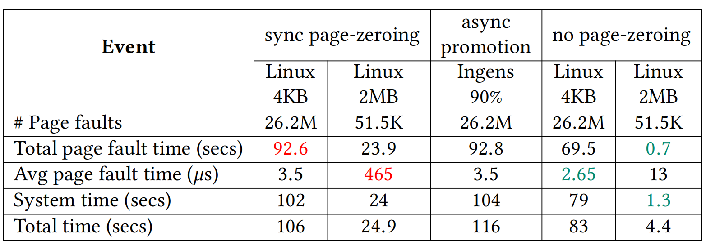
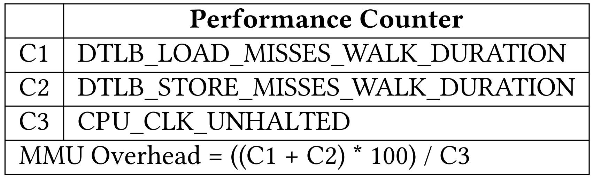
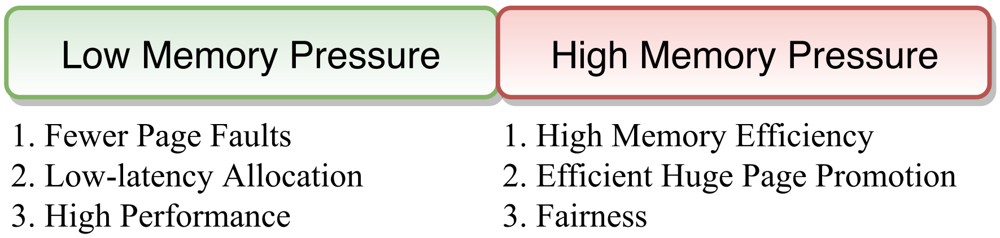
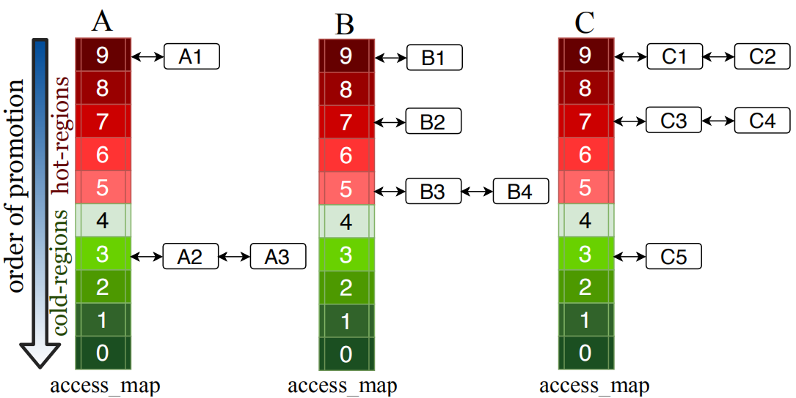

# [HawkEye: Efficient Fine-grained OS Support for Huge Pages](https://www.cse.iitd.ernet.in/~sbansal/pubs/hawkeye.pdf) 

本文分析了主流大页映射机制存在的局限性，并提出了hawkeye大页映射机制，在地址转换开销与内存膨胀，缺页异常处理时延与缺页异常的次数，物理大页资源分配的公平性这三点上做出了平衡。

## 背景和问题：
对于内存占用大的现代应用来说，地址转换开销备受关注。对于这一类应用而言，大页映射机制可以有效降低地址转换开销。

**问题在于**，现有大页映射机制(Linux THP, FreeeBSD, Ingens)并不能提供让人满意的性能，具体来说，它们需要在地址转换开销，物理内存占用量，缺页异常的处理延时和应用之间的内存资源公平分配以及算法自身的开销之间做出复杂的取舍。具体有以下三点：

1.*地址转换开销与内存膨胀*
  
使用大页映射能够减少映射条目，提升MMU（包括TLB）整体效率，从而降低地址转换的开销，但是当分配的物理大页的使用率较低时，会出现内存膨胀(memory bloat)的问题。Linux选择在第一次缺页异常时分配物理大页以降低地址转换开销，但是这会带来内存膨胀；FreeBSD选择在一个2MB的虚拟内存空间全部被访问后才升级为大页映射以内存膨胀问题，但是由于没有及时生成大页映射而牺牲了性能。Ingens提出了一种权衡的策略，即在空闲内存多时尽可能生成大页映射，在空闲内存少时采用FreeBSD的方式推迟生成大页映射，但是Ingens的算法并不能有效的缓解内存膨胀，因为它无法回收在系统初始阶段分配出去的一部分利用率低的物理大页。

2.*缺页异常处理时延与缺页异常的次数*

当第一次访问一段进程的虚拟地址空间时，会因没有分配物理内存而触发缺页异常。操作系统在处理缺页异常时通常需要先清零物理页面，然后才能将其映射到进程的虚拟地址空间，以防止信息泄露或程序本崩溃。但是清零页面对于大页(如2MB)来说开销明显增加，高达缺页异常处理时延的97%。Ingens为了解决这一问题，在缺页异常时只给应用分配4kB小页，而将合并大页的操作全部交给后台线程khugepaged异步完成，但是这样做会失去使用大页的一个重要优点，即可以减少缺页次数。

如表1所示，这是对10GB大小的buffer内每一个4KB页访问取1字节，然后释放buffer获得的累计性能摘要。可以看到linux大页映射机制（图中第二列）相比于基础页(4KB)映射（图中第一列）减少了500倍的page fault数量，最终获取4被的性能提升，但是单次缺页异常的延时上升了约133倍，而Ingens与linux基础页映射表现基本一致。

表 1  缺页异常处理时延与缺页异常的次数

3.*物理大页资源分配的公平性*

**进程间：** Ingens把连续物理内存作为一种系统资源，把进程内部的大页合并比例作为公平性指标，来评估并保证各个进程的公平性。Ingens的公平性策略有一个比较大的缺陷是如果两个进程P1和P2拥
有相同的大页百分比，但P1进程的TLB压力远高于P2（比如P1的访问分散在多个4k小页中，但P2的访问集中在一个或某几个4k小页），此时P1更需要进行大页合并，但Ingens会平等对待这两个进程。

**进程内：** 在单个进程内部，Linux和Ingens都是采用从虚拟地址的低地址往高地址顺序扫描进行大页合并，这种方式对于热点在高地址区间的应用并不公平，通常应用的热点都分布在不同的VMA区间内，当前的做法在实践上很容易出现资源分配不公平的现象。
 
另外，本文还发现，一个进程实际的地址转换开销（MMU开销）不能简单地用工作集大小估算，而应该通过CPU硬件提供的性能计数器来更准精确的评估。如表2所示，C1-C3是三个集成在一些高级CPU内部的硬件性能计数器，MMU开销通过最后一行的公式计算出，即TLB缓存未命中带来的延迟占线程执行时间的比例。

表 2 通过性能计数器评估MMU开销

 

## 设计：

**设计目标** 

图 1 设计目标

 

针对上述三个问题，Hawkeye提出了自己的设计，

1. Asynchronous page pre-zeroing ： 为了降低缺页异常处理时大页填零的延时，异步地提前将[buddy allocator](https://en.wikipedia.org/wiki/Buddy_memory_allocation)中的页面填零，待页面分配时可跳过填零操作，并使用[non-temporal store](https://sites.utexas.edu/jdm4372/2018/01/01/notes-on-non-temporal-aka-streaming-stores/)指令避免缓存污染。

2. Managing bloat vs. performance ：在空闲内存多时，采用与Linux相同的大页分配方法，在空闲内存少时，通过统计构成一个物理大页的全零的4KB页数量来选择利用率低的物理大页并回收其中未被使用的部分。

3. Fine-grained huge page promotion ：
为了解决因线性地扫描整个进程地址空间导致的进程内大页资源分配不公平的问题，HawkEye 定义一个叫access-coverage的指标，通过定期对大页中各小页的页表访问位进行扫描统计，可以判断在一定时间范围内其中有多少个小页被访问过，从而选择出收益最大的VMA区域并为其分配物理大页。（因为access-coverage越大，表示这个VMA所占用的TLB条目数越多，即更有可能导致TLB资源的争抢。）

4. Huge page allocation across multiple processes ：为了在进程间公平的分配大页资源，Hawkeye为每个进程维护了一个叫做access_map的数据结构。access_map是一个数组，每个数组成员称之为一个桶（每个桶内实际是一个链表，链表的节点对应一个2MB的VMA区域）。拿x86的2MB大页举例，每个大页由512个小页组成，根据每个VMA的access-coverage，将其放入对应的桶中中，访问次数为0-49的放在桶0，50-99的放在桶1，以此类推，图2显示了三个进程A、B、C的access_map状况。
Hawkeye首先会根据表2计算出MMU开销最高的进程，有限为其分配大页资源，对于MMU开销相近的进程，则会采用round-robin的方式分配。如果A,B,C三个进程的MMU开销相近，那么分配大页资源的先后顺序是：A1,B1,C1,C2,B2,C3,C4,B3,B4,A2,C5, A3。

图 2 access_map

## 实验：

基于Linux kernel v4.3实现