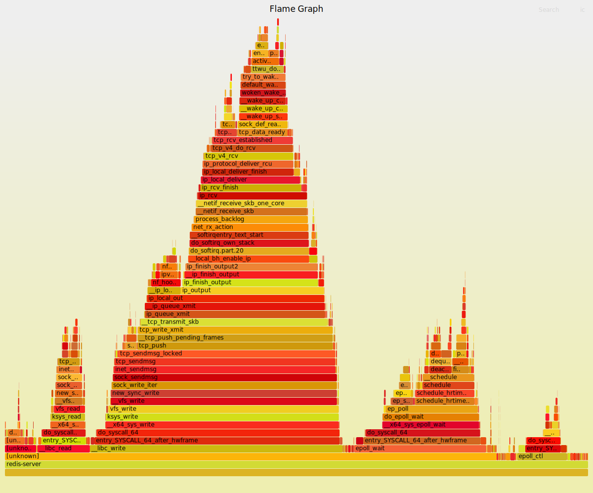

# Redis使用文档——命令处理流程及测试方法

## 1. Redis服务器命令处理流程

### 1.1 解析命令

#### readQueryFromClient
- 位于src/networking.c约 1553 行。
- 读取客户端缓冲区中的字节到c->querybuf中，并调用processInputBuffer函数循环处理命令内容。

#### processInputBuffer
- 位于src/networking.c约 1490 行。
- 基于Redis的RESP协议，根据缓冲区中的字节设置命令结构的argc和argv（在参数c中），并调用processCommand处理命令。

### 1.2 执行命令

#### processCommand
- 位于src/redis.c约 2540 行。
- 从客户端获取输入的命令后，需要对命令进行解析（通过lookupCommand函数检查命令合法性，并进行参数个数检查等），以及一些其他的检查，如client是否通过auth验证、命令参数个数是否正确、是否开启了集群功能需要转向请求、服务器最大内存限制判断等。
- 真正的命令执行在processCommand函数内约 2774 行调用的call函数。

#### call
- 位于src/redis.c约 2422 行。
- 调用命令的实现函数，第一个参数c为客户端结构体，其中的cmd成员（类型为redisCommand）记录了将要执行的命令。约 2446 行的c->cmd->proc(c)执行了真正的命令，如set、get等。
- proc的值可通过同文件约 185 行的命令表redisCommandTable查看，有getCommand、setCommand等，均为真正执行命令操作的函数。

### 1.3 执行命令示例：读写

#### set
- 命令格式：SET key value
- 在1.2节所述的cmd->proc(c)调用后，实际执行的是setCommand函数。进行大小写忽略及编码后，进入setGenericCommand函数，其中的setKey函数将键值关联到数据库中，相当于执行了真正的set。然后调用addReply函数向客户端进行回复。

#### get
- 命令格式：GET key
- cmd->proc(c)实际调用了getCommand函数。在getGenericCommand函数中调用了lookupKeyReadOrReply函数，对数据库内的键值进行了查找，最后无论类型是否正确均调用addReply函数向客户端进行回复。

## 2. 编写C++客户端测试Redis

### 2.1 测试原理

- 简单地使用时间差作为执行命令的延迟，重点在于区分网络传输延迟和命令执行的延迟。
- 基于1.3节，每个命令的网络及执行时延基本划为三个部分——client发起命令传给server、server执行命令、server返回结果给client，具体划分如下：（1）set，processCommand之前为client到server网络传输时延，processCommand直到到setGenericCommand函数的addReply之前为server执行命令时延，addReply之后为server到client网络传输时延；（2）get，processCommand之前为client到server网络传输时延，processCommand直到到getGenericCommand函数的addReply之前为server执行命令时延，addReply之后为server到client网络传输时延。

### 2.2 测试工具

- 负载使用YCSB-tracegen生成的文本文件，客户端使用C++编写，具体可见[has-lab/memcpytest/deps/hiredis/Redistest.cpp](https://github.com/has-lab/memcpytest/blob/redistest/deps/hiredis/Redistest.cpp)。
- 测试客户端逻辑：先读取trace到内存，用vector存储命令以避免边读文件边执行命令带来的额外开销；然后执行warm（预先写入数据）和test（负载，使用的是纯读），客户端会显示总执行时间和test内的平均读延时，服务器端会显示每100000次（可调）命令所使用的时间。

## 3. 测试结果

### 3.1 YCSB

|负载、平台localhost、延迟（ns）|redis3.0|redis-server process|memcached1.6.9|cpp  unordered_map|
|:-:|:-:|:-:|:-:|:-:|
|YCBS -C 10w PUT|4567036228 (48×)|165958963 (1.7×)|3293328853 (35×)|95167984|
|YCBS -C 10w GET|3680065586 (55×)|111535314 (1.7×)|3246008126 (48×)|67352887|
|YCBS -C 1kw PUT|459505246249 (27×)|44231216586 (2.8×)|333604747442 (20×)|16032790538|
|YCBS -C 1kw GET|440780848985 (49×)|23410168671 (2.9×)|335077307127 (41×)|8109711283|
||||

- 括号内为相比于相同测试内容的unordered_map的延时倍数。
- 可以观察到：① redis和memcached的命令执行时延占整体时延很小，大约为2%，更多的是网络传输的时延；② 相比C++标准库的unordered_map，redis的数据存储效率要略低，读写操作的时延增加到了1.7-2.9倍，原因可能是要满足数据校验、并行性等其他要求。

### 3.2 Flame Graph

- 客户端进程：


- 服务器进程：



## 4. Redis及Memcached客户端主要代码

### 4.1 Redis
详细代码位于[has-lab/memcpytest/deps/hiredis/Redistest.cpp](https://github.com/has-lab/memcpytest/blob/redistest/deps/hiredis/Redistest.cpp)。

<details>
  <summary>Redis客户端main函数</summary>
  ```C++
int main() {
    timespec t1, t2, t3, t4;
    uint64_t deltaT;

    Load(true); // load for warm
    Load(false); // load for test
    struct timeval timeout = { 1, 500000 }; // 1.5 seconds， 超时时间

    c = redisConnectWithTimeout((char*)"127.0.0.1", 6379, timeout); // 连接Redis服务器， 需先运行redis-server命令
    if (c->err) {
        printf("Connection error: %s\n", c->errstr);
        exit(1);
    }
    else{
        printf("Connection ok\n");
    }
    
    clock_gettime(CLOCK_REALTIME, &t1);
    Warm_Exec();
    clock_gettime(CLOCK_REALTIME, &t2);
    deltaT = (t2.tv_sec - t1.tv_sec) * 1000000000 + t2.tv_nsec - t1.tv_nsec; //纳秒
    cout<<"Warm time : "<<deltaT<<" ns"<<endl;

    clock_gettime(CLOCK_REALTIME, &t3);
    Test_Exec();
    clock_gettime(CLOCK_REALTIME, &t4);
    deltaT = (t4.tv_sec - t3.tv_sec) * 1000000000 + t4.tv_nsec - t3.tv_nsec; //纳秒
    cout<<"Test time : "<<deltaT<<" ns"<<endl;
    cout<<"Average Get time : "<<de/100000<<" ns."<<endl;
    return 0;
}
  ```
</details>

### 4.2 Memcached
详细代码位于[has-lab/memcpytest/MemcachedTest.cc](https://github.com/has-lab/memcpytest/blob/memcachedtest/MemcachedTest.cc)。
需要下载libmemcached。

<details>
  <summary>Memcached客户端类定义</summary>
  ```C++
class MemCachedClient {
public: 
    ~MemCachedClient() 
    {
        memcached_free(memc); 
    };

    MemCachedClient() 
    {
        memcached_return rc; 
        memcached_server_st *server = NULL;
        memc = memcached_create(NULL);
        server = memcached_server_list_append(server, "127.0.0.1", 11211, &rc);
        rc=memcached_server_push(memc,server);

        if (MEMCACHED_SUCCESS != rc) { 
            cout <<"memcached_server_push failed! rc: " << rc << endl;
        }

        memcached_server_list_free(server); 
    };

    bool Insert(const string key, const string value,time_t expiration = 0) 
    {
        if (key.empty() || value.empty()) return false; 

        memcached_return rc = memcached_set(memc, key.c_str(), key.length(), value.c_str(), value.length(), expiration, 0);
        return memcached_success(rc);
    };

    string Get(const string key) 
    {
        if (key.empty()) return ""; 

        uint32_t flags = 0;
        memcached_return rc;
        size_t value_length;
        char* value = memcached_get(memc, key.c_str(), key.length(), &value_length, &flags, &rc);
        if(rc == MEMCACHED_SUCCESS) {
            return string(value); 
        }
        return ""; 
    };

    bool Update(const string key, const string value,time_t expiration = 0) 
    {
        if (key.empty() || value.empty()) return false; 

        memcached_return rc = memcached_replace(memc, key.c_str(), key.length(), value.c_str(), value.length(), expiration, 0);
        return memcached_success(rc);
    };

    bool Remove(const string key){
        return memcached_success(memcached_delete(memc, key.c_str(), key.length(), 0));
    }

private:
    memcached_st* memc;
}; 
  ```
</details>
