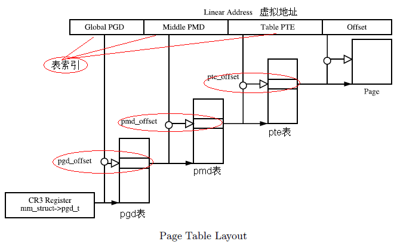

# 1. 写在前面

`mprotect`是一种Linux提供的内存保护的系统调用，通过修改内存区的读、写、执行等属性限制内存访问的方式，若非法访问内存区，则进程会发出SIGSEGV信号。`mprotect`可用于捕捉内存访问行为。

# 2. mprotect用法

[Linux manual page](https://man7.org/linux/man-pages/man2/mprotect.2.html)提供mprotect用法，形式：

```c
#include <sys/mman.h>

int mprotect(void *addr, size_t len, int prot);
```

`mprotect`保护`[addr, addr+len-1]`区域的内存页，`addr`需要页对齐。

内存属性：

- PROT_NONE: 内存不可访问；
- PROT_READ: 内存可读；
- PROT_WRITE: 内存可写；
- PROT_EXEC: 内存可执行；
- PROT_SEM: 内存可原子操作；
- PROT_SAO: 内存必须**有序**处理请求；
- ...

提供的例程：

```c
#include <unistd.h>
#include <signal.h>
#include <stdio.h>
#include <malloc.h>
#include <stdlib.h>
#include <errno.h>
#include <sys/mman.h>

#define handle_error(msg) \
    do { perror(msg); exit(EXIT_FAILURE); } while (0)

static char *buffer;

static void
handler(int sig, siginfo_t *si, void *unused)
{
    /* Note: calling printf() from a signal handler is not safe
        (and should not be done in production programs), since
        printf() is not async-signal-safe; see signal-safety(7).
        Nevertheless, we use printf() here as a simple way of
        showing that the handler was called. */

    printf("Got SIGSEGV at address: %p\n", si->si_addr);
    exit(EXIT_FAILURE);
}

int
main(int argc, char *argv[])
{
    int pagesize;
    struct sigaction sa;

    sa.sa_flags = SA_SIGINFO;
    sigemptyset(&sa.sa_mask);
    sa.sa_sigaction = handler;
    if (sigaction(SIGSEGV, &sa, NULL) == -1)
        handle_error("sigaction");

    pagesize = sysconf(_SC_PAGE_SIZE);
    if (pagesize == -1)
        handle_error("sysconf");

    /* Allocate a buffer aligned on a page boundary;
        initial protection is PROT_READ | PROT_WRITE. */

    buffer = memalign(pagesize, 4 * pagesize);
    if (buffer == NULL)
        handle_error("memalign");

    printf("Start of region:        %p\n", buffer);

    if (mprotect(buffer + pagesize * 2, pagesize,
                PROT_READ) == -1)
        handle_error("mprotect");

    for (char *p = buffer ; ; )
        *(p++) = 'a';

    printf("Loop completed\n");     /* Should never happen */
    exit(EXIT_SUCCESS);
}
```

# 3. mprotect源码分析

按照下面线索追踪系统调用`mprotect`在内核中的执行过程：

```c
SYSCALL_DEFINE3(mprotect, .., start, .., len, .., prot)
    -> do_mprotect_pkey(start, len, prot, pkey=-1)
        -> mprotect_fixup(vma, .., start, end, newflags)
            -> change_protection(vma, start, end, newprot, cp_flags)
                -> change_protection_range(vma, addr, end, newprot, cp_flags)
                    -> change_p4d_range(vma, pgd, add, end, newprot, cp_flags)
                        -> change_pmd_range(vma, pud, addr, end, newprot, cp_flags)
                            -> change_pte_range(vma, pmd, addr, end, newprot, cp_flags)
```

## 3.1. 页表寻址

Linux虚拟内存三级页表寻址，其中：
- PGD: page global directory
- PMD: page middle directory
- PTE: page table entry


虚拟地址利用3级页表访问物理内存：




## 3.2. 数据结构

### 3.2.1. struct vm_area_struct

记录某个Task的一段虚拟内存，而Task的虚拟内存由`struct mm_struct *vm_mm`记录，而`vm_mm`的每个分段的虚拟内存`vma`由双向链表(`vm_next`和`vm_prev`)和红黑树管理(`rb_node vm_rb`)。

```c
struct vm_area_struct {
    /* The first cache line has the info for VMA tree walking. */

    unsigned long vm_start;        /* Our start address within vm_mm. */
    unsigned long vm_end;        /* The first byte after our end address
                       within vm_mm. */

    // 
    /* linked list of VM areas per task, sorted by address */
    struct vm_area_struct *vm_next, *vm_prev;

    struct rb_node vm_rb;

    /*
     * Largest free memory gap in bytes to the left of this VMA.
     * Either between this VMA and vma->vm_prev, or between one of the
     * VMAs below us in the VMA rbtree and its ->vm_prev. This helps
     * get_unmapped_area find a free area of the right size.
     */
    unsigned long rb_subtree_gap;

    /* Second cache line starts here. */

    struct mm_struct *vm_mm;    /* The address space we belong to. */

    /*
     * Access permissions of this VMA.
     * See vmf_insert_mixed_prot() for discussion.
     */
    pgprot_t vm_page_prot;
    unsigned long vm_flags;   
    ....
    const struct vm_operations_struct *vm_ops; // 与这个结构结构体相关的操作，一般在模块初始化时执行自定义的ops
```

# 4. 分析调用路径源码

## 4.1. do_mprotect_pkey

1. 根据起始地址`start`找到对应的`vma`；
2. 判断vma的范围是否覆盖`start`，并尝试在current task的虚拟地址空间的中找链表的前一个内存片段；
3. 遍历`start`至`end`内存片段，修改内存属性。

```c
static int do_mprotect_pkey(unsigned long start, size_t len,
        unsigned long prot, int pkey)
{
    unsigned long nstart, end, tmp, reqprot;
    struct vm_area_struct *vma, *prev;
    int error = -EINVAL;
    
    ...

    vma = find_vma(current->mm, start);
    error = -ENOMEM;
    if (!vma)
        goto out;
    prev = vma->vm_prev;

    ...

        if (vma->vm_start > start)
            goto out;
        
        ...
    }
    if (start > vma->vm_start)
        prev = vma;

    for (nstart = start ; ; ) {
        unsigned long mask_off_old_flags;
        unsigned long newflags;
        int new_vma_pkey;

        /* Here we know that vma->vm_start <= nstart < vma->vm_end. */

        /* Does the application expect PROT_READ to imply PROT_EXEC */
        if (rier && (vma->vm_flags & VM_MAYEXEC))
            prot |= PROT_EXEC;

        /*
         * Each mprotect() call explicitly passes r/w/x permissions.
         * If a permission is not passed to mprotect(), it must be
         * cleared from the VMA.
         */
        mask_off_old_flags = VM_READ | VM_WRITE | VM_EXEC |
                    VM_FLAGS_CLEAR;

        new_vma_pkey = arch_override_mprotect_pkey(vma, prot, pkey);
        newflags = calc_vm_prot_bits(prot, new_vma_pkey);
        newflags |= (vma->vm_flags & ~mask_off_old_flags);

        /* newflags >> 4 shift VM_MAY% in place of VM_% */
        if ((newflags & ~(newflags >> 4)) & VM_ACCESS_FLAGS) {
            error = -EACCES;
            goto out;
        }

        ...

        tmp = vma->vm_end;
        if (tmp > end)
            tmp = end;

        if (vma->vm_ops && vma->vm_ops->mprotect) {
            error = vma->vm_ops->mprotect(vma, nstart, tmp, newflags);
            if (error)
                goto out;
        }

        error = mprotect_fixup(vma, &prev, nstart, tmp, newflags);
        if (error)
            goto out;

        nstart = tmp;

        if (nstart < prev->vm_end)
            nstart = prev->vm_end;
        if (nstart >= end)
            goto out;

        vma = prev->vm_next;
        if (!vma || vma->vm_start != nstart) {
            error = -ENOMEM;
            goto out;
        }
        prot = reqprot;
    }
out:
    mmap_write_unlock(current->mm);
    return error;
}
```

## 4.2. mprotect_fixup

1. 尝试与vma链表上的前向和后向vma合并；
2. 改变vma对应`[start, end]`内存页属性。

```c
int
mprotect_fixup(struct vm_area_struct *vma, struct vm_area_struct **pprev,
    unsigned long start, unsigned long end, unsigned long newflags)
{
    struct mm_struct *mm = vma->vm_mm;
    unsigned long oldflags = vma->vm_flags;
    long nrpages = (end - start) >> PAGE_SHIFT;
    unsigned long charged = 0;
    pgoff_t pgoff;
    int error;
    int dirty_accountable = 0;

    if (newflags == oldflags) {
        *pprev = vma;
        return 0;
    }

    ...

    /*
     * First try to merge with previous and/or next vma.
     */
    pgoff = vma->vm_pgoff + ((start - vma->vm_start) >> PAGE_SHIFT);
    *pprev = vma_merge(mm, *pprev, start, end, newflags,
               vma->anon_vma, vma->vm_file, pgoff, vma_policy(vma),
               vma->vm_userfaultfd_ctx);
    if (*pprev) {
        vma = *pprev;
        VM_WARN_ON((vma->vm_flags ^ newflags) & ~VM_SOFTDIRTY);
        goto success;
    }

    *pprev = vma;

    if (start != vma->vm_start) {
        error = split_vma(mm, vma, start, 1);
        if (error)
            goto fail;
    }

    if (end != vma->vm_end) {
        error = split_vma(mm, vma, end, 0);
        if (error)
            goto fail;
    }

success:
    /*
     * vm_flags and vm_page_prot are protected by the mmap_lock
     * held in write mode.
     */
    vma->vm_flags = newflags;
    dirty_accountable = vma_wants_writenotify(vma, vma->vm_page_prot);
    vma_set_page_prot(vma);

    change_protection(vma, start, end, vma->vm_page_prot,
              dirty_accountable ? MM_CP_DIRTY_ACCT : 0);

    /*
     * Private VM_LOCKED VMA becoming writable: trigger COW to avoid major
     * fault on access.
     */
    if ((oldflags & (VM_WRITE | VM_SHARED | VM_LOCKED)) == VM_LOCKED &&
            (newflags & VM_WRITE)) {
        populate_vma_page_range(vma, start, end, NULL);
    }

    vm_stat_account(mm, oldflags, -nrpages);
    vm_stat_account(mm, newflags, nrpages);
    perf_event_mmap(vma);
    return 0;

fail:
    vm_unacct_memory(charged);
    return error;
}

```

## 4.3. change_protection

判断对HugePage页属性改变还是对普通页。

```c
unsigned long change_protection(struct vm_area_struct *vma, unsigned long start,
               unsigned long end, pgprot_t newprot,
               unsigned long cp_flags)
{
    unsigned long pages;

    BUG_ON((cp_flags & MM_CP_UFFD_WP_ALL) == MM_CP_UFFD_WP_ALL);

    if (is_vm_hugetlb_page(vma))
        pages = hugetlb_change_protection(vma, start, end, newprot);
    else
        pages = change_protection_range(vma, start, end, newprot,
                        cp_flags);

    return pages;
}
```

## 4.4. change_protection_range

在改变页属性之前会将CPU cache中的页表信息写回，在改变页表属性之后会写回TLB的页表映射项。

```cpp
static unsigned long change_protection_range(struct vm_area_struct *vma,
        unsigned long addr, unsigned long end, pgprot_t newprot,
        unsigned long cp_flags)
{
    struct mm_struct *mm = vma->vm_mm;
    pgd_t *pgd;
    unsigned long next;
    unsigned long start = addr;
    unsigned long pages = 0;

    BUG_ON(addr >= end);
    pgd = pgd_offset(mm, addr);
    flush_cache_range(vma, addr, end);
    inc_tlb_flush_pending(mm);
    do {
        next = pgd_addr_end(addr, end);
        if (pgd_none_or_clear_bad(pgd))
            continue;
        pages += change_p4d_range(vma, pgd, addr, next, newprot,
                      cp_flags);
    } while (pgd++, addr = next, addr != end);

    /* Only flush the TLB if we actually modified any entries: */
    if (pages)
        flush_tlb_range(vma, start, end);
    dec_tlb_flush_pending(mm);

    return pages;
}
```

## 4.5. change_p4d_range / change_pud_range / change_pmd_range / change_pte_range

按照p4d->pud->pmd寻址到pte，改变页属性。

改变页属性的动作由`ptent = pte_modify(oldpte, newprot);`执行。

```c
static unsigned long change_pte_range(struct vm_area_struct *vma, pmd_t *pmd,
        unsigned long addr, unsigned long end, pgprot_t newprot,
        unsigned long cp_flags)
{
    pte_t *pte, oldpte;
    spinlock_t *ptl;
    unsigned long pages = 0;
    int target_node = NUMA_NO_NODE;
    bool dirty_accountable = cp_flags & MM_CP_DIRTY_ACCT;
    bool prot_numa = cp_flags & MM_CP_PROT_NUMA;
    bool uffd_wp = cp_flags & MM_CP_UFFD_WP;
    bool uffd_wp_resolve = cp_flags & MM_CP_UFFD_WP_RESOLVE;

    do {
        oldpte = *pte;
        if (pte_present(oldpte)) {

            oldpte = ptep_modify_prot_start(vma, addr, pte);
            ptent = pte_modify(oldpte, newprot);
            if (preserve_write)
                ptent = pte_mk_savedwrite(ptent);

            if (uffd_wp) {
                ptent = pte_wrprotect(ptent);
                ptent = pte_mkuffd_wp(ptent);
            } else if (uffd_wp_resolve) {
                /*
                 * Leave the write bit to be handled
                 * by PF interrupt handler, then
                 * things like COW could be properly
                 * handled.
                 */
                ptent = pte_clear_uffd_wp(ptent);
            }

            /* Avoid taking write faults for known dirty pages */
            if (dirty_accountable && pte_dirty(ptent) &&
                    (pte_soft_dirty(ptent) ||
                     !(vma->vm_flags & VM_SOFTDIRTY))) {
                ptent = pte_mkwrite(ptent);
            }
            ptep_modify_prot_commit(vma, addr, pte, oldpte, ptent);
            pages++;
        } else if (is_swap_pte(oldpte)) {
            ...
        }
    } while (pte++, addr += PAGE_SIZE, addr != end);
    arch_leave_lazy_mmu_mode();
    pte_unmap_unlock(pte - 1, ptl);

    return pages;
}
```

# 5. 参考资料

- http://abcdxyzk.github.io/blog/2015/06/02/kernel-mm-alloc/