# Don’t Forget the I/O When Allocating Your LLC

[论文PDF下载链接](https://yifanyuan3.github.io/files/iat-isca21.pdf)

现代服务器CPU中，LLC(Last-Level Cache)是影响负载性能的关键硬件资源，如何管理LLC是多租户云中性能隔离和QoS的关键。Intel提出的DDIO(Data Direct I/O)架构创新，直接将入站I/O流量导入LLC而非内存，这引起了与LLC有关的两个问题：Leaky DMA以及Latent Contender。论文对这两个问题进行了研究，提出第一个将设备入站I/O视为一等公民的LLC管理机制——IAT。IAT使用CPU的硬件性能计数器来监视并分析Core/LLC/DDIO的性能，为DDIO或租户自适应地调整LLC way的数量，并且动态选择与DDIO共享LLC资源的租户，以最小化租户和I/O的性能干扰。

## 0. 写在前面

### 0.1 Cache Way的概念

先复习一下直接映射Cache。

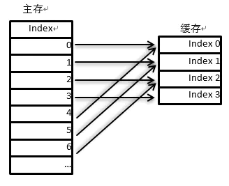

直接映射（也称为单路组相联）是一种多对一的映射关系，在这种映射方式下，主存中的每个数据块只能有一个cacheline与之对应。直接映射最大的好处就是查找对应cacheline的速度很快，但是如果Cache大小不够大，那么其时间局部性会很低。

为了平衡时间局部性和空间局部性，现在计算机系统中所使用的Cache很多是多路组相联（N-Way Set-Associative），结合了直接映射和全相联映射的优点，命中率较高且查询开销较小。其中每个Way可以视作一个完整的直接映射Cache。

### 0.2 LLC的概念

LLC（Last Level Cache）通常指由芯片上所有功能单元（如CPU Core、IGP、DSP）共享的最末级缓存，在CPU中一般是L3 Cache，GPU中可能是L4 Cache。L1、L2 Cache通常都是每个CPU Core一个，这意味着每增加一个CPU Core都要增加相同大小的面积，即使每个CPU Core的L2 Cache有很多相同的数据也必须各自保存一份，因此有必要存在一个所有Core共享的L3 Cache。

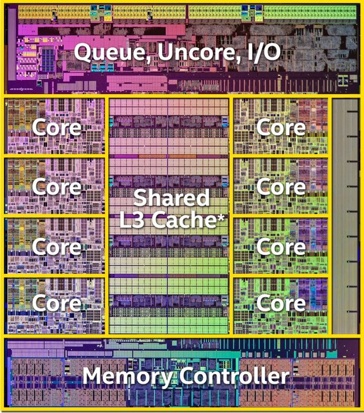

下图是CPU内寄存器、各级Cache以及内存的访问延迟。可以看到，LLC的访问速度大概是内存的五倍。

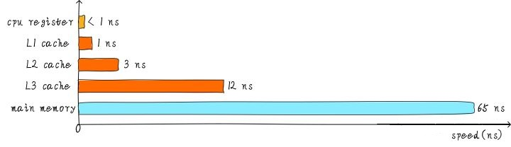

## 1. 背景

基础设施即服务(infrastructure-as-a-service, IaaS)在云数据中心占据主导地位。IaaS向上层租户隐藏底层硬件，并允许多个租户通过虚拟机和容器等虚拟化技术共享相同的物理平台。这不仅方便了云的操作和管理，而且实现了高的效率和硬件利用率。

### 1.1 现代LLC管理

如既往研究所述，共享的LLC会导致并置的虚拟机、容器之间存在性能干扰，这推动了在现代服务器CPU上进行LLC监控和分区的实践。从Xeon®E5 v3一代开始，Intel开始提供RDT（Resource Director Technology）用于内存层次结构中的资源管理。在RDT中，CMY（Cache Monitoring Technology，缓存监控技术）提供了通过不同内核监视LLC利用率的能力；CAT（Cache Allocation Technology，缓存分配技术）可以将LLC的way分配给不同的核（从而提供给不同的租户）。程序员可以通过访问相应的特定于模型的MSR寄存器或使用高级库来利用这些技术。

### 1.2 DDIO技术

通常来自PCIe设备的DMA操作使用内存作为目的地址，也就是说，当数据从设备传输到主机时，数据将被写入设备驱动程序指定的地址的内存中。之后，当CPU Core被告知传输完成后，它会将数据从内存中提取到缓存层进行后续处理。

由于过去几十年来I/O设备的带宽急剧增加，这种DMA方案的两个缺点变得突出:

- 访问内存相对耗时，这可能限制数据处理的性能，处理速度不够将发生丢包。

- 占用大量内存带宽。对于每个数据包，它将至少写入内存一次，并从内存读取一次。

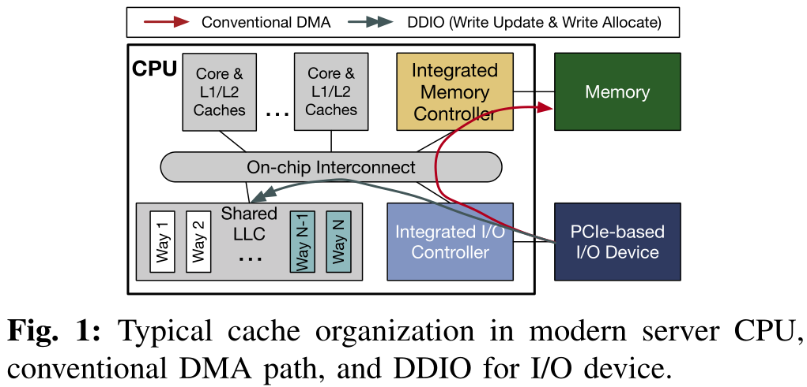

为了减轻内存负担，Intel提出了DCA（Direct Cache Access）技术，允许设备直接将数据写入CPU的LLC。在现代Intel Xeon CPU中，这已经实现为Data Direct I/O技术(DDIO)，这对软件是透明的。

### 1.3 虚拟化中的租户-设备交互

现代数据中心采用两种流行的模型来组织多租户虚拟化服务器中的I/O设备，并进行不同的权衡，关键的区别在于它们与物理设备的交互方式。

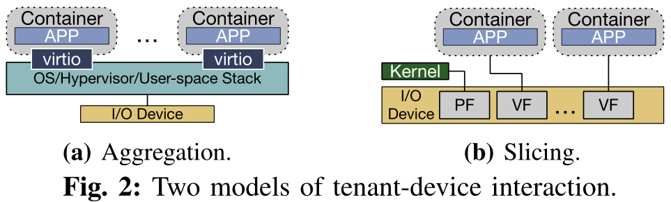

在第一个模型中，逻辑上集中的软件堆栈被部署用于I/O设备交互。它可以在操作系统、管理程序甚至用户空间中运行。软件栈控制物理设备，向物理设备发送/接收数据包。租户通过诸如virtio这样的接口连接到设备。由于此模型中的所有流量都需要通过软件堆栈，所以我们称此模型为“Aggregation（聚合）”。

在第二个模型中，利用了基于硬件的Single Root Input/Output Virtualization（SR-IOV）技术。通过SR-IOV，一个物理设备可以被虚拟成多个虚拟函数（VFs）。当物理函数（PF）仍然连接到主机操作系统/管理程序时，我们可以将VF直接绑定到租户。换句话说，基本的交换功能被卸载到硬件上，每个租户直接与物理设备进行数据接收和传输。由于该模型将硬件资源分散并将其分配给不同的租户，因此也称为“Slicing（分片）”。

## 2. 动机：I/O对LLC的影响

DDIO的使用对LLC主要存在以下两个问题。

### 2.1 Leaky DMA问题

默认情况下，只有两个LLC的way提供给DDIO的write allocate。当入站数据率（例如，NIC Rx率）高于CPU Core可以处理的速度，LLC里等待处理的数据很可能会被驱逐到内存，当一个Core需要它时，它又被带回到LLC。这会导致额外的内存读写带宽消耗，并增加每个包的处理延迟，最终导致性能下降。

### 2.2 Latent Contender问题

目前大多数LLC管理机制都不知道DDIO，当使用CAT为不同的核分配LLC way时，可能将DDIO使用的LLC way分配给某些运行LLC敏感工作负载的Core。这意味着，即使这些LLC way从Core的角度完全隔离，DDIO实际上仍然在与Core争夺LLC资源。

## 3. IAT设计

IAT是一种I/O感知的LLC管理机制，它可以更好地在多租户服务器的各种情况下使用DDIO技术。当IAT从DDIO流量中检测到LLC miss的数量增加时，它首先确定miss是由I/O流量还是运行在Core中的应用程序引起的。在此基础上，IAT为Core或DDIO分配更多或更少的LLC way，以减轻Core和I/O的干扰。IAT还可以调整租户的LLC分配，以进一步减少core-I/O争用。具体来说，IAT执行了6个步骤来实现其目标，如下图。

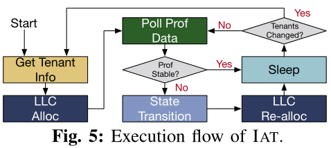

### 3.1 Get Tenant Info

初始化（或租户变更）时，IAT通过“Get Tenant Info”步骤获取租户信息和可用的硬件资源。

在硬件资源方面，IAT需要了解并记住每个租户所分配的Core和LLC way；对于软件，它需要知道两件事：（1）租户的工作负载是否为“I/O”，这可以帮助IAT确定性能波动是否由I/O引起；（2）每个租户的优先级。IAT假设每个工作负载有两个可能的优先级（在实际部署中可能有更多）——“性能关键型（PC）”和“尽力而为型（be）”。

在获得租户信息之后，IAT相应地为每个租户分配LLC way（即LLC Alloc步骤）。

### 3.2 Poll Prof Data

在这一步中，IAT会对每个租户的性能状态进行轮询，以决定LLC的最优分配。

**Instruction per cycle（IPC）**：IPC是衡量CPU Core上程序执行性能的常用指标，IAT使用它来检测租户的性能变化。

**LLC reference and miss**：反映了工作负载的内存访问特征。

**DDIO hit and miss**：DDIO hit是应用write update的DDIO事务的数量，意味着目标cacheline已经在LLC中；DDIO miss反映了应用write allocate的DDIO事务的数量，这表明必须将victim cacheline逐出LLC以进行分配。这两个指标反映了I/O流量的强度及其给LLC带来的压力。

### 3.3 State Transition

IAT设计的核心是一个全系统的Mealy FSM，它基于Poll Prof data的数据来决定当前系统的状态。对于每个迭代，如果在Poll Prof Data中发生变化，状态转换（包括自转换）被触发；否则，IAT将保持之前的状态。

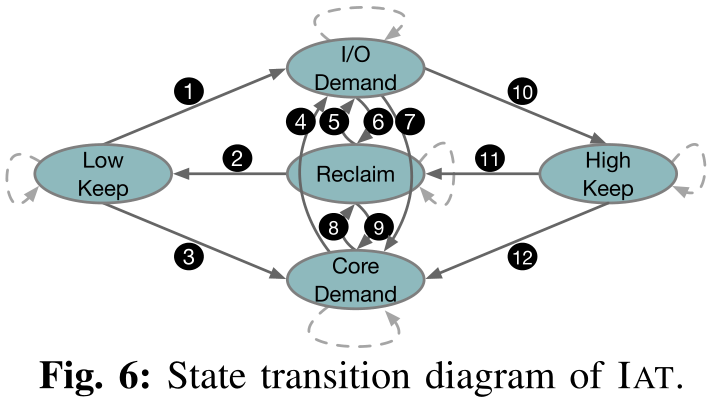

**Low Keep**：I/O流量不密集，不对LLC产生压力。如果DDIO miss计数很小，则IAT处于这种状态。此时将DDIO的LLC way的数量保持在最小值(DDIO_WAYS_MIN)。
  
**High Keep**：这种状态下，IAT已经为DDIO分配了最大数量(DDIO_WAYS_MAX)的LLC way。

**I/O Demand**：这是一种I/O与Core争用LLC资源的状态。这种状态下I/O流量变得非常密集，用于write update的LLC空间无法满足DDIO事务的需求。因此，系统中频繁地发生write allocate(DDIO miss)，导致大量cacheline逐出。

**Core Demand**：在这种状态下，I/O也会与内核争夺LLC资源，但原因不同。此时Core需要更多的LLC空间。换句话说，一个内存密集型I/O应用程序正在核心上运行。因此，Rx缓冲区数据经常从分配给Core的LLC way中被驱逐，导致DDIO hit减少，DDIO miss增加。

**Reclaim**：在这种状态下，I/O流量不密集，用于DDIO的LLC way的数量处于中等水平，可能存在浪费。在这种情况下，应该考虑从DDIO回收一些LLC way。同样的，为租户分配的LLC way也可能存在浪费，需要回收。

  
状态转换详细过程

IAT从Low Keep状态初始化。当DDIO miss数大于阈值THRESHOLD_MISS_LOW时，表示当前DDIO LLC way不足。IAT通过进一步检查DDIO hit值和LLC ref来确定下一个状态。随着LLC ref的增多，DDIO hit计数的减少意味着Core越来越多地与DDIO争夺LLC，并且Rx缓冲区中的条目经常从LLC中逐出。在这种情况下，IAT移动到Core Demand状态③。否则(即DDIO hit计数增加)，IAT将移动到I/O Demand状态①，因为DDIO miss归因于更密集的I/O流量。

在Core Demand状态下，如果IAT观察到DDIO miss计数的减少，会将其视为系统平衡的信号，并返回到Reclaim状态⑧。如果IAT观察到DDIO miss数增加，DDIO hit数没有减少，将进入I/O Demand状态④，因为现在Core不再是主要的竞争对象。如果IAT没有观察到这两个事件，将停留在Core Demand状态。

在I/O Demand状态下，如果IAT仍然观察到大量的DDIO miss，将继续保持这种状态，直到为DDIO分配了DDIO_WAYS_MAX数量的LLC way，然后转移到High Keep状态⑩。如果出现DDIO miss的严重减少，IAT会认为DDIO的LLC容量过度供应，并将进入Reclaim状态⑥。同时，更少的DDIO hit和稳定甚至更多的DDIO miss表明Core在竞争LLC，所以IAT进入Core Demand状态⑦。High Keep状态也遵循同样的规则——⑪和⑫。

如果在DDIO的LLC way达到DDIO_WAYS_MIN数量之前，IAT没有观察到DDIO miss计数有增加，那么将保持Reclaim状态②，然后转移到Low Keep状态。否则，IAT将转向I/O Demand状态，为DDIO分配更多的LLC way，以摊销来自密集I/O流量的压力⑤。同时，如果IAT同时观察到DDIO hit数的减少，将进入Core Demand状态⑨。

### 3.4 LLC Re-alloc

状态转换后，IAT会为DDIO或Core重新分配LLC way。

首先，IAT更改分配给DDIO或租户的LLC way的数量。在I/O Demand状态下，IAT每次迭代都会增加DDIO的LLC way的数量。在Core Demand状态下，IAT每次迭代都会为所选租户增加LLC way。在Low Keep和High Keep状态下，IAT不改变LLC的分配。在Reclaim状态下，IAT每次迭代从DDIO或Core中回收LLC way。所有空闲way都在一个池中，以供选择分配。

其次，IAT将洗牌分配给租户的LLC way，即适当选择LLC压力最小的租户，并将其分配的way共享为DDIO的way。与DDIO共享LLC way可能会导致Core的性能下降，因此有必要减少这种干扰。运行PC工作负载的租户应该尽可能地与DDIO的LLC way隔离，IAT尽力只让BE租户与DDIO共享way。在洗牌之前，IAT根据当前迭代中的LLC ref计数对所有BE租户进行排序，并选择值最小的一个或多个与DDIO共享LLC way。

### 3.5 Sleep

在“LLC Re-alloc”步骤之后，应用程序性能可能需要一段时间才能稳定。此外，轮询性能计数器并不是没有代价的。因此，有必要为IAT选择一个合适的轮询间隔(在论文的实验中为1秒)。在每次Sleep之后，如果IAT被告知租户信息变化，它将进行“Get Tenant Info”和“LLC Alloc”步骤。否则，将进行“Poll Prof Data”的下一次迭代。

## 4. IAT实现

论文将IAT实现为一个Linux用户空间守护进程，对应用程序和操作系统是透明的（也可以在内核空间中、CPU电源控制器等地方实现）。

**LLC分配**：为CPU Core分配LLC利用Intel pqos库的API；对于DDIO则是通过读写DDIO相关的MSR。

**分析和监控**：使用pqos的API进行常规分析和监控（LLC miss、IPC等）。监视DDIO的hit、miss则使用了非核心性能计数器。

**租户信息**：由于CAT将LLC way分配给Core，所以IAT需要知道每个租户所使用的Core。简单起见，IAT将这种从属关系记录在一个文本文件中。在真实的云环境中，IAT可以拥有一个到编排器或调度器的接口，以动态查询从属关系信息。

## 5. 实验评估

### 5.1 实验配置

**硬件配置**：

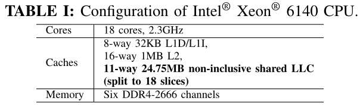

**系统软件**：

由于当前DDIO不支持远程socket，论文在socket-0上运行所有实验。为了反映多租户云环境，论文在docker容器中运行应用程序。使用1024个条目作为Rx/Tx缓冲区大小。对于需要TCP/IP堆栈的容器，使用DPDKANS来实现高性能。主机和容器都运行Ubuntu 18.04。为了测量IAT的绝对开销并且不影响租户，论文在一个专用的Core上运行IAT守护进程。

**IAT参数**：

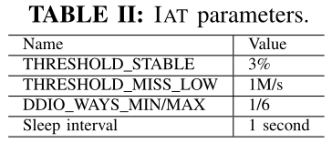

### 5.2 微基准测试结果

对于Leaky DMA问题的解决：

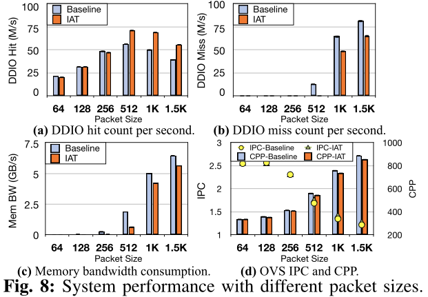

对于Latent Contender问题的解决：

详细描述可参见论文。

### 5.3 应用测试结果

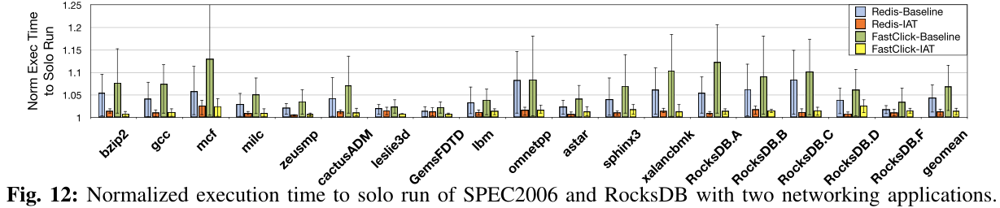

详细描述及其他测试可参见论文。

## 6 讨论

### 6.1 IAT的局限

首先，像大多数基于现代Intel cpu的机制一样，IAT只能以LLC的way粒度进行分区，这是一种商用硬件限制。英特尔cpu上的低结合性(11-way)可能会导致内存不足(当分配多个租户时)和性能下降。缓解这种情况(但放松隔离性)的一种方法是对租户进行分组，并分配LLC的way。

其次，作为大多数动态LLC分区建议的一个硬限制，IAT不能处理微秒级的流量/工作负载变化。这主要是因为：（1）缓存需要一定的时间才能生效；（2）较短的间隔可能会导致采样数据的波动。换句话说，即使在一个单一的细粒度例程中，也可能存在具有不同特征的步骤，这些特征更加短暂。例如，当间隔为1ms或更短时，即使受监视的租户在没有任何干扰的情况下一直在做稳定的工作，一些工作负载的IPC值也会大幅波动。而且，在这个时间尺度上访问CPU寄存器的时间是不可忽略的。在这种情况下，IAT应该与最先进的CPU核心调度机制协同工作，以保持严格的性能隔离。

最后，IAT依赖一些用户提供的租户信息来描述工作负载。然而，论文作者认为这不是一个问题，因为IAT的目标是需要极高性能的场景，这在私有云中比公共云更常见。在私有云中，基本的租户信息对运营商应该是透明的。

### 6.2 硬件上的IAT

IAT可以在硬件上实现。一方面，它允许我们考虑每个设备的DDIO统计数据，并基于这些统计数据以更快的速度调整细粒度的DDIO，而不必担心性能开销。另一方面，硬件实现可以使DDIO在运行时选择LLC way-它将允许DDIO对LLC中的数据目的地有更细粒度的（cacheline）控制，并可以更快地检测争用/拥塞（微秒级）。

### 6.3 DDIO用于远程套接字

目前，DDIO只支持本地套接字。也就是说，入站数据仅被注入到对应I/O设备所连接的套接字中，即使应用程序运行在远程套接字上。克服这一限制的一个解决方案是多插槽NIC技术，其中来自同一个NIC的入站数据可以被分派到不同的插槽。作者还希望DDIO可以通过套接字互连技术(Intel UPI)来支持远程套接字。

### 6.4 未来DDIO的考虑

当前在Intel cpu中的DDIO实现不区分设备和应用程序。也就是说，来自各种PCIe设备的入站流量(包括write update和write allocate)被同等对待。这反过来又可能导致同时使用DDIO的应用程序之间的性能干扰。作者希望未来Intel CPU中的DDIO可以是设备感知的。也就是说，它可以将不同的LLC way分配给不同的PCIe设备，甚至在单个设备中分配不同的队列，就像CAT在CPU Core上所做的那样。此外，作者希望DDIO可以是应用程序感知的，这意味着应用程序可以选择完全或部分使用DDIO。例如，为了避免缓存污染，应用程序可能只对包头启用DDIO，而将有效负载留给内存。

[返回博客列表](https://haslab.org/blog/)