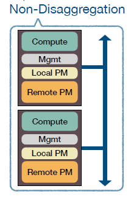
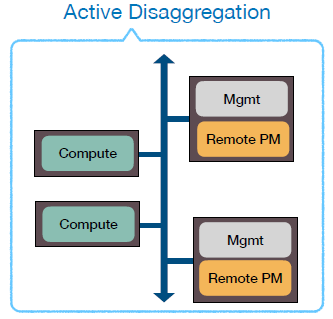
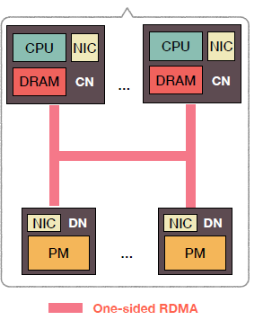
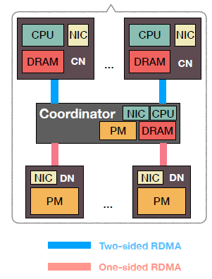
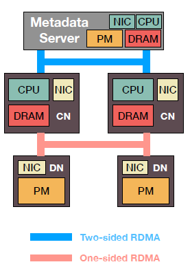
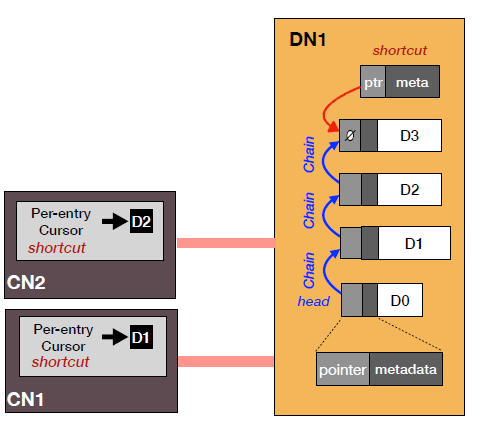
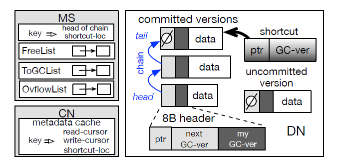
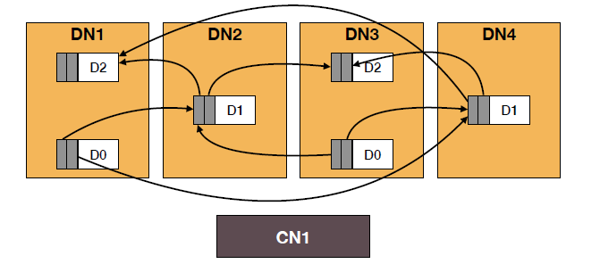

# 论文阅读笔记：

关于**Disaggregating Persistent Memory and Controlling Them Remotely: An Exploration of Passive Disaggregated Key-Value Stores**这篇论文的笔记

[原文链接](https://www.usenix.org/conference/atc20/presentation/tsai)

### 提出背景

传统的分布式存储系统中，每个节点都会包含计算和存储两个部分，一个节点既可以访问本地的存储部分也可以访问远端的存储部分。传统的存储部分是由SSD或者HDD组成，但随着非易失性内存（PM：persistent memory）的提出，越来越多的存储系统采用了这种存储介质。形成的组织架构如下图所示：

### 存在的问题

- 在单个节点中，计算和存储之间存在着处理速度方面的差异，无法发挥最佳的性能

- 可扩展性差

- 存在数据一致性与可靠性方面的问题

### 分离模式

针对传统分布式存储系统存在的问题，人们提出了将计算和存储分离的模式，这种模式相比于传统的模式在资源管理、可扩展性等方面表现得更好，现在的许多数据中心和云服务平台都正在采用这种模式。

此外，有一种称为RDMA（Remote Direct Memory Acces）的网络技术正在应用于分布式系统中，这种技术能够允许跨过CPU直接访问远端节点的内存，因此具有低延迟和低CPU利用率的特点，采用这种技术能够大大提高分布式系统的性能。

既然分离出了计算和存储节点，那么就需要在其中一种节点上安装管理程序以维护这个系统，根据管理程序所在的节点，结合PM存储介质和RDMA传输技术，提出了两类模型：aDPM(active disaggregated PM)和pDPM(passive disaggregated PM)。其中，主动(active)和被动(passive)是指对数据的管理模式。

### aDPM

aDPM的架构如下图所示

可以看到，在aDPM中，将管理程序安装在存储节点，采用这种方式可以降低延迟，但是为了维持较大的网络带宽，在存储节点需要有较高的处理能力，由此会产生较大能耗。此外，如果该系统采用了RDMA技术，那么在这种情况下，需要事先通过管理层才能到达内存，并没有发挥RDMA直达内存的优点。

### pDPM

由于aDPM还存在着一些不足，于是考虑将管理程序放在计算节点，从而组成了pDPM模型。pDPM的架构如下图所示：

采用这种模式有效地解决了aDPM中RDMA无法发挥作用的不足，在这种模式下，只需要在存储节点安装支持RDMA的智能网卡，就能实现对存储节点内存的直接访问。但在这种模式下，存储节点失去了处理能力，接下来的问题就是在哪里处理与管理数据。从这点出发，提出了三种模式：pDPM-Direct，pDPM-Central和Clover

#### pDPM-Direct

直观的想法是在计算节点进行数据的管理，计算节点通过单向的RDMA对存储节点进行读写操作，它的架构如下所示：

以下简要介绍这种架构在读写方面的实现：

对于一条数据，它在存储节点中的形式是一个KV条目，每个KV条目包含已提交和未提交数据，同时这些数据需要有校验码保证可靠性。

- 当进行读操作时，读取对于KV条目中的已提交数据，并进行校验，如果校验失败，需要重新读取。

- 当进行写操作时，首先对要写的KV条目加锁，再先后将数据写入未提交和已提交数据中，最后释放锁。

可以看到，采取这种方式存在的问题有：

- 写操作时较慢

- 一条数据需要复制为两份保存，会造成空间的浪费。

#### pDPM-Central

pDPM-Direct采用的方式相当于将数据的处理分散到每一个计算节点上，那么相对应的另一种思路是将数据的处理集中在一个调度器，这个调度器位于计算节点和存储节点之间，这就是pDPM-Central采用的方法。它的架构如下所示：

以下简要介绍这种架构在读写方面的实现：

在调度器中的PM保存着一张映射表，每个条目保存的是一条数据所在的地址。

- 当进行读操作时，计算节点会向调度器发送一个RPC请求，调度器会给对应得映射表条目加锁，然后调度器从存储节点读取数据并返回给计算节点，最后释放条目上的锁

- 当进行写操作时，计算节点会向调度器发送一个RPC请求，此时调度器需要为这条数据在存储节点中分配空间，然后调度器将数据写入分配的空间中，最后更新内部的映射表（需要加锁）

可以看到，采取这种方式存在的问题有：

- 由于中间经过调度器，读操作的速度下降

- 调度器本身的CPU使用率非常高，需要处理计算节点的RPC请求、分配存储节点的空间等

- 调度器成为了该系统的一个瓶颈

#### Clover

Clover采取的模式是对以上两种方式的混合，它将数据和元数据分离，分别采用不同的形式进行管理，其中对于数据的管理（称为数据层），采用的是pDPM-Direct中的方式，即将数据的读写操作分散在每个计算节点中；对于元数据的管理（称为元数据层），采用的是pDPM-Central中的方式，即将数据空间分配和垃圾回收等操作集中在一个元数据服务器(MS)中。它的架构如下图所示：

##### 数据层

对于数据层，需要完成的基本操作是数据的读写操作，这里采用的是一种不需要加锁的数据结构，对于一条数据以链表的形式存储，链表的每个结点代表的是该数据的历史版本，不难看出，该链表的最后一个结点就是该数据的最新版本。同时在计算节点中保存着一个游标（类似指针），代表的是上一次访问该条数据时的版本（不一定是最新的）。

- 当进行读操作时，根据计算节点中的游标找到该条数据对应链表中的位置，从该位置开始遍历直至找到链表末尾，得到该条数据的最新版本。

- 当进行写操作时，需要在存储节点对应数据条目中添加一个新的结点，如果该链表只有一个结点，说明是新创建的数据，只需要在计算节点中添加新的指向该结点的游标；如果链表有多个结点，说明是对数据的更新，将代表上一版本的结点指向新创建的结点，最后更新执行写操作的计算节点中的游标。

可以看到，在读操作中当遇到链表很长而游标指向的历史版本过早时，存在遍历时间过长的情况。因此可以采取一种优化措施，在存储节点内部保存一类称为捷径(shortcut)的指针，它们会指向对应数据条目中尽量新的版本结点。在实际应用时，会并行采取遍历链表和使用捷径指针的方式，直到其中一种方式获得最新的数据。

数据层的组织形式如下图所示：

##### 元数据层

对于元数据层，它只与计算节点进行通信，进行空间管理、垃圾回收、负载均衡等操作。

对于空间分配的操作，在MS中将空闲空间打包为一个块(chunk)，每个块的大小和数据缓冲区的大小一致，不同的块会有不同的大小，这些块会组成一个空闲队列。当计算节点需要进行写操作时，会在后台向MS请求分配一个对应的块，MS会在空闲队列中将这个块发送给计算节点。

对于垃圾回收操作，在写完成之后，计算节点可能需要淘汰一些历史版本结点，因此后台会给MS发送回收请求，收到回收请求的MS会将原来分配出去的块重新放回空闲队列中。

以上操作的组织形式如下图所示：

对于数据可靠性与负载均衡，一个数据条目的历史版本的副本可能存在于不同的存储节点上，一个版本结点可以指向多个下一版本结点，尽管它们存在不同的存储节点。大致思路如下图所示：

### 小结

在以上三种pDPM模型中，Clover尝试结合另外两种模型的优点，经过实验证明Clover的确具有读写延迟低、能耗低、成本低等优点，但也存在大量写冲突情况下性能变差的问题。总之，在设计分布式存储系统时可以考虑采用pDPM中的Clover模型。
