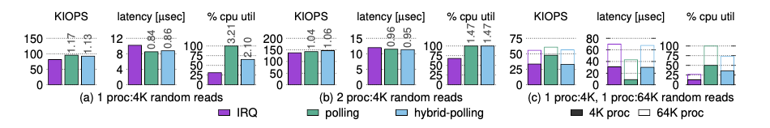
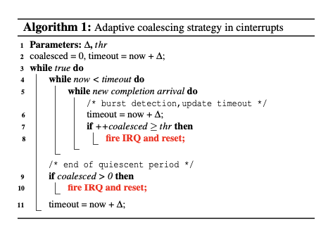
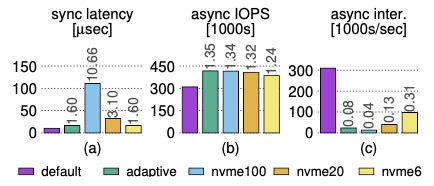
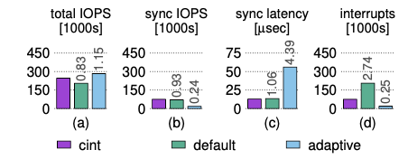
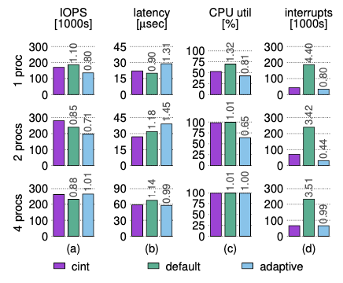
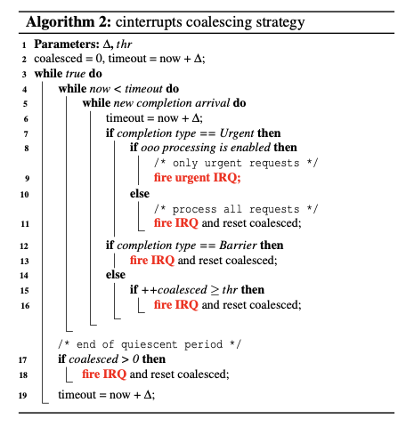
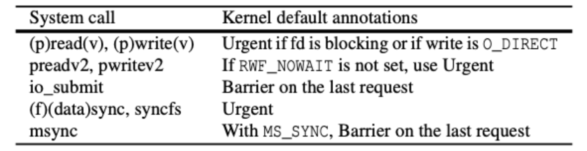

# 论文阅读笔记：

**Optimizing Storage Performance with Calibrated Interrupts**


 [原文链接](https://www.usenix.org/conference/osdi21/presentation/tai)


 ### 1.	介绍

​		中断是操作系统和设备之间的基本通信模式，随着高速存储设备(如NVMe，使应用程序不仅能够每秒提交数百万个请求，而且能够同时提交多达65535个并发请求，每次完成都发送中断可能导致中断风暴，使系统陷入停顿)的发展，过多的中断可能会对软件充分利用现有和未来存储设备的能力造成致命影响。

​		通常情况下，中断合并通过将请求批量化为一个单一的中断来解决中断风暴。然而，批处理在请求延迟和中断率之间创建了一个折衷。本文作者进行了相关检测，CPU利用率在没有合并的情况下增加了55%，而即使在最小的合并量下，由于大量超时，对于小请求，请求延迟也增加了10倍之多。在Linux中，中断合并在默认情况下是禁用的。

​		本文提出了一种中断校准技术（Cinterrupts）。首先为NVMe实现了自适应合并（Adaptive Coalescing），这是一种动态的、仅设备端的方法，它根据工作负载调整批处理，但发现它仍然会给请求增加不必要的延迟。原因是设备端的启发式方法无法实现最佳延迟，因为设备缺少推断请求者意图的语义上下文，因此，后续工作中提出了中断校准，通过向发送到设备的请求中添加2bit标志位（Urgent和Barrier）来传递语义信息，通过校准中断，硬件和软件在中断生成上进行协作，避免中断风暴，同时仍能及时交付。

​		在微基准测试中，Cinterrupts与最先进的中断驱动方法的延迟相当，而每次请求花费的时钟周期减少了30%，并提高了高达35%的吞吐量。在不对应用程序进行修改的情况下，Cinterrupts使用默认的内核校准来提高RocksDB和KVell在YCSB基准测试中的吞吐量，比最先进的方法提高14%，比无校准的自适应方法降低28%的延迟。

 ### 2. 背景及相关工作

磁盘的寻道时间为几毫秒，每秒最多产生几百次中断，这意味着中断可以很好地实现软件层面的并发，同时避免了昂贵的开销。

新的存储设备是用固态存储器构建的，它不仅可以承受每秒数百万次的请求，还可以承受多个并发请求。NVMe规范通过提供多个队列（每个设备最多64K）将这种并行性暴露在软件中，每个队列最多64K的请求可以被提交和完成。

#### 2.1 中断合并

NVMe规范标准化了存储设备中断合并的思想，只有在完成队列中有足够的项目阈值或超时后，才会触发中断。这种方法存在的问题：

1. NVMe只允许聚合时间以100μs的增量设置，而设备的延迟接近10μs以下。例如，通常需要10μs的小请求被延迟100μs，导致延迟增加10倍。
2. 即使NVMe合并粒度更合理，阈值和超时都是静态配置的。这意味着中断合并在工作负载发生小的变化后很容易中断，例如，如果工作负载暂时不能达到阈值。NVMe标准甚至指定默认情况下关闭中断合并。

#### 2.2 轮询

μdepot和Arrakis通过轮询处理更高的完成率。通过SPDK直接从用户空间轮询需要对应用程序进行大量更改，而从内核空间或用户空间轮询会浪费CPU周期。FlashShare只对低延迟应用程序进行票选，但这仍然很昂贵。Cinterrupts公开了中断生成的应用程序语义，这样系统就不必求助于轮询。



上图比较了Intel Optane DC P4800X上三个基准测试的混合轮询、轮询和中断的性能和CPU利用率。

在所有情况下，轮询都提供了最低的延迟，因为轮询线程会立即发现完成，CPU利用率为100%。当有一个线程通过read syscall提交请求时，混合轮询做得很好，因为请求完成是一致的。但是，当添加更多线程或I/O大小时，混合轮询的CPU利用率仍然比中断高1.5倍到2.7倍，而性能没有明显改善。

 ### 3. Cinterrupts的设计

#### 3.1 自适应合并

NVMe标准中的中断合并的问题：即使NVMe规范中的超时粒度更小，但仍然是固定的，这意味着当工作负载不需要中断时，将生成中断，当工作负载确实需要中断时，必须等待超时。

文章提出的自适应算分如下：



突发检测发生在第6行，每当有新的完成到来时，超时就会被推后∆。相反，NVMe合并无法检测突发，因为它不动态更新超时，这意味着它只能检测固定大小的突发。

为了限制请求延迟，自适应策略使用一个thr，thr是它将合并为单个中断的最大请求数（第14-15行）。这对于长寿命的突发事件是必要的，以防止请求完成的无限延迟。



（a） 同步读取请求的延迟。

（b） 具有高iodepth的异步读取工作负载的吞吐量。

（c） 异步工作负载的中断速率。标签显示相对于默认值的性能。

无论NVMe合并是如何配置的，自适应策略对于这两种工作负载都有更好的性能

#### 3.2 Urgent

Urgent用于请求单个请求的中断：设备将为任何带有Urgent标记的请求生成立即中断。Urgent请求的主要用途是使设备能够校准延迟敏感的请求的中断，消除了自适应策略中的延迟。



如果没有cinterrupts，来自任何一个线程的请求对于设备来说都是无法区分的。默认（无合并）策略通过为每个请求生成一个中断来解决这个问题，从而导致比Cinterrupts多2.7倍的中断。

两个线程运行混合工作负载的合成工作负载：一个线程通过read提交同步请求，一个线程通过libaio提交异步请求。Cinterrupts在默认情况下（无合并）实现了最佳同步延迟和更好的吞吐量。自适应策略以牺牲同步延迟为代价，实现了更好的整体吞吐量。标签显示相对于中断的性能。

#### 3.3 Barrier

为了校准批量请求的中断，Cinterrupts使用Barrier，它标记一个批的结束，并指示设备在其所有之前的请求完成后立即生成中断。urgent中断和Barrier断的语义区别在于，Urgent请求完成后立即生成紧急中断，而如果请求无序完成，Barrier中断可能需要等待。



为了证明Barrier的有效性，在同一个核心上运行了一个可变数量（1、2、4）的线程实验，每个线程通过libaio进行4KB的随机读取，以固定的4个批次大小提交。

单线程中，默认（无合并）策略可以提供比cinterrupts更低的延迟，但生成的中断数是Cinterrupts的4.4倍。

双线程中，因为校准中断可以实现更好的CPU使用率，cinterrupts具有最好的吞吐量和延迟。

四线程中，自适应策略与Cinterrupts的性能相当，因为在没有CPU空闲的情况下，延迟是一个较小的因素。但自适应策略的合并是以牺牲同步请求为代价的。

#### 3.4 完整算法



 ### 4. Cinterrupts的实现

#### 4.1 软件修改

对一个内核进行修改，使其能够对特定类型的请求设置相应的标志位，标志的划分如下图：



Cinterrupts内核通过文件系统和块层将标志从系统调用层传递到设备。在系统调用处理层，Cinterrupts在iocb结构中嵌入位。块层可以分割或合并请求。在请求分割的情况下——例如，一个1M的写将被分割成几个较小的写块——每个子请求将保留父请求的位。在合并请求的情况下，合并请求将在其子请求中保留位的超集。如果这个超集同时包含Urgent和Barrier，为了简单起见，将合并的请求标记为Urgent。

对于默认值与应用程序级语义不匹配的情况，利用preadv2/preadw2系统调用接口为应用程序来覆盖这些默认值：

```
ssize_t preadv2(int fd, const struct iovec *iov,int iovcnt, off_t offset, int flags)
```

创建了两种新的标志类型，RWF_URGENT和RWF_BARRIER，应用程序可以使用它们来传递它认为合适的位。

#### 4.2 硬件修改

Cinterrupts修改了硬件-软件边界，以支持Urgent和Barrier。其关键硬件组件是一个NVMe设备，它可以识别标志位并执行相应的中断策略。

为了Cinterrupts模拟中断的生成，进行了以下方面的探索：

- 使用紧急优先队列来实现Urgent。能够实现Urgent，但没有办法实现Barrier或Cinterrupts的算法；此外，在NVMe设备中，虽然可以有一个专门的紧急优先队列，但硬件队列在NVMe设备中仍然是有限的
- 使用特殊的伪命令来强制NVMe设备生成中断，但论文中使用的设备不符合相关方法的规范。
- 文章采用了sidecode来进行中断模拟，该sidecore使用处理器间中断（interprocessor interrupts，IPIs）来模拟硬件中断：
  - 将一个专用核分配给一个目标核。专用内核运行一个在NVMe设备驱动中创建的内核线程，该线程轮询目标内核的完成队列并根据Cinterrupts的算法生成IPI。Cinterrupts的标记被嵌入到请求的命令ID中，轮询的专用核心检查以确定哪些位被设置。在cinterrupts的硬件级实现中，Urgent和Barrier可以在NVMe规范的提交队列条目中的任何保留位中传达。
  - 禁用了分配给该核心的NVMe队列的硬件中断，这样，目标核心只接收中断，如果中断硬件将触发中断。

> 仍然使用真正的硬件来执行I/O请求，并且驱动程序仍然通过普通的SQ/CQ对与NVMe设备通信，但是用专用的内核替换了设备的本机中断生成机制，此仿真有3-6%的开销

#### 4.3 其他讨论

##### 4.3.1 其他IO请求

​		由于文件系统日志记录位于写请求的关键路径上，非紧急日志事务导致应用程序级请求的延迟略有增加。因此，默认情况下，将日志提交标记为紧急。

​		应用程序在标记写回请求方面没有看到显著的好处。因此，当这些请求对延迟敏感时，需要依赖应用程序来进行通知，例如，当通过fsync显式请求时，页面缓存刷新将是紧急的。

##### 4.3.2 其他的实现

- Barrier的实现可以是严格的，也可以是宽松的。
- 严格的barrier只有在提交队列中它前面的所有请求都已完成时才释放中断。
- 宽松的Barrier相当于紧急的，它不需要中断生成算法来记录任何附加状态。本文评估的Cinterrupts原型使用了一个宽松的barrier，它已经具有显著的性能优势。
- 保留单独的Barrier标志的原因：对应用程序来说，Barrier在语义上是不同的，并且使将来的实现能够选择实现严格的Barrier。	

##### 4.3.3 紧急风暴

​		如果系统中的所有请求都标记为紧急，这可能会无意中导致中断风暴。为了解决这个问题，cinterrupts有一个模块参数，可以配置为以固定的中断速率为目标，用基于中断率的指数加权移动平均（EWMA）的轻量级启发式方法执行。

##### 4.3.4 代码行数

Linux修改以支持Cinterrupts总计约100行。NVMe驱动程序中的Cinterrupts模拟大约有500行，另外还有200行用于实现严格的Barrier和紧急风暴。

### 5.Cinterrupts for Networking

NIC（网卡）在中断方面与NVMe驱动器存在类似的问题。未来，一个方向是将cinterrupts应用到网络堆栈中。然而，实现这一目标更具挑战性，原因如下：

1. **合作**。要使网络中断正常工作，应该更改多个通信方，以便就cinterrupts语义的通信方式达成一致。特别是，应该修改发送器以发送网络包，以能够指示在到达其目的地时是否立即触发中断，并且应该修改接收器以作出相应的反应。在此过程中，任何中断驱动的软件路由器也最好支持cinterrups。
2. **分割**。在传输时，软件可以使用TSO（TCP Segmentation Offload）来传递一个相当大的(≤64KB）TCP段到NIC，依赖NIC将流出的段分成一串（大小≤MTU）。同样，对于LRO（Large Receive Offload），NIC可以将多个传入帧重新组合成一个较大的段，然后再将其交给软件。存储中断只影响设备中断的时间和数量。网络cinterrupts还可以增加I/O请求的数量，从而增加CPU的使用。如果发送方或接收方的CPU饱和，Cinterrupts这样的策略可能会无意中降低延迟和吞吐量，从而需要考虑CPU使用情况的更复杂的策略。
3. **URG和PSH**。TCP标志URG和PSH似乎与中断有关。但是，这些标志的语义不能被重新用于Cinterrupts。具体来说，URG是用来实现套接字带外通信的，其使用模式涉及POSIX SIGURG信号。(URG也有安全问题[28, 29, 80]，中间盒和防火墙往往默认清除它）。当检查PSH在Linux网络堆栈中的使用情况时，可以发现它在许多情况下的使用比对Cinterrupts合适。例如，使用单一的写系统调用发送一个16KB的信息，经常导致四个以太网帧封装PSH段，而不是一个。

 ### 小结

1. 证明了现有的NVMe中断API对实际的性能造成了严重的限制
2. 为NVMe设计了一种自适应合并策略并与NVMe规范中的中断合并策略对比，证明了自适应策略的性能
3. 在提出自适应策略后，为改善延迟和吞吐量，提出了在请求中添加Urgent和Barrier标记位，并证明了其有效性。
4. Cinterrupts结合了紧急、屏障和自适应突发检测策略，在工作负载需要中断时生成中断，使工作负载即使在动态环境中也能体验到更好的性能。

