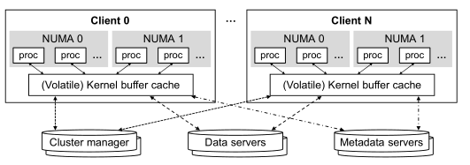
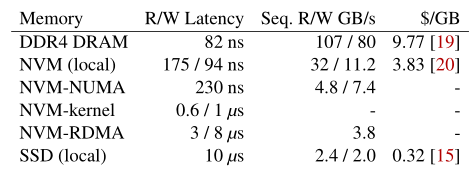
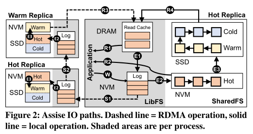

# 论文阅读笔记：

关于**Assise: Performance and Availability via Client-local NVM in a Distributed File System**这篇论文的笔记

[原文链接][Assise: Performance and Availability via Client-local NVM in a Distributed File System](https://www.usenix.org/conference/osdi20/presentation/anderson)

### 相关背景

在传统的分布式文件系统中，一般采用的是存储与应用程序分离的模式，在服务器端存储文件数据，在客户端运行应用程序。客户端的内存仅仅被当作一个易失性的缓存使用，该缓存保存的是文件系统的状态，被一个节点中的不同处理器共享，通过系统调用访问。在服务器端，除了保存数据和元数据，还需要保存文件系统的状态，并对集群进行管理。传统的分布式文件系统架构如下所示：

### 存在问题

采用这种存储分离模式存在的主要问题有以下三个方面。

#### 网络与内核延迟

内核的延迟主要表现在应用程序发出的请求，例如写操作，需要通过系统调用的方式进入内核，在这过程中存在开销；网络的延迟主要表现在如果缓存不命中，需要多次与元数据服务器进行网络通信以获取实际数据，在这过程中，即使采用RDMA也会造成较大的开销。

#### 固定页面块

在客户端中以固定的页面块粒度管理缓存，这种方式会放大许多分布式应用程序典型的小IO操作，同时当IO大于块大小时，会增加缓存的一致性开销。

#### 故障重建

出现故障时需要从头开始重建故障客户端的缓存，这意味着需要很长的故障切换时间重新建立应用程序级服务，并且在恢复期间需要有很高的网络利用率。

### 引入NVM

在使用NVM之前，分布式应用程序需要考虑到多种不同的工作负载，例如IO粒度、分片模式和一致性要求，为了满足这些需求，往往需要做出权衡，例如在小IO之前支持大传输，或者在崩溃一致性和快速恢复之前支持稳态性能。但随着NVM的普及，这些权衡需要重新评估，这是因为NVM具有以下两方面的优势：

- 在性能上，量化的比较如下图所示，可以看到不同的NVM访问方式在性能上也存在差异，其中本地访问NVM在读写延迟方面接近DRAM，而用RDMA访问NVM在读写延迟方面也优于本地访问SSD。

- 在快速恢复方面，NVM能够为热数据提供可恢复的缓存，常见的故障一般是软件崩溃导致的，只需要重启即可，而NVM可以保证数据在重启之后保持不变。

### Assise

从以上传统分布式文件系统存在的问题和NVM的优势出发设计了Assise分布式文件系统。这种文件系统设计的主要目的是为了将NVM的性能最大化，而从不同方式访问NVM的性能差异可以看出，最好的方式是在本地访问NVM，基于这点出发，就需要将数据保存在客户端节点上，同时需要设计新的协议和模式用于解决这种架构带来的一致性等方面的问题。Assise架构如下所示：

它的特性主要有以下几点：

- 本地进程、套接字、节点NVM的普及和持久缓存
- 没有内核参与、块放大和不必要的一致性开销
- 即时的应用程序故障切换
- 节点恢复时间大大缩短
- 更低的读取延迟

在Assise中避免了远程存储服务器的使用，文件数据都保存在客户端节点本地，使用高速缓存一致性层（CC-NVM）对缓存的文件系统状态进行服务，主要是为了保证崩溃一致性.

具体来说，CC-NVM提供了前缀崩溃一致性(prefix crash consistency)；为所有IO操作提供了线性化能力(linearizability)；链式复制(chain-replicate所有的文件系统更新。

在Assise中，进程通过库文件系统(LibFS)直接访问本地NVM中缓存的文件系统状态，其中的库文件系统能够复制为热副本用于故障恢复。CC-NVM通过每个套接字中的守护程序(SharedFS)与集群管理服务器(Cluster manager)共同作用分层协调多个LibFS

以下介绍Assise中的几个重要功能的具体实现

#### IO操作

IO操作的总体流程如下图所示：

对于应用程序的写操作，具体流程如下：

1. LibFS直接写入NVM中的进程本地缓存(**W**)，该缓存的形式是更新日志，代替了传统的块缓存
2. 通过RDMA的方式将更新日志链式复制到其他副本的日志中（**S1**，**S2**），用于故障恢复，复制链的最后一个节点在完成复制后会发送一个确认信号表示链式复制完成
3. 当更新日志的填充达到阈值时，将会启动驱逐(eviction)，采用LRU的淘汰策略，将数据先移至SharedFS的NVM中(**E2**)，再移至SSD中(**E3**)。对于热副本(hot replica)，NVM存的是热数据，而在温副本(warm replica)中，NVM存的是温数据，这是为了读操作中加速温数据的读取。对于复制链上的所有副本，它们的驱逐都是并行完成的，在结束之后会进行确认，确保所有副本缓存相同的状态，以实现快速故障切换。

对于应用程序的读操作，具体流程如下：

1. 首先读取本地LibFS中DRAM中的缓存(**R1**)
2. 如果DRAM中不存在，则检查本地SharedFS中的热缓存(**R2**)
3. 如果本地热缓存中不存在，并行检查温副本的NVM和本地的SSD(**R3**,**R4**)
4. 对于本地SSD中和远端NVM中的数据，本地的LibFS会进行预取操作，保存在本地的RDMA中，除了预取需要的数据以外，还会将其中剩余的数据一起取出，同时需要对这些预取的数据进行驱逐处理，将它们转移至本地的更新日志中(**E1**)

#### 一致性

在Assise中，用CC-NVM在进程间共享文件系统状态，提供可线性化的分布式缓存一致性，在奔溃时提供前缀语义，同时实现了可扩展访问。

对于前缀奔溃一致性的实现，CC-NVM需要跟踪本地NVM中更新日志的写入顺序，在链复制时，再利用RDMA的写入顺序，保证将日志写入副本。这样可以确保文件系统的更新能够持久化和可复制，并且写操作历史的前缀能够被恢复。

对于可线性化共享的实现，CC-NVM会序列化多个进程队共享状态的并发访问，如果发生奔溃，将通过租约机制恢复相同的序列化。租约机制类似于读写锁，到那时可以撤销并再超时后过期。租约用于授予对一组文件和目录的共享读和独占写权限，LibFS需要通过系统调用的方式从SharedFS获得租约，租约会一直保留到被SharedFS撤销，撤销一般是在另一个LibFS要访问租用的文件或者当前LibFS奔溃或租用超时时发生。在租约撤销被转移时，SharedFS会强制转移租约之前清除原租约持有人的读写缓存，并去车主覆盖的数据。SharedFS会记录和复制每次在NMV中租约的传输，以实现奔溃一致性。

对于可扩展访问，CC-NVM采用了层次化的方式。具体来说是将租约分层委托，集群管理器是委托树的树根，然后分发到SharedFS中，最后的LibFS作为委托树的叶子节点。LibFS首先会向本地的SharedFS请求租约，如果本地SharedFS不持有租约，那么会进一步咨询集群管理器。如果目前没有任何租约持有者，那么集群管理器会赋予请求的SharedFS租约，并委托给发出请求的LibFS；如果目前存在租约持有者，SharedFS会将请求转发给这个持有者，并缓存它的信息，完成租约的转移。这种分层管理的模式能够减少网络通信，从而减少授权过程中的开销。

#### 故障恢复

Assise将具有持久性的文件系统状态缓存在本地的NVM中，可用于快速恢复。对于不同类型的崩溃，Assise采用了不同的方式解决，一般常见的崩溃类型有以下几种：

- LibFS恢复，发生原因是应用程序进程的崩溃。在这种情况下，本地的SharedFS会驱逐崩溃的更新日志，恢复已完成的写入并撤销租约。然后在本地节点重新启动崩溃的进程，并立即重用所有文件系统，LibFS中的DRAM将被重建。
- SharedFS恢复，发生的原因是操作系统崩溃。在这种情况下，通过存储新启动的操作系统检查点，使用NVM加速操作系统的重启。启动后，Assise通过检查存储在NVM中的SharedFS日志，重新恢复之前运行的LibFS实例
- 缓存副本故障转移，发生原因是在电源故障或硬件问题等待节点恢复。此时会立即故障切换到热副本，该副本中的SharedFS会接管故障节点的租约管理，使用复制的SharedFS日志对任何应用程序副本重新授予租约。在故障节点停机期间对文件系统的写入会失效，为了跟踪写操作，集群管理器会维护一个纪元号(epoch number)，所有SharedFS会收到纪元更新的通知，每个纪元都会维护一个位图，用于记录该纪元写入的信息节点。
- 节点恢复，发生原因是节点奔溃。在这种情况下，集群管理器会确保所有节点的租约到期，然后才允许节点加入，重新加入后，启动SharedFS恢复。恢复过程中，SharedFS会使自崩溃以来写入的每个块失效。

#### 温副本

在Assise中，为了充分利用内存的层次结构，将远程的NVM作为第三级缓存，在本地的DRAM和本地的NVM之下，基于这种设计方式，引入了温副本(warm replica)。温副本会参与链式复制，接收文件系统的更新，但是在更新日志驱逐策略上有所不同，温副本会跟踪LibFS和SharedFS缓存之外的指定温数据的LRU链。温副本能够通过在NVM提供读取减少温数据的读延迟。

### 小结

Assise作为一个新型的分布式文件系统，将文件系统的元数据和数据与应用程序放在同一位置，提出了一种全新的崩溃一致性协议CC-NVM，以充分利用本地NVM的性能，同时提供可线性化。在NVM中使用热副本最大限度减少了应用程序恢复的时间并确保了数据的可用性。针对传统存储分离的分布式系统存在的问题提供了优化方案，具有更低的尾延迟，更高的吞吐量、可扩展性、可用性，更短的故障恢复时间。

