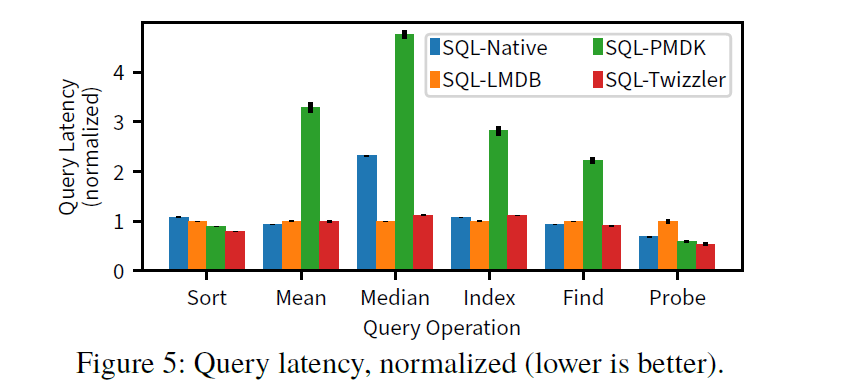
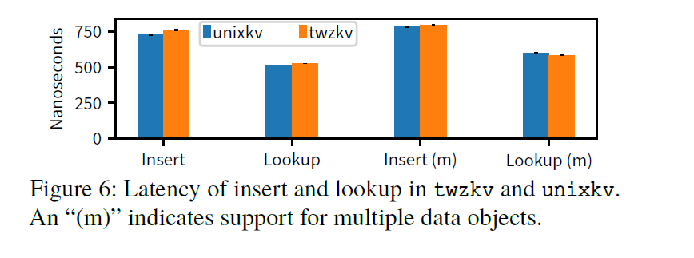

# 论文阅读笔记

论文题目为：
 **Twizzler: a Data-Centric OS for Non-Volatile Memory**

 [原文链接](https://www.usenix.org/conference/atc20/presentation/bittman)

## 0. 前言

> 持久化：这个概念是和"暂时"等概念相对的,数据在计算机中有一般有两个存储地,内存为暂存,因为电源关机就会数据丢失,如果需要反复使用,就要持久保存,实现持久化了。
> POSIX：可移植操作系统接口(英语：Portable Operating System Interface)是IEEE为要在各种UNIX操作系统上运行软件,而定义API的一系列互相关联的标准的总称。
> PMDK：全称Persistent Memory Development Kit ,它是一套用于在非易失性内存(Non-volatile Memory)上进程编程的用户态软件库。

## 1. 提出背景

### 1.1 问题发现

在当前的操作系统设计中,易失性内存和高延迟持久性存储的分离要求操作系统管理数据的临时副本并在持久性操作中介入。如下图所示,获得持久性的旧方式:将显式加载到易失性内存中的数据反序列化,再使用该数据,而后重新序列化,然后显式地将它存储到磁盘中。

当前的持久化数据操作,其标志是有大量内核参与、需要数据序列化。但是,将低延迟可直接附加的 NVM 引入内存层次结构,这种核心设计显然是不足的,无法有效的利用 NVM 的优点。

- NVM 的低延迟特性：访问 NVM 的系统调用的成本在访问本身的延迟中占主导地位。

- 第二个特性是处理器可以使用加载和存储指令直接访问持久存储。对 NVM 的直接、低延迟访问意味着显式序列化不适合——它增加了复杂性,因为程序员必须维护不同的数据格式和它们之间的转换,并且由于 NVM 的低延迟,开销是无法忍受的。

而现有的 POSIX 模型和 PMDK 模型或多或少的都有缺陷：
**POSIX**

- 具有显式持久化和数据访问
- 多种形式的数据转化
- 大量的内核参与

**PMDK**

- 没有操作系统支持
- 数据共享难
- 慢指针

### 1.2 Data Centric OS

操作系统要最有效地使用 NVM 的两个基本要求：
**①.从持久性路径中删除内核**
持久化数据的系统调用代价高昂,我们必须为程序提供轻量级的、直接的、内存式的访问来操作持久数据。

**②.设计永远持续的指针**
长寿命数据结构可以直接引用持久数据,因此指针必须与它们指向的数据具有相同的生命周期。相比之下,虚拟内存映射是短暂的,因此不能有效地命名持久数据。根据定义,持久数据由多个参与者同时或随着时间的推移访问,因此必须以一种有助于共享而无需与特定参与者相关联的短暂上下文形式来存储。

将满足这两个要求的操作系统称为以数据为中心,而不是当前以流程为中心的操作系统。

- 对持久内存中数据结构的操作是以数据为中心的操作系统的主要功能,操作系统试图避免对此类操作进行干预,而是仅在必要时进行干预,以确保安全性和隔离等属性。
- 为了满足这两个要求,以数据为中心的操作系统必须提供有效的抽象来识别独立于数据位置的数据,构建不依赖于临时上下文的持久数据关系,并促进持久数据的共享和保护。

## 2. 设计思路

根据以上背景信息,我们希望设计一种模型,其中持久数据作为内存数据结构进行维护,而不是序列化或显式加载、卸载。为了避免序列化,这个模型必须支持在任何执行上下文都有效的持久指针,而不仅仅是创建它们的上下文。

本篇文章设计的 Twizzler 的目标就是：

- 少量的内核介入
- 普遍功能的支持(例如：安全性、共享性、一致性)
- 实现低开销的持久性指针

## 3. Twizzler的设计

Twizzler 是一个独立的内核,并在用户空间运行时为程序提供执行支持。下图显示了系统组织的概览以及系统的不同部分如何对数据对象进行操作。
 

Twizzler 的内核为用户空间库 **(称为libtwz)** 提供足够的服务,为应用程序提供执行环境。libtwz的主要工作是管理持久对象到地址空间的映射并处理持久指针。

为了兼容 POSIX ,作者通过 twix 提供 POSIX 支持,twix 是一个模拟 Linux 系统调用的库。修改了 musl ,这是一个所有程序都链接到的 C 库,将syscall指令的调用替换为对 twix 的调用,twix 在内部跟踪 Unix 状态,如文件描述符。这样对数据对象的操作完全在用户空间中处理,会减少对 memcpy 的调用。

Twizzler也提供了线程、地址空间、持久对象和安全上下文的概念。以下从各方面介绍Twizzler的设计。

### 3.1 对象管理

Twizzler 将数据组织成对象,这些对象可能是持久的。每个对象都由一个唯一的 128 位对象 ID 标识。对象提供连续的内存区域,这些区域组织具有相似生命周期的语义相关数据。应用程序通过映射服务访问对象,方法是将每个对象映射到地址空间中的一个连续范围。

内核为对象管理提供服务,例如创建和删除对象。

- 对象由 create 系统调用创建,它返回一个对象 ID。程序还可以选择向 create 调用提供现有对象 ID ,说明新对象应该是现有对象的副本。Twizzler 对此使用 copy-on-write。

- 通过 delete 系统调用删除对象。像 Unix 的 unlink 一样,对象是引用计数的,其中引用指的是地址空间中的映射。一旦引用计数达到零,对象就可以被删除。

### 3.2 地址空间管理

为了支持用户空间对地址空间的操作,内核和用户空间共享一个定义地址空间布局的对象(称为"***视图***")。视图只是一个普通对象,因此标准访问控制机制适用于强制隔离。

- 当应用程序将对象映射到它们的地址空间时,它们会更新视图以指定特定对象应该在特定位置可寻址。然后内核读取对象并确定请求的虚拟地址空间布局。视图对象像页表一样布局,其中表中的每个条目对应于虚拟地址空间中的一个插槽。每个表条目包含对象ID和读取,写入,以及(如执行保护位,以进一步保护对象的访问)。

- 当页面错误发生时,错误处理程序尝试通过执行写时复制、检查权限或尝试将对象映射到插槽来处理错误。如果它无法处理故障(由于保护错误或视图对象中的空条目),它会将故障提升到libtwz处理它的用户空间,可能通过终止线程,或者可能通过映射对象。当内核将一个对象映射到一个槽中时,它会相应地更新地址空间的页表。

- 当线程向视图对象添加条目时,它们不需要通知内核,当发生故障时,内核会根据需要读取条目。但是,当更改或删除条目时,线程必须通知内核,以便它可以更新现有的页表条目。

### 3.3 持久性指针

Twizzler 提供跨对象的持久指针,指针不是指向虚拟地址,而是通过对object-id : offset元组进行 ***编码*** 来指向对象内的偏移量。
为了更有效地编码这个元组,通过每个对象的外部对象表 (FOT)使用索引,该表位于每个对象内的已知偏移量处。

- 这使指针能够引用持久数据,但它也允许对象具有引用全局对象空间中任何对象中的数据的外部指针。

- 如下图所示,FOT 是一个条目数组,每个条目存储一个对象 ID。跨对象指针存储为 64 位FOT_idx:offset值,其中FOT_idx是 FOT 的索引。这将提供了大偏移量和大量对象 ID ,因为 ID 不存储在指针本身中。

- 取消引用时,Twizzler 使用指针的FOT_idx部分作为 FOT 的索引,检索对象 ID。FOT 和跨对象指针的组合在逻辑上形成了一个object-id:offset对。

 

- 此外,Twizzler 将数据对象的命名空间扩展到一台机器之外,独立于机器的数据引用是跨对象指针的自然结果。

现有解决方案在这种可扩展性方面受到限制。它们要么限制 ID 空间(在指针中存储 ID 所必需的),从而在共享时需要复杂的协调或序列化；要么需要额外的状态(例如每个进程或每个机器的 ID 表)必须与数据一起共享,迫使接收机器"修复"引用。更糟糕的是,修复是特定于应用程序的,因为对象 ID 位于任何指针内,而不是通常已知的位置。

每个对象 FOT 导致更容易共享的自包含对象,从而更好地与远程共享​​内存系统交互。

指针转换在两个libtwz函数的帮助下发生：ptr_lea(加载有效地址)和ptr_store。

- 当程序取消引用指针时,它首先调用ptr_lea。通过在 FOT 中查找,指针被解析为对象 ID 和偏移量对,之后libtwz确定引用的对象是否已经被映射(通过维护每个视图的元数据)。如果没有,它会在视图中选择一个空槽并将对象映射到那里(一种不调用内核的廉价操作)。映射后,libtwz将对象的临时虚拟基地址与偏移量组合在一起,并返回新指针。所述ptr_store函数做的相对ptr_lea ,它将虚拟指针转换为持久指针。

- FOT 管理由libtwz处理。虽然在 FOT 中查找是一个简单的数组索引操作,但存储可能需要添加到 FOT。为了避免重复条目,libtwz 会遍历FOT 寻找兼容的条目。如果没有找到,它会自动保留一个新条目并在存储指针之前填充它(刷新缓存行以保留它)。

- 翻译指针的开销很小并且结果可以被缓存。Twizzler 通过先前翻译的每个对象缓存来提高性能。

### 3.4 安全与访问控制

Twizzler 对基于内存的对象的关注要求我们围绕基于硬件的执行设计安全模型,其中 MMU 会检查每次访问。这种设计在以数据为中心的操作系统中是不可避免的,因为内核并不参与每个内存访问。内核仅在映射对象时指定访问权限,然后依靠硬件以低开销强制执行这些权限。

Twizzler做出的一个关键设计选择是对安全性的后期绑定。

- 应用程序请求访问具有所需权限的对象。如果他们仅以允许的方式访问对象(例如,只读取只读对象),则不会发生错误。这是因为当映射一个对象(通过视图)时,内核不会立即参与,因此无法在映射时检查特定访问的访问权限。例如,如果一个程序读取对象A,并且该程序被允许读取A,即使它请求对对象进行读写访问,也应该允许它执行读取。这种后期绑定支持更简单的程序,无需担心通过重新映射数据对象来提升访问权限。程序可以在事先不知道它们可能访问的对象的权限的情况下取得进展,从而使操作系统的访问控制机制能够在应用程序中重用。

- Unix 类似的 OS 中的安全上下文抽象需要维护对一组根本不同的事物(例如路径、虚拟内存位置和系统调用)的访问权限。相反,Twizzler 的安全上下文通过 ID 而不是虚拟地址指定对对象的访问权限。这也使安全上下文持久化,允许将它们用作为线程分配安全角色的主要方式。

### 3.5 崩溃一致性

- Twizzler 提供了用于构建崩溃一致性数据结构的原语。在低层次上,它提供了一种写入机制返回缓存行。应用程序在 Twizzler 之外使用这些原语来构建对崩溃一致性数据结构的更大、更复杂的支持。

- Twizzler 还提供了事务持久性日志记录机制。程序员可以编写TXSTART – TXEND块来表示事务和TXRECORD语句来记录预先更改的值。这类似于 PMDK 提供的机制。如果应用程序需要使用不同日志记录机制的更复杂的事务,它们可以使用库。

- Twizzler 提供了一种机制,用于在崩溃后恢复供电时重新启动线程。由于视图是持久对象,线程执行期间的所有映射对象在电源循环中都是已知的,并被映射回。然后线程在特殊的_resume入口点启动,允许程序处理特定于应用程序的电源故障,访问程序在断电时程序状态(数据段、堆等)。

## 4. 评估

作者评估 Twizzler 的主要目标是：

1. 表明 Twizzler 在能够满足以数据为中心的 OS 的需求,使得程序能直接访问持久数据。
2. 证明定义的编程模型提供了足够的能力来轻松有效地构建具有 NVM 的真实应用程序。
3. 衡量系统的性能以了解Twizzler提升和丢失性能的地方。

作者通过两种方式实现了这些目标：移植现有软件 (SQLite) 和为 Twizzler 编写新软件。第一个展示了编程环境的通用性(遗留软件可以很容易地移植)和即使对于遗留软件也有潜在的性能提升。第二个展示了 Twizzler 编程模型的真正力量,并允许我们充分探索我们的设计选择的后果,而不受传统设计的约束。

### 4.1 编写新软件

构建三个新软件来评价：
基于哈希表的键值存储 (KVS)、红黑树数据结构和日志守护程序。每个都有不同的特征和目标,它们一起展示了 Twizzler 在允许简单实现、几乎免费的访问控制以及直接表达对象之间复杂关系的能力方面的灵活性。使用我们的 KVS 和红黑树代码,将 SQLite连同 YCSB驱动程序一起移植到 Twizzler,使我们能够在更大的范围内探索 Twizzler 的模型,现有的程序可以让我们在一个复杂的系统中研究 Twizzler 的性能,该系统可以存储和处理数据。

#### 键值存储

我们实现了一个基于多线程哈希表的键值存储 (KVS),称为twzkv,以研究跨对象指针和我们的访问控制的后期绑定。twzkv 支持按键(任意大小)插入、查找和删除值,并在查找期间分发指向持久数据的直接指针。在插入期间,它在索引插入的键和值之前将数据复制到数据区域。

在 twzkv 中实现访问控制涉及让索引引用多个数据对象中的数据,为这些对象分配不同的访问权限,并根据所需的访问权限从这些对象中进行分配。由于 Twizzler 的跨对象指针的透明性,我们能够在保留原始代码的同时实现这一点。在插入时,应用程序指示要将数据复制到的数据对象,如下图所示。

 

通过支持多个数据对象,twzkv可以利用操作系统的访问控制,避免复杂性。无限制数据可以进入 D0 ,而受限数据可以进入D1。由于每个对象都有不同的访问控制,用户可以设置对象的访问权限,然后根据策略决定插入数据的位置。无论数据对象的访问限制如何,索引都指向正确的位置,并且twzkv仍然分发直接指针,但是被限制访问 D1 中的数据的用户将无法取消引用该指针。

与 Unix 实现的比较。为了与现有技术进行比较,仅使用Unix功能(称为unixkv)构建了一个类似的 KVS。

- 它也将索引和数据分开,但它必须手动计算和构造指针。
- 在unixkv 中支持多个数据对象很复杂,因为我们必须在索引中存储和处理文件路径,并存储对指针路径的引用,增加了36% 的开销和代码复杂性。这对于指针相对较少的实现来说是很多的。
- 在unixkv中只是为了重新实现 Twizzler 的支持,额外的复杂性还包括手动打开、映射和增长文件的代码,其中大部分在Twizzler中由Twizzler内部处理。
- 由于手动指针处理,开发 unixkv 时出现开发twzkv时不存在的错误延长了开发时间。
- 虽然twzkv获得了透明的访问控制,但unixkv没有,因为缺乏按需对象映射和安全性的后期绑定。相反,unixkv需要在映射之前知道对象权限,这是一个限制重用操作系统访问控制能力的限制,twzkv可以通过安全性的后期绑定来利用这一点。

#### 红黑树

- unixrbt使用特定于应用程序的解决方案来管理指针；如果其他应用程序想要使用由unixrbt创建的数据结构,他们将必须知道指针系统的实现细节(或共享实现,从而重新实现 Twizzler 的大部分库)。此外,由于 Twizzler 改进了对跨对象指针的系统范围支持,这些转换可以自动进行。

- 与 twzrbt 不同,unixrbt 的树仅限于单个持久对象； 阻止树任意增长的限制,不允许它直接编码对树对象之外的数据的引用,并且不会获得上面针对 twzkv 讨论的跨对象数据引用的好处。 将对此的支持添加到 unixrbt 需要修改核心数据结构以包含路径并显着改变代码,将其长度增加至少 2 倍,而 twzrbt 免费获得此功能。

- twzrbt 的另一个优点是与 unixrbt 相比减少了支持代码； unixrbt 需要代码来管理和增长文件和映射,而我们将 twzrbt 实现为简单的数据结构代码,Twizzler 管理这种复杂性。 unixrbt 中额外的错误处理代码和指针有效性检查(在 Twizzler 中自动处理)增加了开发时间和实现复杂性。

### 4.2 移植SQLite

将 SQLite 移植到 Twizzler 以展示 Twizzler 对现有软件的支持,并评估为 Twizzler 设计的 SQLite 后端的性能。

- 对 LMDB 接口的实现证实了我们从 KVS 案例研究中获得的经验：存储接口和实现的大部分复杂性来自存储和内存之间的分离。但 NVM 的出现极大地改变了游戏规则,允许程序员直接通过内存中的数据结构进行思考。结果是像 KVS 中的游标这样的接口变得多余。我们为 LMDB 实现了这个接口,但这些函数主要是围绕存储指向 B 树节点的指针和直接遍历树而无需单独加载和复制的包装。结果是一个非常简单的实现 (500 LoC),仍然满足所需的接口。未来的 NVM 软件可以使用 Twizzler 的编程模型来更有效地编写软件,从而避免对由两层存储层次结构强制的复杂性的需求。

## 5. 性能比较

测量 KVS 和红黑树的性能,执行了微基准测试 ,并针对 SQLite、SQLightning 的 Linux (Ubuntu 19.10) 实例评估了 SQLite 的 Twizzler 端口,以及我们的 SQLite 到 PMDK 的端口。 测试在运行频率为 2.30 GHz、192 GB DRAM 和 128 GB 英特尔 Persistent DIMM 的 Intel Xeon Gold 5218 CPU 上运行。 我们针对 musl C 库而不是 glibc 编译了所有测试,因为 Twizzler 使用 musl 来支持 Unix 程序。

> 基准测试程序(Benchmark): 是用来测量机器的硬件最高实际运行性能,以及软件优化的性能提升效果。

 

上表显示了常见的 Twizzler 函数的延迟,包括指针转换。显示的解析指针的开销不包括取消引用最终结果,因为无论指针如何解析都是必需的。

我们运行了四种 SQLite 变体,三种在 Linux 上,一种在 Twizzler 上,并比较了它们的性能：

- “SQL-Native”(未修改的 SQLite)
- “SQL-LMDB”(使用 LMDB 作为存储后端的 SQLite)
- “SQL- PMDK”(SQLite 在 PMDK 上使用我们的红黑树)
- “SQL-Twizzler”(我们在 Twizzler 上运行的 SQLite 端口)。

SQL-Native 以mmap模式运行,因此它和 SQL-LMDB 都使用mmap来访问数据。我们在相同的硬件上运行每个并标准化结果。

在标准 YCSB 工作负载下的吞吐量：

 

一百万行表上的查询延迟,测量了计算均值和中值、排序行、查找特定行、构建索引和探测索引的性能：

 

通过插入一百万个不同的键值对,然后按顺序查找每个键值对,将twzkv与unixkv进行了比较：

 

- 在unixrbt和twzrbt上测量了插入和查找 100 万个 32 位整数的延迟。twzrbt的插入和查找延迟为 528±3 ns和 251.8±0.5 ns而unixrbt 的插入和查找延迟分别为 515±2 ns 和 213±1 ns。适度的开销伴随着显着提高的灵活性,因为unixrbt不支持跨对象树,并且支持代码较少(unixrbt手动实现映射和指针转换)。

## 6. 总结

Twizzler 相对于现有的系统的优势：

- Twizzler 可以直接的操作持久数据不需要序列化
- 能够更加轻松的进行程序间的数据共享
- Twizzler 有更简单更灵活的跨对象指针操作
- Twizzler 也可以兼容现有的软件
- 在 Twizzler 上编程更加简单易用

对Twizzler上编写的软件和移植软件的性能比较：

- Twizzler 对现有软件的性能没有太大的提升,也没有降低性能
- 在 Twizzler 上编写软件更加的简便灵活

总之论文做出贡献如下：
Twizzler 展示了一个前进的方向：一个围绕 NVM 设计的操作系统,它为直接访问内存提供了新的、高效且易于使用的语义。Twizzler 中的跨对象指针允许程序员通过从持久数据访问路径中删除内核,以低开销轻松构建可组合和可扩展的应用程序,从而提高灵活性和性能。尽管(小)指针转换开销,我们更简单的编程模型提高了性能。通过使程序能够轻松操作大型共享内存数据,即使是具有大 RAM 但没有持久内存的内存层次结构也能从我们的设计中受益。与现有系统相比,我们的编程模型易于使用,我们能够快速构建具有高级访问控制功能的真实应用程序原型,并移植现有软件 (SQLite)。

