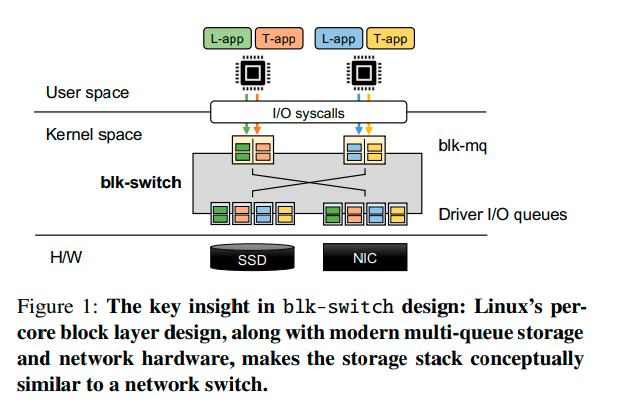
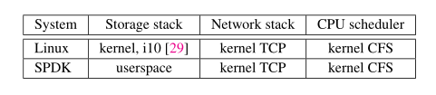
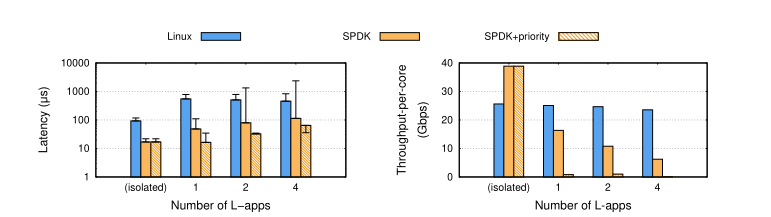
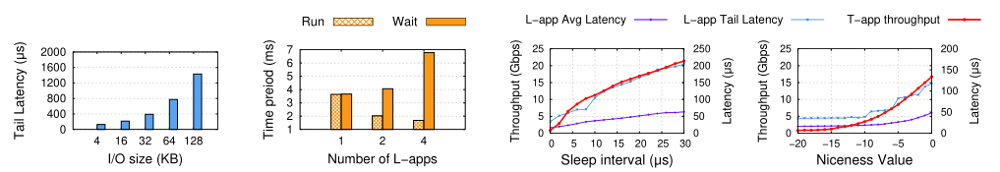
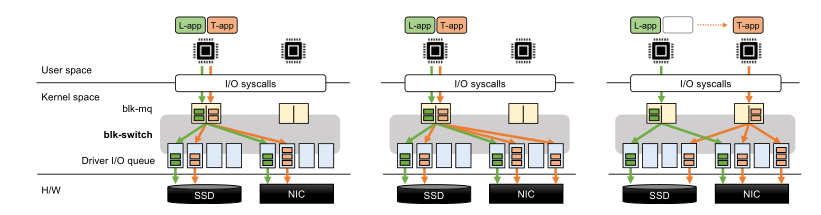
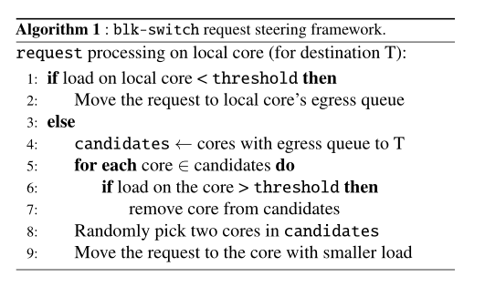
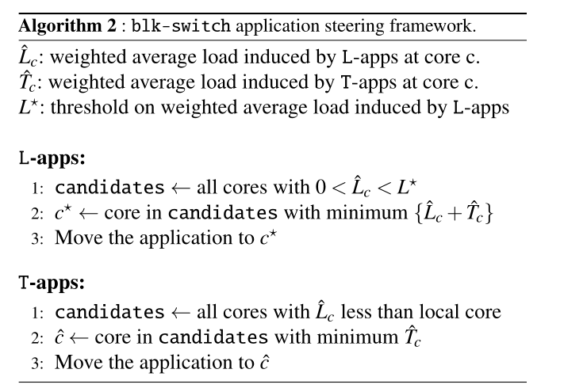
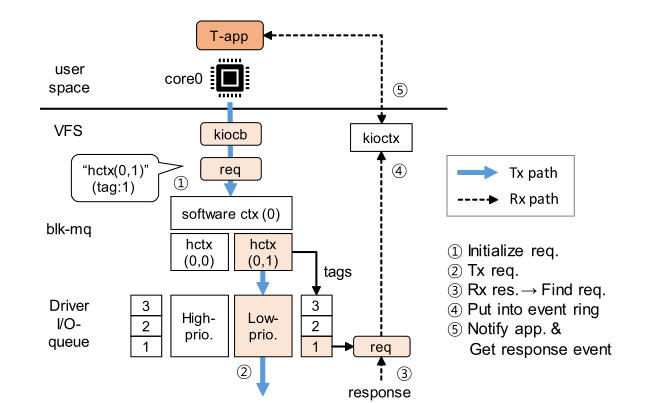
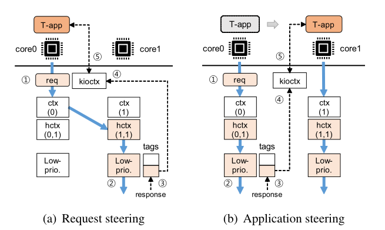

# 论文阅读笔记

论文题目为：
**Rearchitecting Linux Storage Stack  for µs Latency and High Throughput**

 [原文链接](https://www.usenix.org/conference/osdi21/presentation/hwang)

## 1.遇到的问题

存储和网络硬件性能改进巨大，但由于CPU的费用高昂，无法直接更换CPU，因此现CPU性能已经无法与其他性能改进巨大的硬件相比配。

资源复用原则在Linux中根深蒂固，以至于在常见的多租户（ multi-tenant）部署情况下性能会出现问题——当对延迟敏感的L-app与受吞吐量限制的T-app竞争主机计算和网络资源时，Linux无法提供µs规模的尾延迟。

尽管Linux取得了巨大的成功，但它已经成为现代应用程序和硬件的关键瓶颈

## 2.本文做的贡献

重新构建Linux存储堆栈，使得即使应用程序在接近硬件容量的吞吐量下执行读/写操作，Linux也可以实现µs规模的尾延迟。即使数十个L-apps和T-apps在内核堆栈的所有计算、存储和网络层上争夺主机资源，也可以同时保持低延迟和高吞吐量。并且这种性能可以在不修改应用程序、网络和存储硬件、内核CPU调度器和/或内核网络堆栈的情况下实现。

## 3.block-switch技术概述

引入block-switch技术：

在Linux的 per-core layer  queues，结合现代多队列存储和网络硬件，使存储堆栈在概念上类似于网络交换机，采用了计算机网络中的经典技术（例如，多个出口队列、单个请求的优先处理、负载均衡和交换机调度)。

为了实现上述观点，block-switch为Linux存储堆栈引入了一个per-core, multi-egress queue block layer架构(图1)。应用程序使用标准的Linux api来指定其性能目标，并提交读/写请求。在底层，对于每个应用程序类别，block-switch在per-core的基础上创建一个“出口”队列，该队列映射到底层设备驱动程序的唯一队列。这种多出口队列设计允许块交换将入口队列(应用端块层)与出口队列(设备端驱动程序)解耦，因为在某一个核上的入口队列上提交的请求现在可以在任何核上的出口队列上处理。块交换就像一个“交换机”——在每个单独的核心上，块交换根据应用程序的性能目标和跨核负载（load across cores），将提交在该核心的入口队列上的请求导向一个出口队列。

block-switch在这样的交换架构中集成了三个思想，可以同时为L-app(时延敏感的应用)提供µ-scale的尾延迟，为T-apps（吞吐受限的应用）提供高吞吐量：

1. 将来自L-apps的请求映射到核上的出口队列，并按优先级顺序处理未完成的请求。在每个单独的核上，L-app出口队列中的请求先于T-app出口队列处理。这确保了L-app观察到最小的延迟膨胀。但这种优先处理L-app,且按照优先级处理的方法容易造成T-app的饥饿（瞬时负载和持久负载）。

2. 瞬时负载：某个核上的L-app突然发出大量的请求（bursts of requests from an L-app on the same core）。
   
   解决方法：将应用程序端队列与设备端队列分离，并通过交换架构将它们互连，从而能够高效地实现不同的负载平衡策略。由此引入请求引导技术（request steering），在所有可用核的出口队列对来自T-app的请求进行负载平衡
   
3. 持久负载：在同一个核上，有多个L-app竞争资源（multiple contending L-apps on the same core）。
   
      解决方法：应用程序引导技术（application steering）：在较大的时间尺度上引导应用程序线程在不同的可用核之间交换，目的是最小化T-app和L-app之间的持续争用。
   
      由此可见，上述两个引导技术分别是在请求和线程两个级别上进行应用的。

## 4.介绍现有的存储栈结构

主要介绍了两种存储栈结构：

1. linux(包括远程存储堆栈）
2. SPDK(广泛部署的用户空间堆栈)

通过测量比较这两种存储栈结构得出了一系列结论。

### 4.1测量设置

表 1 总结了被评估系统（linux和SPDK）中使用的存储堆栈、网络堆栈和 CPU 调度程序。

 Linux 使用block multi-queue，将per-core software queues映射到底层设备驱动程序队列（用于本地存储访问的 NVMe 驱动程序和用以访问远程存储的i10队列）

SPDK 是一个基于轮询的系统，应用程序轮询它们自己的的 I/O 队列（用于本地存储访问）和/或它们各自的 TCP 套接字（用于远程存储访问）； 在底层，SPDK 使用它自己的驱动程序通过 TCP 访问远程存储设备。

具体的测量设置：

1. 硬件设置：单核CPU
2. 争用场景：一个 T-app 与越来越多的 L-apps 竞争，以在通过速度为100Gbps 的链接而连接的远程内存存储上执行读取请求。 并且让T-apps 产生大量的请求， L-apps 产生 4KB 的请求。为了确保公平比较，对于每个单独的系统，我们使用该系统的延迟-吞吐量曲线上的拐点设置 T-apps 的“理想”负载和请求大小。
3. 测量场景：隔离场景（每个应用程序都有自己的主机资源）和共享场景（所有应用程序共享主机资源）。

### 4.2测量结果与解释

图 2：当每个应用程序隔离运行时（服务器上没有其他应用程序），现有存储堆栈可以实现低延迟和高吞吐量。 然而，当多个应用程序竞争主机资源时，现有存储堆栈的性能就会出现问题——它们要么无法维持微秒级延迟（Linux 和 SPDK），要么无法维持高吞吐量（SPDK+优先级）。 随着越来越多的 L-app 与 T-app 竞争，性能进一步下降。

---

图 3：图 2现象的根本原因。（左-右）(a)：Linux 由于 HoL 阻塞而产生高尾延迟。 (b)：由于 CPU 调度程序执行 CPU 资源的公平调度，SPDK 产生高尾延迟和低吞吐量，导致每个应用程序的等待时间越来越长，运行时间越来越短。 (c, d): SPDK+priority产生 T-app 的完全饥饿； 增加 L-apps 的睡眠间隔和/或 优先级会导致 T-app 吞吐量增加，但代价是 L-apps 的平均和尾部延迟增加。见 §2.2 中的详细讨论。

---

如图（2）所示，Linux 实现了 118µs 的 P99 尾部延迟和 26Gbps 的单核吞吐量； 与 Linux 相比，SPDK 实现了减少5 倍的延迟和增加了 1.5 倍的吞吐量。

测量结果的解释：

1. 由于没有优先级划分而造成队头 (HoL) 阻塞

   在 Linux 存储堆栈的早期版本中，所有核提交的请求都在一个队列中处理，这就导致了导致跨多核争用以及HoL（head-of-line） 阻塞。 现在的 Linux 使用per-core block layer queues来缓解这些问题； 然而，我们发现 HoL 阻塞仍然可能发生在块层队列（较罕见）或设备驱动程序队列（更常见）。这是因为 Linux 存储堆栈使用a single per-core non-preemptive thread 来处理在同一个核上提交的所有请求。 当多个应用程序在一个核上竞争时，来自 T-apps 的大量请求会导致 HoL 阻塞，这会导致 L-apps 的高尾延迟； 我们在图 2 中观察到高达 7 倍的延迟。图 3(a) 显示，正如预期的那样，HoL 阻塞的影响随着 T-apps 的请求大小线性增加。

2. 由于没有优先级划分而造成CPU调度策略过于公平

   完全公平调度程序 (CFS)：在共享内核的应用程序之间平均分配 CPU 资源，毫秒时间尺度，分配时间片。当到达某个应用程序的时间片时，该应用程序完全占用核；因此，只有当应用程序使用完它的时间片后，调度程序才会将核从该应用程序中释放出来。因此在L-app时间片将要结束时才发起的请求会在极大地程度上被延迟处理，因为它们需要等到该程序下一个时间片到来时才能被处理。因此，即使一个 L-app 与一个 T-app 竞争，与孤立情况相比，SPDK 的尾部延迟也有 5 倍的膨胀；当多个 L-app 与一个 T-app 共享核心时，延迟膨胀增加到 108 倍甚至更高。由于 CPU 在竞争应用程序之间公平共享，因此这种基于轮询的系统不仅会产生巨大延迟，而且还会使得吞吐量下降（竞争核的应用程序越多，吞吐量下降越多）。

   对尾延迟的影响取决于两个因素:
   
   (1)单个时间片的长度;
   
   (2)连续时间片之间的时间间隔。
   
   前者决定了单个时间片内可以处理的请求数量，后者决定了在提交请求的时间片内无法处理的请求的“等待时间”。在我们的实验中，我们通过检查CFS调度器轨迹来衡量这两个因素。在图 3(b) 中，“Run”条显示给每个 L-app 的时间片的平均长度，“Wait”条显示每个 L-app 的连续时间片之间的平均时间间隔。我们发现，随着L-app数量的增加，单个L-app时间片的长度会减少，等待时间也会增加。这导致：
   
   (1).在时间片边界处的请求会遭受更大的延迟，因此尾延迟也会增加。
   
   (2) 大部分请求受到连续时间片之间的间隔的影响，因此平均延迟增加。
   
   ---

根据上面两个原因的分析发现，没有设置优先级会使得延迟和吞吐率不太理想，那么如果设置了优先级并严格遵守会产生什么样的结果呢？

1. 由于严格的优先级划分，吞吐量接近于零：基于轮询的设计中的饥饿现象。

   Linux CPU 调度程序允许对 L-app进行优先级排序。不幸的是，基于轮询的设计也不能与优先级很好地相互配合。我们重新运行上面的 SPDK 结果，并且使 L-apps 比 T-apps 具有更高的优先级。结果（“SPDK+priority”）表明，这种优先级划分会导致两个不良影响：

   1. T-app完全饥饿因为 L-apps 具有更高的优先级并且由于其基于轮询的设计而始终处于活动状态，因此调度程序不会抢占这些应用程序；
   2. 如果一个核上有多个 L-app 竞争，CPU 资源会在这些应用程序之间公平共享，导致平均延迟增加，但尾部延迟不会受到太大影响。这是因为，当给予更高的优先级时，L-app将获得更长的时间片，因此就能在每个时间片内处理更多的请求，而只剩下一小部分请求将受到时间片间隔的影响。因此，虽然时间片之间的等待时间增加，但在 99% 处看不到效果（但在更高的的百分数处可看到显着的增加）。这也是图 2 中4个L-app情况下实验结果的原因：尾部延迟比平均延迟更差（因为延迟分布极度偏向较高的百分位数）。

   ---
   在图 3(c) 中，我们重新运行单个 L-app 和 T-app 的情况，这次让 L-app 在提交请求后休眠一段时间，并改变这个间隔。 当 L-app 休眠时，允许 T-app 得到调度。 可以看出，增加睡眠间隔会导致 T-app 吞吐量增加。 然而，它是以增加 L-apps 的尾部延迟为代价的。 

   在图 3(d) 中，我们重复单个 L-app 和单个 T-app 实验，但通过调整优先级值来改变 L-app的优先级（较低的优先级值意味着更高的优先级）：T-app 的 优先级值值设置为 0， 并且我们将 L-app 优先级值从 -20（最高优先级）更改为 0。CFS 根据优先级值将时间片分配给进程。 因此，随着优先级值的增加，L-app 获得的 CPU 周期份额越来越小，导致 T-app 的份额增加。 结果，T-app 的吞吐量增加了，但代价是 L-app 的延迟增加。
   
   ---
   
### 4.3 结论

   经过测量对比后发现如下结论：

   1. 现有的基于Linux的解决方案由于行首阻塞（ head-of-line blocking）而面临很高的尾延迟，特别是在越来越常见的多租户部署中。
   2. 当每个应用程序都有一个专用内核时，基于轮询的存储堆栈（例如 SPDK）可以实现低延迟和高吞吐量。但是，当多个应用程序共享一个核时，这种解决方案也无法很好地实现低延迟和高吞吐率。
   3. 现有的存储堆栈是无法同时实现高吞吐量与低延迟的！

## 5. block-switch的设计

如上所述，blk-switch 建立在 Linux 的per-core block layer queues  与modern multi-queue storage and network hardware 相结合的基础之上，使存储堆栈（storage stack）在概念上类似于网络交换机。 blk-switch 为 Linux 存储堆栈引入了一个“交换”架构，允许应用程序提交的请求被引导到系统中的任何核心并在其上进行处理。

以下分别描述：

 1. 交换式架构，以及它如何启用 blk-switch 中的技术来实现 L-apps 的低延迟。

 2. 如何将应用端队列与设备端队列分离，并通过 blk-switch 的交换架构将它们互连，从而能够有效实现不同的负载均衡策略，从而实现 T-apps 的高吞吐量。

在详细介绍之前先做两个说明：

1. 使用单个目标设备（本地或远程存储服务器）描述 blk-switch 设计，因为与 Linux 类似，blk-switch 完全独立地处理每个目标设备。
2. blk-switch 不需要修改应用程序和/或系统接口——应用程序通过诸如 io_submit() 之类的标准 API 向内核提交 I/O 请求。与提供差异化服务的任何其他系统类似，blk-switch 必须确定应用程序目标。在 Linux 内核中，blk-switch 可以轻松完成这项任务：它使用标准的 Linux ionice 接口，允许为单个应用程序/进程 设置“调度等级（scheduling class）”（应用程序和/或内核请求提交接口无需做任何更改）。在当前的实现中，blk-switch 使用两个 ionice 等级来区分 L-apps 和 T-apps。很容易扩展 blk-switch 以支持额外的应用程序需求——例如，需要低延迟和高吞吐量的应用程序可以使用额外的应用程序等级（使用 ionice）来指定它们的性能目标，并且 blk-switch 可以以这样一种方式进行扩展：每个核不仅可以适当地确定优先级，而且还可以为此类应用程序的请求进行负载平衡。此外，如果性能目标随时间发生变化（例如，从延迟敏感请求到吞吐量敏感请求），ionice 接口还允许应用程序动态更改它们的等级。请注意，ionice 仅用于存储堆栈解释，与 CPU 调度优先级不同。

### 5.1 Block Layer is the New Switch

图 4：blk-switch 的设计说明。 （左）多出口队列架构：每个设备上的前两个和后两个队列分别用于左核和右核（每个应用类一个）； （中）请求转向机制：当左核的网卡队列出现短暂拥塞时，请求被转向到右核对应的队列； （右）应用转向机制：当左核 NIC 队列持续拥塞时，T-app 被转向右核。 见 第3节 的讨论。

---

1. 多个出口队列

   blk-switch 为 Linux 存储堆栈引入了一个 per-core, multi-egress queue block layer architecture。对于在服务器上运行的每一类应用程序，blk-switch 会在per-core 的基础上创建一个“egress”队列。每个队列都会被映射到唯一的底层设备驱动程序队列(用于本地存储访问的存储驱动程序，或用于远程存储访问的远程存储驱动程序)。blk-switch 分配一个专用内核线程来处理每个单独的出口队列，并根据应用程序性能目标为这些线程分配优先级。例如，在 L-apps 和 T-apps 的情况下，blk-switch 将最高优先级分配给处理 L-app 请求的线程（在发送和接收队列中）；因此，在每个单独的核上，内核 CPU 调度程序将优先处理 L-app 请求而不是 T-app 请求， T-app 请求处理线程会被立即抢占。因此，在隔离情况下，L-app 请求观察到的延迟是最小的：除了上下文切换的必要开销之外，延迟的唯一来源是该核上的其他 L-app 请求。

2. 将请求处理与处理应用程序的核分离

   1. 旧的设计：

      现有的block layer multi-queue 设计将request processing 与the core where the application submits the request紧密耦合。虽然在核未充分利用时有效，但这种设计可能会导致核的利用率不理想：如果一个内核 C0 过载而另一个内核 C1 负载不足，当前的存储堆栈则不会利用 C1 来处理在 C0 提交的请求。

   2. 新的设计：

      blk-switch 利用其多出口队列设计来构建交换式架构，以缓解此限制（图 4）：它允许在某个核提交的请求从该核的入口队列引导到任何其他核的出口队列（对应的应用程序类别），在该核（重定向后的核）上进行处理，并在该核上返回的响应重新路由回对应的应用程序核。虽然从应用程序核中解耦请求处理有一些开销（在延迟和 CPU 方面），但允许 blk-switch 有效地利用系统中的所有核。例如，在 L-app 和 T-app的情况下，blk-switch 可以引导请求并在轻负载的核上处理它们，从而提高 T-apps 的吞吐量。此外，在每个核上处理的请求中，blk-switch 继续提供隔离（isolation）：L-app 出口队列将优先处理来自L-app的请求。

### 5.2 请求引导

根据上面的描述，请求引导技术是为了解决瞬态负载的。在这种瞬态负载下，blk-switch 使用请求引导技术在可用核之间对系统进行负载平衡——它以单个 T-app 请求的粒度将瞬态过载核上的入口队列中的 T-app 请求引导到其他核上的出口队列。重要的是，blk-switch 仅对吞吐量受限的T-app执行请求引导。尽管请求转向会产生一些开销，但对于 T-apps 来说这是一个很好的权衡：在瞬态负载期间，blk-switch 能够有效地利用其他核的可用 CPU 周期来维持 T-app 的吞吐量。图 4（中）展示了一个例子。

做出请求转向决策需要对系统中各个核的瞬时负载进行估计。对于 I/O 是主要瓶颈的 T-apps，blk-switch 的多出口队列设计提供了一种有效的方法——使用 T-app 出口队列中未完成请求的瞬时字节和来确定瞬时 per-core 负载并将请求引导到负载较轻的核上。然而，如果没有任何额外的机制，这种方法可能会导致不完美的请求控制决策，因为它没有考虑许多其他重要因素（例如，排队延迟、请求类型为读/写、计算 I/O 比率等）；目前有大量关于估计核负载的研究，并且这些机制中的任何一个都可以纳入 blk-switch 决策制定中。

算法 1 显示了 blk-switch 的请求控制机制的通用框架。blk-switch 以单个请求的粒度执行请求控制。提交请求后，blk-switch 首先检查本地核是否可用：如果本地核上的负载小于阈值，则认为本地核心可用，并将请求排入其出口队列。这是为了确保 blk-switch 仅在必要时产生请求转向的开销。如果本地核心过载，blk-switch 使用基于二次幂选择 （power-of-two choices）[41] 的机制来选择一个核来引导请求。在到达同一目的地的出口队列中（如 3.1 节所述），它随机选择其中两个核，并将请求引导到负载较低的核心。二次幂选择是有效的，因为 

(1) 当本地核过载时，最多需要检查两个出口端口；

 (2)  it reduces contention between cores on queues since two cores are unlikely to write requests to the same core at the same time.

blk-switch 没有在远程存储服务器端实现请求引导；如果远程存储服务器出现短暂拥塞，那么应用端相应的出口队列就会建立起来。在这种情况下，我们的应用端的请求引导算法不会选择这个出口队列，而是将请求转发到其他核的队列。这样，应用程序端的请求引导就足以处理应用程序和远程存储服务器的瞬时拥塞。

### 5.3 应用程序引导

根据上面的描述，应用程序引导技术是为了解决持续负载的。应用程序引导，即通过以将线程从持续过载的核引导到某个未充分利用的核的方式将 CPU 分配给各个应用程序线程。图 4 展示了一个例子（右）。blk-switch 在粗粒度的时间尺度上执行应用程序转向（在我们的实现中，默认值为 10 毫秒），因为它仅用于处理持续负载。与请求引导不同，blk-switch 在应用端和远程存储服务器上都实现了应用引导；对于后者，它引导在 blk-switch 的接收端出口队列中处理的线程。

对于应用程序转向，blk-switch 使用类似于请求转向的框架，但做了修改（算法 2）。与请求转向框架不同，blk-switch 的应用程序引导中明确考虑了由 L-app 引起的核上的加权平均负载。原因：

1.进行应用转向是为了减少 L-apps 和 T-apps 之间的长期争用；因此，我们希望 T-apps 被引导到具有由 L-apps 引起的低加权平均负载的核（并且，新核上的 T-app 负载的加权平均值低于当前核）。

2.我们还希望可能将多个 L-apps 放在同一个核上，以进一步减少 L-apps 和 T-apps 之间的干扰——只要L-app在核上产生较低的加权平均负载，那么在核上共存L-app并不会对他们的性能产生负面影响。我们现在使用 L*  =100KB 的默认阈值来确保只有少量 L-apps 聚合在同一个核上。

## 6. blk-switch的实施细节

在Linux kernel 5.4.上进行修改，尽量重用当前内核存储栈的结构。最后修改的结果是：添加了928行代码——530 in blk-mq layer， 118 at device driver layer，280 for target-specific functions at remote storage layer.

 图5在blk-switch中T-app的请求数据通路 来自 T-app 的请求被转发到 T-app 出口队列，并从该 I/O 队列获取标签。Linux 维护了多种数据结构，以便将响应转发回正确的应用程序。blk-switch 使用了相同的基础架构。

Linux block layer overview.我们描述了 Linux 存储堆栈如何与异步 I/O 接口一起工作（参见图 5，但忽略优先级）。在创建 I/O 请求之前，应用程序需要使用 io_setup() 设置一个 I/O context ，它会在 VFS 层创建一个 kioctx 结构。这个 kioctx 包括:

 (1) 一个环形缓冲区，请求完成事件在其中排队 (so that the application pulls them up later asynchronously); 

(2) 应用进程信息，用于在新的完成事件准备好时唤醒应用程序。

每个 kioctx 都与一个context identifier关联。当应用程序提交带有context identifier的请求时，VFS 层会创建代表 I/O 请求的 kiocb，并使用identifier找到相应的 kioctx。kiocb 有一个指向 kioctx 的指针。block layer基于 kiocb 创建  bio instance，并将其封装在 request instance中：这包括与某个设备驱动程序 I/O 队列相关联的 hardware context (hctx)。在将请求转发到设备驱动队列之前，block layer需要获取一个tag number。tags 是一个请求指针数组，其大小与驱动队列的队列深度（ the queue depth of the driver queue）相同。block layer维护一个位图来记录tag的占用情况。当所有tag都被占用时（即驱动程序队列已满），block layer需要等待，直到某个tag可用。获取到tag后，再将请求发送到与 hctx 关联的驱动程序队列。

在设备上进行 I/O 处理后，响应将返回到具有相同tag number的核。内核使用tag number从标签数组中找到相应的请求实例，释放tag number，bio instance 中的 kiocb被取出，以便找到kioctx。最后，完成事件被排入 kioctx 的环形缓冲区，并向应用程序发送通知。

 图6在blk-switch中请求的数据通路  (a) (w/ request steering): request is steered to the queue on core1 via  hctx(1,1) acquiring a tag from the steered queue. The response comes back to the  steered queue on core1. (b) (w/ application steering): When an application is  moved from core0 to core1, the in-flight request, sent before application  steering, comes back on core0. blk-switch finds the corresponding kioctx via the  tag and wakes up the application.

blk-switch 请求引导的实现。由于每个 hctx 都被视为一个出口队列，因此请求引导算法的主要目标是在本地拥塞的情况下跨内核选择一个非拥塞的 hctx。blk-switch 维护请求引导算法所需的每个核的负载（updating on a per-request basis）。之后，请求将从被引导到的 hctx 中获取一个tag 。一旦请求进入相应的驱动程序队列，下面的驱动程序级和块层接收处理，该处理将在与引导hctx相关联的核心上完成。当响应从设备返回到内核时，我们能够从tag中找到被引导的请求实例；因此，返回原始 kioctx 很简单，因为可以从请求实例中取出 kioctx（图 6（a））。内核通过 kioctx 向在 与入口端口关联的内核上运行的 应用程序发送唤醒信号。

blk-switch 应用程序引导的实现。在应用程序引导决定将应用程序移动到新的核时，blk-switch 调用 sched_setaffinity 内核函数来执行移动操作。完成此操作后，被移动的应用程序产生的请求将被提交到新核上的入口队列。blk-switch 维护应用程序引导所需的每个核的加权平均负载（基于每个请求更新）。即使在应用程序从一个核移动到另一个核期间存在“进行中”请求时，也很容易维护应用程序的语义。blk-switch 通过tag将“进行中”的请求转发给正确的应用程序（图 6（b））；与请求转向类似，blk-switch 能够找到跟踪应用程序位置的最初的kioctx，从而可以唤醒关联的应用程序。因此，可以将响应传送到对应的应用程序。

