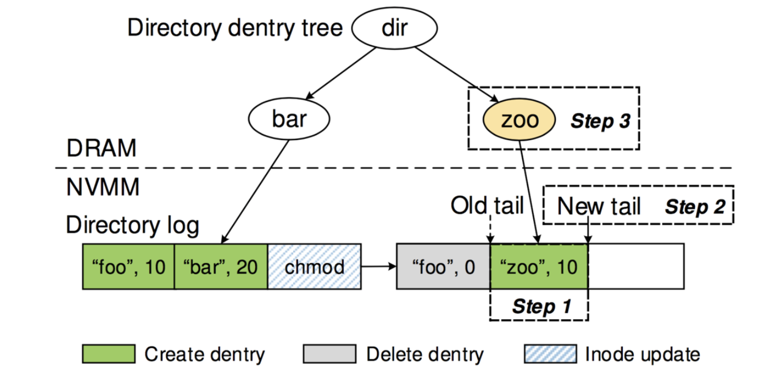
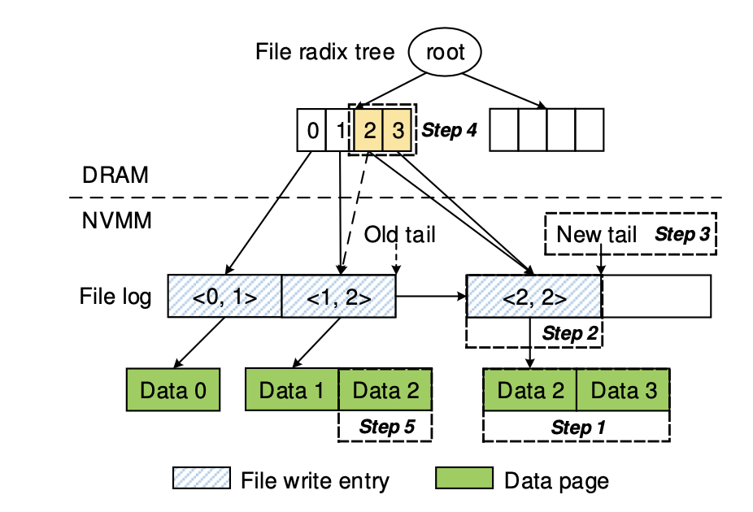
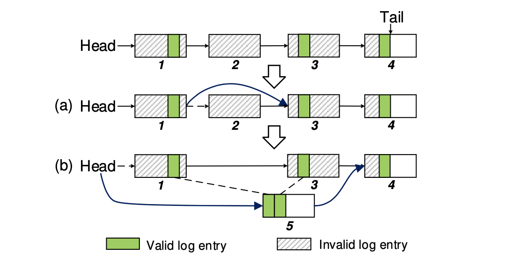
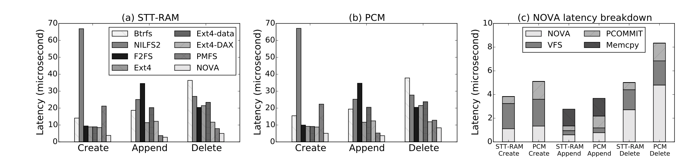
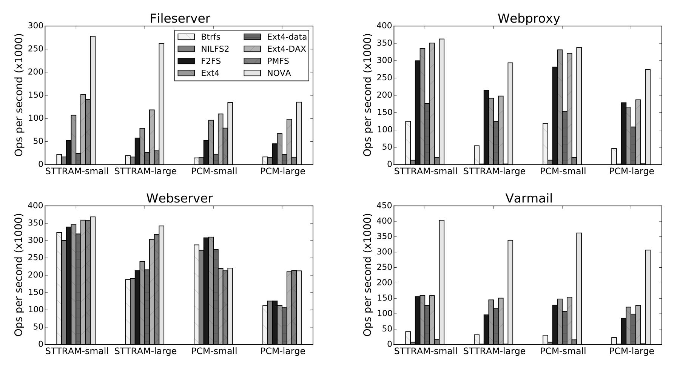

# 论文阅读笔记：

**NOVA: A Log-Strictured File System for Hybrid Volatile/Non-volatile Main Memories**

 [原文链接](https://www.usenix.org/system/files/conference/fast16/fast16-papers-xu.pdf)

### 概述

NOVA是一个DRAM+NVM混合内存文件系统，旨在最大化混合内存系统的性能，同时提供强大的一致性保证。NOVA调整了传统的日志结构，以利用NVM的快速随机访问能力。

NOVA为每个节点维护单独的日志，以提高并发性，并将文件数据存储在日志之外，以最大限度地减少日志大小，减少垃圾收集成本

NOVA的日志提供元数据、数据和mmap的原子性，并专注于简单性和可靠性，将复杂的元数据结构保存在DRAM中以加速查找操作。

实验结果表明，在写密集型工作负载中，与最先进的文件系统相比，NOVA提供了22%到216倍的吞吐量改进，与提供同样强大的数据一致性保障的文件系统相比，NOVA提供了3.1倍到13.5倍的改进。

### 提出问题

1. 数据一致性问题：

   现代CPU和内存系统可能会对数据进行重排序存储到内存从而提高性能，在系统故障时，数据的一致性会被破坏。为了弥补这一点，文件系统需要显式地从CPU的缓存中刷新数据以执行排序，这就增加了大量的开销，浪费了NVM的性能。

   主流的提供数据一致性的文件系统使用以下几种方法：

   1. Journaling：数据写入次数翻倍，浪费带宽

   2. Shadow Paging：从受影响的叶节点到根节点，要进行级连更新

      以上两种都需要严格排序，降低了性能

   3. Log-Structuring ：将小的随机写入请求组合成一个较大的顺序写入，硬盘和基于NAND闪存的固态硬盘（SSD）可以有效地处理。然而，传统的日志结构文件系统依赖于连续的空闲区域，而维护这些区域需要开销很大的垃圾收集操作。

2. 性能问题

   在传统的存储系统中，慢速存储设备（如磁盘）的延迟主导着访问延迟，因此软件效率并不重要。

   在NVM中，软件成本可以迅速支配存储延迟，浪费了性能。

   由于NVMM存储器具有较低的延迟，并且在处理器的存储器总线上，软件应该能够通过load和store直接访问它们。

3. 写重排序

   处理器及其缓存层可以重排存储操作以提高性能。CPU的内存一致性协议对内存更新的顺序做出了保证，但现有的模型并没有对更新何时到达NVMM提供保证。因此，电源故障可能使数据处于不一致的状态。

   英特尔提出了面向NVM的新指令，包括clflushopt（clflush的一个更有效的版本）、clwb（明确写回一个缓存行而不使其失效）和PCOMMIT（强制存储到NVMM）。NOVA是以这些指令为基础建立的。

4. 原子性

    POSIX风格的文件系统语义要求许多操作是原子性的。存储设备通常只提供关于原子性的基本保证。磁盘提供了原子化的扇区写入，而处理器只保证8字节（或更小）、对齐的存储，是原子性的。为了建立文件系统所需要的更复杂的原子性更新，程序员必须使用更复杂的技术。

### 解决方案

#### 主要设计

在NVMM中保留日志，在DRAM中保留索引

给每个节点提供自己的日志

在复杂的原子更新中使用日志和轻量级日志。

将日志作为一个单链表来实现。

不记录文件数据。

#### 数据结构

1. **Superblock & Recovery inode**

   Superblock 包含了全局的文件系统信息，而 recovery inode 则存放了用于下一次启动加速 NOVA remount 的恢复信息

2. **inode tables**

   NOVA 首先会为每一个 inode table 初始化一个 2 MB 的 inodes array，每一个 inode 都是 128 byte 字节，所以给定一个 inode number，NOVA 会很容易就定位到对应的 inode。

   对于新增的 inode，NOVA 会使用 round-robin 算法，依次添加到各个 inode table 上面，保证整个 inodes 的均匀分布。如果一个 inode table 满了，NOVA 会再分配一个 2 MB 的 sub-table，并用链表串联起来。为了减少 inode table 的大小，每个 inode 上面有一个 bit 来表示是否 invalid，NOVA 就能重用这些 inode 给新的文件或者目录了。

   一个 inode 包含指向 log 的 head 和 tail 指针，log 是一个由 4 KB page 串联的链表，tail 一直指向的是最后一个提交的 log entry，当系统第一次访问 NOVA 的时候，NOVA 会通过遍历 head 到 tail 的所有 log 去重建 DRAM 里面的数据结构。

   NOVA在每个CPU维护一个节点表、日志和NVMM空闲页列表，以避免全局锁定和扩展性瓶颈。

3. **journal**

   NOVA 的 journal 是一个 4 KB 的环形 buffer，使用一对 `<enqueue, dequeue>` 指针来操作这个 buffer。Journal 主要是为了保证操作多个 inode 的原子性，首先 NOVA 会将更新追加到 inode 的各自 log 上面，然后开启一个事务，将涉及到的 log tail 写入当前 CPU 的 journal enqueue，并且更新 enqueue 指针，当 各个 inode 完成了自己的更新，NOVA 就更新 dequeue 指针到 enqueue，完成事务的提交。

4. **log/data pages**

#### 空间管理

在NOVA中，NVMM 给每个 CPU 分了一个内存池，然后将空闲的 page list 保存在了 DRAM 里面。

如果当前 CPU 内存池里面没有可用的 page，就从最大的内存池里进行分配。

#### 目录操作

NOVA中，目录包括两个部分：

1. NVMM中：

   1. directory entry (dentry) ：包括子文件/目录的名称、它的节点号和时间戳。
   2. inode update entry：NOVA将节点更新条目添加到目录的日志中，以记录对目录节点的更新。

2. DRAM中：

   radix tree：用于加速dentry的查询速度而维护的一个数据结构，key 是 dentry 名称的哈希值， tree 的子节点指向 log 中相应的 dentry

以添加节点为例，在添加“zoo”目录时，首先在 inode table 里面为 zoo 选择并初始化一个未使用的 inode，然后将 zoo 的 dentry 添加到目录的 log 里面，使用当前 CPU journal 更新 log tail ，对新的 inode 设置 valid 位，最后，将 zoo 添加到 radix tee 中。

#### 文件操作

NOVA 的文件 log 包含两种：

1. inode update entries

2.  write entries：描述写操作以及指向实际的data page。如果一次写入太大，NOVA 会使用多个 write entries，并将它们全部追加到 log 后面，然后最后更新 log tail。

向文件的第二页（<2，2>）写8KB（即2页）需要五个步骤：NOVA首先将数据副本写入新的页面（第1步）并附加文件写入条目（第2步）。然后，它更新日志尾部（步骤3）和弧度树（步骤4）。最后，NOVA将数据的旧版本返回给分配器（步骤5），如上图所示。

#### Atomic mmap

NOVA 使用了一种 atomic-mmap 的机制，它其实是使用了一个 replica pages，然后将实际修改的数据放到了 replica pages 上面，当用户调用了 msync 操作，NOVA 就会将相关的修改当做一次 write 操作处理，它会使用 movntq 指令将 replica pages 的数据拷贝到 data pages，然后在原子性的提交。

#### 垃圾回收

NOVA有两种垃圾回收方式：

1. **Fast GC** 

   当 NOVA 发现一个 log page 里面所有的 entries 都是 dead，可以通过更新page的指针直接回收这个 page。如上图(a)中，page2中国呢全为dead，因此只需将page1的next指针指向page3。

2. **Thorough GC**

   当一个 log page 中 live entries 的数量小于一半时，NOVA 会进行 Thorough GC。

   具体方法是将该页面中的 live entries 拷贝到另一个新的 log 上面，然后将指向该页面的指针指向新的 log，并且回收旧的 log，如上图(b)所示。

#### 关机和恢复

1. **正常关机后的恢复**

   NOVA将NVMM页面分配器状态存储在恢复节点的日志中，并在随后的重挂载中恢复分配器。由于NOVA在这种情况下不扫描任何节点日志，恢复过程非常快。

2. **失败/错误后的恢复** 

   发生崩溃后，NOVA通过扫描inode日志重建NVMM分配器信息。

   首先，NOVA检查每个日志并回滚任何未提交的事务，以恢复文件系统到一个一致的状态。

   第二，NOVA在每个CPU上启动一个恢复线程，并行扫描节点表，对节点表中的每个有效节点进行日志扫描。NOVA对目录内码和文件内码使用不同的恢复机制。对于目录节点，NOVA扫描日志的链接列表以列举它所占用的页面，但它不检查日志的内容。对于一个文件节点，NOVA读取日志中的写条目来列举数据页。

   在恢复扫描过程中，NOVA建立了一个缺失页面的位图，并根据结果重建分配器。这个过程完成后，文件系统就可以接受新的请求了。

#### NVMM保护

### 性能表现

1. Microbenchmarks：使用一个单线程的微基准来评估基本文件系统操作的延迟。该基准创建了10,000个文件，对每个文件进行16次4KB的追加，调用fsync来保持文件，最后将其删除。下图为在STT-RAM和PCM上，不同文件系统的性能。

   

2. Macrobenchmarks：本文选择了四个Filebench工作负载--Fileserver、Webproxy、Webserver和Varmail来评估NOVA的应用级性能。具体对比如下图。

   

3. 垃圾回收：在30s的测试中，Fast GC回收了11%的陈旧日志页。在一小时的测试中，回收了94%的页面。结果表明，在长期运行中，简单和低开销的FastGC的效率足以回收大部分过期的日志页。
4. 恢复：NOVA可以在1.2毫秒内重挂一个50GB的文件系统。

### Highlights

1. 通过修改日志结构的更新策略，数据和元数据修改的日志结构化原子提交，没有页级日志、影子分页或垃圾收集的成本，同时由于NVM的写入对数据的顺序性不敏感，因此不把日志作为磁盘上的物理顺序对象来维护。

2. 基于物理位置，NOVA元数据被分为两部分：

   内存部分支持有效的查找，但不提供原子支持；

   日志结构的NVM部分难以搜索（必须扫描日志），但支持有效的原子更新。

   在正常操作中，内存部分是由NVM部分懒散地构建的。当文件系统第一次被挂载时，只有基本的元数据从超级块中被初始化。当用户应用程序发出文件访问时，内存中的节点、目录、内存分配器等的表示是通过扫描日志和应用所有变化来初始化的。

### 总结思考：

NOVA作为五年前的论文，在NVM刚刚兴起时提出了一个非常具有使用前景的文件系统，但是依然存在一些问题：

1. NOVA仅适用x86-64架构，为每个CPU分配内存池，不利于在CPU数量不同的机器中移植
2. DAX是NVM的一个重要特性，但是NOVA并不支持，而是采用Atomic mmap，将数据拷贝到副本页面并反过来对其映射。在后续的工作中，作者对代码进行了修改以支持DAX，但由于其通过对已经映射到进程地址空间的文件部分禁用CoW来实现，因此无法使用write()来对映射到进程地址空间的文件进行写入，后续，在[NOVA Fortis](https://cseweb.ucsd.edu/~swanson/papers/SOSP2017-NOVAFortis.pdf)中，作者进行了解决。
3. 文中提到的Throught CG是非原子性的，在回收过程中发生系统崩溃，可能会导致数据的不一致。