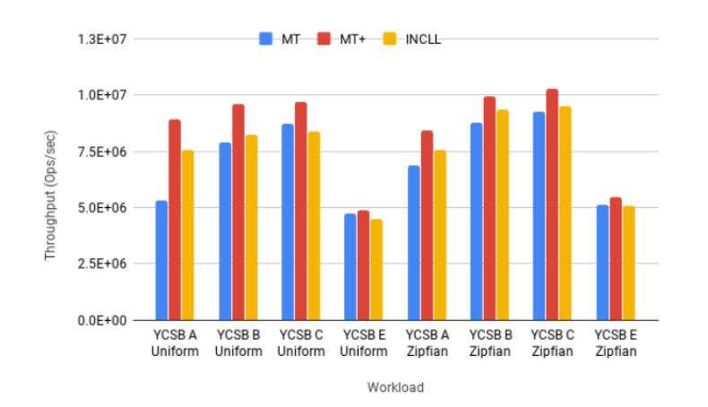

# 论文阅读笔记：

**Fine-Grain Checkpointing with In-Cache-Line Logging**

 [原文链接](https://arxiv.org/pdf/1902.00660.pdf)

### 概述

本文介绍了缓存内行日志（In-Cache Line Logging，InCLL），这是一种在某些非易失性数据结构中加速撤销日志的新技术。传统的基于撤销的日志记录，日志条目必须在脏数据之前到达持久的NVM，否则当系统崩溃时缓存内数据都会丢失，而且没有办法使用撤销镜像将系统状态恢复到之前的状态。

In-Cache Line Logging基于这样的事实：在如今的的商用NVM中，日志条目和脏数据（可以驻留在不同的缓存行中）之间的写入顺序必须通过缓存刷新和内存fence指令来执行，开销很大，但是同一缓存行中的数据写入顺序是固定的，没有额外开销。通过将缓存数据和日志放在同一缓存行中可以减小这种开销，要么数据与日志一同被持久化到内存中，要么两者均没有写入内存，始终保持数据的一致性。

### 提出问题

1. NVM的特性
   1. 由于NVM是字节寻址的，因此可以直接在NVM中存储高效的、基于指针的结构，如B+树或哈希图。在故障发生后，这些结构仍然保留在NVM中，使系统在重启和恢复数据后能够立即恢复
   2. 处理器的缓存是瞬时的。在断电期间，所有没有从高速缓存写到NVM的内存写入都会丢失。处理器内存系统也使将缓存行数据一致性写入NVM的任务变得复杂。缓存行并不是按照应用程序修改它们的顺序写回NVM，而是按照内存系统自己确定的缓存替换策略。因此，NVM需要解决的一个问题是，当意外断电时，如何保持NVM中的数据处于一致的状态。
2. 保持NVM一致性的方案
   1. 日志：日志为恢复过程提供了足够的信息，以便将结构恢复到一个一致的状态。但系统必须确保在修改数据之前将日志完全刷新到NVM。这就需要使用缓存刷新指令将脏的缓存行从缓存转移到NVM。这些回写只有在栅栏指令执行后才能保证完成，产生了昂贵的开销，因为它们需要一个完整的往返NVM的过程。
   2. 检查点：每隔一段时间，应用程序的整个状态就会被保存在耐用介质上。在故障发生后，最后记录的检查点被恢复到内存中，计算从这一点开始恢复，需要重新执行检查点和故障之间的工作。由于将应用程序的整个状态复制到慢速持久介质上是很昂贵的，大多数系统以不频繁的间隔（几分钟到几小时）进行检查点，以减少这种成本。检查点的间隔是记录检查点的开销和重新执行丢失的计算的成本之间的权衡。

### 解决方案

本文将细粒度检查点、In-Cache-Line日志和外部日志应用于Masstree以说明这些技术的优势。

**细粒度检查点**：以64ms为一个Epoch，在一个Epoch结束时，将缓存中所有的数据刷新到NVM，以确保下一个Epoch开始时数据是一致的。

**In-Cache-Line Logging**：

在本文对Masstree的修改中:

1. 将键值对数量改成14个，余下的一个8字节区域作为日志使用，分别为InCLL1和InCLL2，分别用于记录键值对0-6和7-14的修改（只能记录一次修改）。

2. 第一个缓存行包含permutation字段以及它的日志inCLLp、nodeEpoch 字段。permutation字段类似一个位图，用于记录数组中某个位置是否被占用。nodeEpoch用于记录当前的

**外部日志**：由于一个InCLL只有八位，能够处理的数据量有限，因此使用外部日志来记录相对复杂的操作。

**插入**：

无节点分裂时，首先记录permutation字段，然后写入键和值，最后更新nodeEpoch字段。有节点的分裂时，采用外部日志记录。

**删除**：

删除键值对时，只需要将对应的permutation位置为无效即可。但有一种情况例外：在同一个Epoch中，对键值对的同一位置先删除再插入，插入的新值会覆盖InCLL中对被删除的值的记录，如果此时系统故障进行恢复，将无法恢复到上一个Epoch，因此这种情况下采用外部日志。

**更新**：

由于更新需要记录更新的位置以及之前的数据，因此需要更多的位，但如果使用两个字节，会减小一个Masstree节点中键值对的数量，因此本文选择将两个InCLL压缩在一个字节中，0-3位用来记录被修改的键值对序号（0-6和7-14），4-47位用来记录指向实际值的指针，48-63位记录被修改的Epoch的低16位，可以和InCLLp的nodeEpoch的高16位结合起来，产生InCLL被使用的完整Epoch。

在更新时，先检查InCLLp的nodeEpoch是否等于curEpoch，是，说明该节点在当前Epoch内被修改，如果仍是对同一键值对进行的修改，则修改数据即可，否则说明涉及到了两个键值对，需要用到外部日志；否，说明该节点在当前Epoch中第一次被修改，在InCLL中填入对应的值即可。

**恢复**：

首先应用外部日志，并行恢复。对于InCLLs，与外部日志不同，如果要通过InCLLs恢复，需要遍历整个树，这代表着比较长的延迟，因此InCLLs的恢复是惰性的。系统定义了一个用于恢复的锁阵列。当一个线程试图恢复一个节点时，它对叶结点地址进行哈希，以找到一个合适的恢复锁。在获得锁之后，线程会检查该节点的Epoch是否低于当前执行中的Epoch。如果是的话，线程会尝试从InCLL中恢复节点。首先，它检查nodeEpoch是否是一个失败的Epoch。如果是，则通过将permutationInCLL字段复制到其中来恢复permutation字段。第二，该线程通过将低16位与nodeEpoch的高位相结合，重建InCLL的Epoch。如果得到的Epoch是一个失败的Epoch，那么索引和值指针就会从InCLL字段中检索出来，并对对应位置的值进行修改。最后，节点的InCLL被初始化为当前执行中的Epoch，以表明该节点不需要进一步恢复。在一个叶子节点被外部记录的时候，它可能已经被修改了，并且这些修改被记录在它的InCLL中。因此，外部日志的内容将不等于节点在故障Epoch开始时的状态，简单地将日志复制到节点上是不足以实现正确恢复的。在使用外部日志恢复后，也必须对InCLL进行恢复。

### 性能评估

1. **吞吐量**

   实验条件：

   ​	将细粒度检查点和InCLL与未修改的、瞬时的Masstree（MT）和Masstree的改进版本（MT+）进行了比较，后者采用了INCLL的两项改进，即在每个历时使用全局barrier和为Masstree的池分配器生成内存空间，而不是通过jemalloc获得。

   实验结果：

   ​	

2. **恢复时间**

   实验条件：

   ​	在开始一个新的Epoch开始前立即使系统崩溃。这是外部日志中记录的节点数量的最坏情况下的情况。

   ​	工作负载是写重负载的（write-heavy）（50%的写），树是1M个条目（InCLL的最坏情况）。

   实验结果：

   ​	在Epoch中记录了84K个节点。应用这些日志条目大约需要15ms。正如预期的那样，即使在最坏的情况下，恢复也是很快的。

### Highlights

1. 细粒度检查点，一种确保系统故障后NVM中数据结构一致、可快速恢复的技术。
2. 缓存线内记录，这是一种撤销记录的技术，能够从一个时代的开始恢复状态，而不需要在正常情况下刷新缓存线。
3. 对Masstree数据结构实施这些技术，使其具有持久性，并证明了它们在高度优化的系统中的应用及其低（5.9-15.4%）的运行时开销成本。

### 总结思考

本文的核心工作是In-Cache-Line Logging，本文提出的其他技术，是在InCLL的局限性的基础上提出的，比如InCLL所能记录的数据量小，因此需要相对频繁的检查点技术来降低一个Epoch中对缓存的操作；外部日志是当InCLL无法记录比较复杂的操作时使用。因此本文所用技术在以下情况下效果很好：

1. 随机操作，即在一个Epoch内，对多个节点进行操作，而不是对一个节点中多个键值对操作
2. 进行的操作大多数都可以使用InCLL来记录

本文在Masstree的基础上实现了InCLL和细粒度检查点等技术，如果存在大量的顺序操作，对一个节点的多个键值对进行修改，则需要频繁使用外部日志，且频繁进行检查点操作，效率依然不高（个人认为可能还会下降）。

