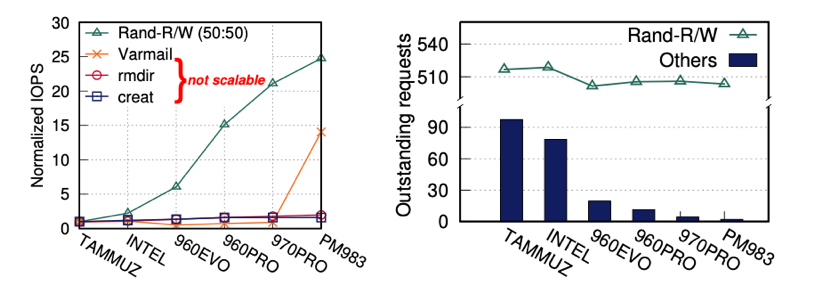
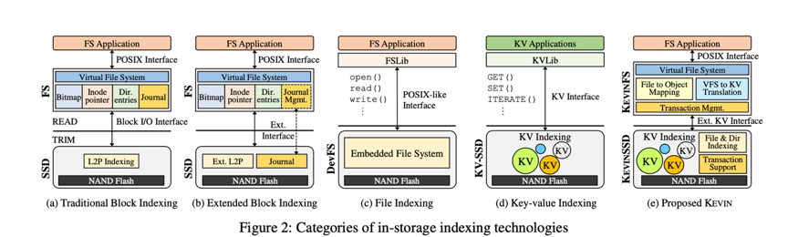
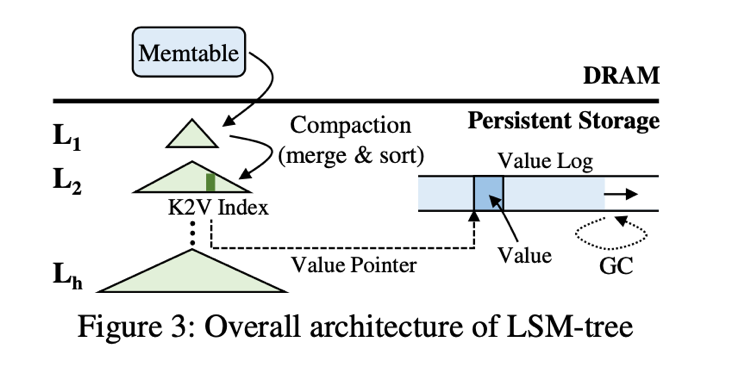
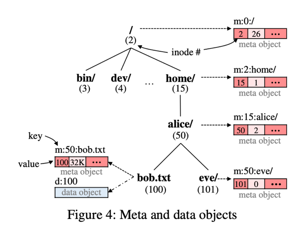
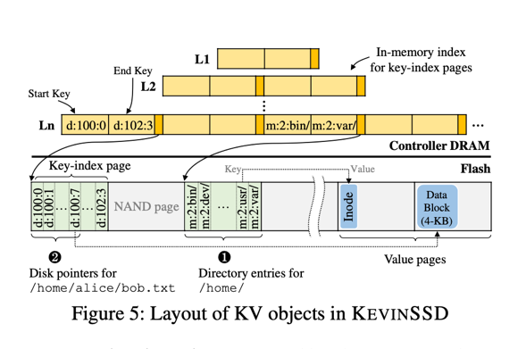
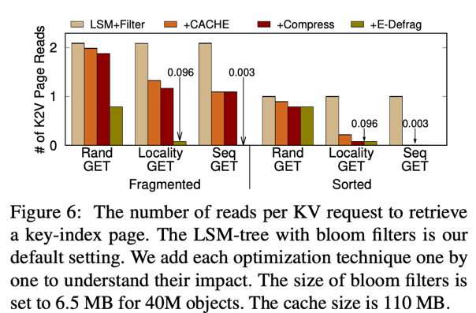
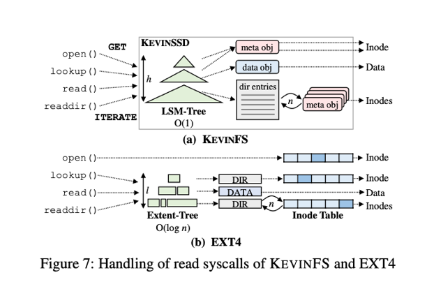
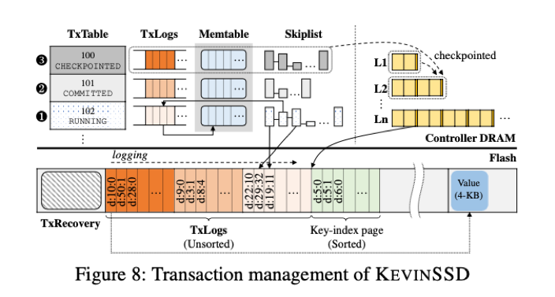

# 论文阅读笔记：

 **Modernizing File System through In-Storage Indexing**

 [原文链接](https://www.usenix.org/conference/osdi21/presentation/koo )

 ### 1.	问题发现

 传统文件系统的问题：
 - 基于具有简单块数组接口的存储设备之上的复杂的文件系统的体系结构不适合当今的技术趋势。
文件系统必须对磁盘中元数据执行额外的操作带来许多额外的 I/O 和主机接口上的数据传输从而导致严重延迟。
 - 摩尔定律的终结导致cpu的性能提升变得非常苦难，因此文件系统系能的发展遇到了瓶颈。随着SSD快速存储设备将系统瓶颈从设备到主机端软件 I/O 堆栈。

测量 EXT4 文件系统在底层 SSD 性能提高时不同文件操作性能的变化，其中TAMMUZ 是ssd中性能最差的，PM983 是最好的。三个基准测试：
- creat 和 rmdir 作为元数据密集型工作负载。  
- Varmail作为 fsync （同步内存中所有已修改的文件数据到储存设备）密集型工作负载。 
- Rand-R/W：对直接挂载到没有文件系统的主机上的SSD发出随机读写。

测试结果如图中看出在没有任何元数据操作的 Rand-R/W 下，随着 SSD 速度的提高，I/O 性能大幅提升高达 24.8 倍。但是，在 creat 和 rmdir 下对元数据密集型操作下文件系统的性能仅仅提高了 1.6 倍和 2.0 倍。测试结果如下所示：

 

总结：对于 Rand-R/W，主机系统可以通过发送足够数量的 I/O 来充分利用底层 SSD 的性能。但是，在元数据和 fsync 密集型工作负载下，文件系统无法提交足够多的 I/O 来完全驱动 SSD，特别是当底层 SSD 速度很快时，吞吐量会低得多。

 ### 2. 背景及相关工作

 

 - 图 2（a）：传统的文件系统，块存储设备提供了块 I/O 接口将底层存储介质抽象为固定大小的逻辑块的线性数组，提供块 I/O 操作。存在问题：文件系统维护各种磁盘数据结构的额外 I/O 流量管理成本很高，需要日志来支持一致性，容易出现碎片。

 - 图 2（b）：扩展块 I/O 接口。使用事务性 SSD 的自定义接口，将日志机制卸载到存储，一些人提出了一种顺序保留接口和相应的 L2P 索引设计，以缩短日志的 I/O 调度延迟、提出了在存储硬件级别解决磁盘指针的碎片问题。这些措施缓解了特定问题，但无法从根本上消除与文件系统元数据相关的 I/O 开销。而且，由于各个策略都有特定的设计，难以统一所有策略。

 - 图 2（c）：文件索引和界面。 DevFS将本地文件系统完全嵌入在存储硬件中，将 POSIX 接口提供给用户级应用程序。所有元数据操作都在存储设备内部执行，可以完全消除 I/O 堆栈和通信开销。缺点：硬件资源昂贵、文件系统功能有限、限制了高级文件系统功能的实现、提供新功能的固件升级会增加维护成本。

 - 图 2（d）：键值索引和接口。Kinetic HDD 和 KV-SSD 在存储硬件中实现了部分键值存储引擎。提供可变大小的KV对象，并提供 KV 操作。KV-SSD 通过在存储端进行 KV 索引来加速 KV 客户端。缺点：现有的 KV 接口和算法不足以用来索引文件和目录、只有单个 KV 对象具有原子性和持久性使得删除文件系统日志很困难。仅仅在KV-SSD 上简单地实现文件系统可能无法保证性能改进。

 - 图 2（e）：KEVIN 是现有 KV-SSD 的自然延伸。基于 LSM 树的存储引擎有效地索引文件和目录，支持删除文件系统日志的事务。是一种新的 POSIX 兼容文件系统，它可以转换 VFS 调用并将文件和目录映射到 KV对象。KEVIN 将文件系统拆分为操作系统和设备，提出了扩展的 KV 接口来有效地连接这两个组件。

 ### 3. LSM-Tree 基础

 LSM 有𝐿1、𝐿2、...、𝐿h−1 和 𝐿h（ h 是树的高度）多个级别。每个𝐿𝑖+1 比𝐿𝑖 大𝑇倍。每个级别都包含按键排序的唯一KV 对象。如下图所示：

 

KV对写入流程：
 - KV 对象首先写入memtable。当 memtable 写满时，LSM 树顺序地将缓冲的 KV 对象写入 𝐿1 中的空闲空间。
 - 一旦 𝐿1 变满，𝐿1 的 KV 对被冲出到 𝐿2，同理当 𝐿𝑖 满了时，𝐿𝑖 被冲出到 𝐿𝑖+1。同时当KV对从 𝐿𝑖 刷新到 𝐿𝑖+1时，LSM-tree执行compaction：对𝐿𝑖和𝐿𝑖+1的KV对象的合并和排序。

compaction优化：
 - 对键和值分开管理降低压缩成本。将 value附加到value日志，在树中储存日志中定位相应值的键和值的指针。一对 <key, value pointer> 称为 K2V 索引。在compaction过程中不需要读取object的值，当一个value大小很大时候，compaction成本可以大大降低。

KV对检索流程以及优化：
 - 从上往下检索，如果从 𝐿𝑖 获取的候选 KV 对象与想要的不匹配，我们应该在 𝐿𝑖+1中查找另一个候选对象。找到所需的 KV 对象LSM 树就只用向客户端返回<key，value>对。如果键和值分开，则需要根据key读取存储在值日志中的值。
 - 由于LSM 树可能会查找多个级别，不同级别的键范围可以重叠，会造成额外的读取。使用bloom过滤器减少级别额外读取，可以减少到一个左右。
 

 ### 4. KEVIN 整体架构

 #### 4.1 文件和目录的映射

KEVINFS有三种类型的 KV 对象：
 - 超级块保存文件系统信息。
 - 元数据储文件或目录的属性（inode 编号、大小和时间戳）。
 - 数据对象保存文件数据。

KV键命名规则：
- 规则 1：元数据对象键： (i) 前缀“m:”、(ii) 父目录的 inode 编号、(iii) 分隔符“:”  (iv) 文件或目录的组合名称。
- 规则2：数据对象键： (i) 前缀“d:”  (ii) 文件的 inode 编号的组合。经过扩展以提供 KV 对象的语义，以便存储硬件可以更有效地索引它们。

KV 对象文件形式举例如下图所示：

 

 目录的查询方式 ：使用迭代检索属于特定目录的文件和目录列表。比如要列出 /home/alice/ 中键以 m:50: 开头的文件和目录，使用迭代器 ITERATE(m:50:,2) 并将其发送到存储，然后返回带有前缀 m:50:（例如，图 4 中的 bob.txt 和 eve/）。在迭代命令中指定最大对象计数 cnt（防止读取过多）。cnt为2，表示/home/alice/中的子目录和文件数总数。遍历整个文件系统树很容易实现。根‘/’的inode编号固定为2。

 #### 4.2 KV对象的索引

KV 对象提供给文件系统的由存储索引引擎 KEVINSSD 管理，使用 LSM 树索引。将 KV 对象映射到闪存，分配和释放闪存空间。
图 5 为KEVINSSD 的架构。每个级别，维护内存表。表中每个条目有<开始键、结束键和指针>，指针指向保存KV对象的flash页面。为了快速搜索操作，所有条目都按开始键排序。

- 元数据对象索引。元数据对象key对应于典型文件系统中的文件或目录名称，而元对象值相当于一个 inode。每个索引都是一对<key，value指针>。类似于目录文件中的目录条目<文件或目录名称，inode编号>。根据命名规则1，属于同一父目录的 K2V 索引按父目录的 inode 编号排序，会被打包到相同的键索引页面中。
优点：目录条目得到有效更新。现有文件系统读取和写入 4 KB 块以修改目录条目列表。在 KEVINSSD 中，只需写入 (SET) 或删除 (DELETE) 元对象，我们就可以更新目录中的目录条目。从而消除了数据移动成本。
- 数据对象索引。KEVINSSD 将数据对象拆分为具有唯一后缀的 4 KB 子对象，并将它们作为独立的 KV 对进行管理。对于大小为32KB的/home/alice/bob.txt，其数据对象被分成8个4KB的子对象，后缀不同，'d 100:0'、'd 100:1'、...、 'd 100:7'在存储中。如果检索或更新了大对象的一小部分，则只需要从闪存中读取或写入相应的子对象。
优点：在 KEVINSSD 中，得到读取数据的 K2V 索引是在存储中完成的。数据对象的 K2V 索引的更新是通过 SET 和 DELETE 写入或删除数据对象来完成的。KEVINSSD 不涉及任何外部 I/O 来索引文件数据。

 #### 4.3 KV对象的索引优化

- 降低压缩成本。压缩能涉及许多读取和写入，通过分离键和值来最小化压缩 I/O 的方式管理元数据和数据对象。基于 inode 的命名策略为数据对象分配短键，将许多子对象键打包到闪存页面中。通过压缩数据对象的 K2V 索引更进一步。子对象键具有规则模式（例如，“d 100:0”、“d 100:1”、...），因此即使使用需要可忽略的 CPU 周期的原始增量压缩，它们也具有高度可压缩性。

- 降低层级查找成本。 LSM 树不可避免地涉及对不同层的多次查找。使用小型bloom过滤器将层级查找的额外读取次数减少到大约 1。为了进一步降低查找成本，在 DRAM 中缓存常用的 K2V 索引。

- 降低碎片树成本。 LSM-tree 允许每个级别与其他级别具有重叠的键范围。因此，属于同一父目录或文件的 K2V 索引可以跨多个级别进行碎片化。要检索目录条目或磁盘指针的完整列表，必须读取不同级别的多个闪存页面。通过合并和排序相邻级别的 K2V 索引的压缩来隐式解决的。

各种方案测试结果如下图所示：

总结：即使进行了此类优化，KEVINSSD 的读取性能也比没有任何额外 I/O 索引的块存储设备稍慢。然而，由于元数据 I/O 的减少，我们的整个系统表现出比现有系统高得多的性能。此外，虽然现有文件系统上的元数据 I/O 随着老化和碎片化而增加，但 KEVINSSD 的索引成本通过定期压缩存储中的 LSM 树和其他优化来持续保持。

 ### 5. 实现 VFS 操作

- 写系统调用实现。由两个 KV 命令处理，SET 和 DELETE。因为 KEVINFS 不需要修改磁盘元数据的事实，KEVINFS 比 EXT4 需要更少的 I/O 操作。以取消链接为例，KEVINFS 发出两个 DELETE 命令以从存储中删除元对象和数据对象。另一方面，EXT4必须更新数据和inode 位图以返回数据块和inode。EXT4需要更新目录条目以从目录中排除已删除的文件。
- 读系统调用实现。通过两个 KV 命令来实现，GET 和 ITERATE。KEVINFS 向指定的元数据或数据对象发送 GET 或 ITERATE，如图 7（a）所示。open 检索文件的 inode，实现为对元数据对象的 GET。查找与打开相同，在给定完整路径名（例如 /home/alice/）的情况下，它检索目录组件的 inode（例如，'/'、'home/' 和 'alice/'） 通过将 GET 发送到元对象。从文件中读取数据也被转换为 GET 到数据对象。最后，readdir 对应于 ITERATE，它检索属于同一父目录的元对象。

LSM 树被用作统一的索引数据结构来为 KEVIN 中所有与读相关的系统调用提供服务，EXT4 依赖于几个磁盘数据结构：一个 inode 表、一个索引磁盘指针的范围树和一个保存目录条目及其 inode 编号的目录文件（参见图 7(b)）。

KEVIN 和 EXT4进行比较分析：
- KEVINFS 受益于其存储索引，所有与 LSM 树相关的 I/O 都在存储中执行，没有任何外部数据传输。
- 对于查找和小文件读取，KEVINFS 需要查找 LSM 树获取元或数据对象。EXT4 需要搜索盘区树以查找定位目录或常规文件的磁盘块的磁盘指针。都涉及额外的磁盘读取。，EXT4 在 inode 中嵌入了一些磁盘指针跳过小文件的树搜索步骤，而KEVINFS 无法避免树搜索。但是，KEVINFS在查找时不需要读取目录文件，并且在读取其元对象时预加载小文件的数据。因此这两个系统表现出相似的性能。
- 大文件读取，在 KEVINFS 中，查找 LSM 树的最坏情况 I/O 成本是 𝑂(h)（ h 是树的高度）。使用bloom过滤器优化后，平均 I/O 成本基本上小于两次。在 EXT4 中，extent 树的最坏情况 I/O 成本是 𝑂(𝑙)， 𝑙 是树的高度（默认情况下 𝑙 = 5）。所以平均 I/O 成本都是 𝑂(𝑙𝑜𝑔 𝑛)，其中 𝑛 是实际决定树高度的文件的区数。如果文件没有碎片化，𝑛 接近于 1，因此树搜索需要少于两次读取。但是，如果碎片严重，则 I/O 成本可能会超过两次读取。
- 文件碎片化比较，在 EXT4 中，许多文件数据将分散在不连续的逻辑块中，EXT4必须向磁盘发出许多读取请求，严重影响了 I/O 吞吐量。在 KEVINFS 中，不会发生逻辑碎片，因为每个文件都表示为一个对象，而不是一组逻辑块。因此，KEVINFS 始终可以执行大粒度的顺序读取。因此，当文件连续分配时，EXT4 通常提供良好的性能，但 KEVINFS 更能抵抗碎片化。
- 读目录，readdir 需要检索目录条目的完整列表以读取关联的 inode。EXT4 根据 inode 表碎片的程度提供不同的性能。如果将 inode 分配在一起并因此存储在相同的块中，则只需要很少的块 I/O 来检索它们。但是，如果它们高度碎片化，EXT4 会有高 I/O 开销。在 KEVINFS 中，目录条目指向的 inode分散在多个页面中，但这会降低 readdir 的性能。解决方法：KEVINFS 使用了一个简单的调整，将元对象重写到磁盘。当 ITERATE 检索的元对象从页面缓存中被逐出时，即使其中一些非dirty的，KEVINFS 也会将它们重写到磁盘。一起驱逐的所有元对象会被写入相同的闪存页面，以便下次 KEVINFS 可以快速检索它们而无需多次读取页面。

 ### 5. 崩溃一致性

#### 5.1 KEVINFS一致性

KEVIN通过支持细粒度事务的 KEVINSSD 实现用户启动的 fsync 和刷新守护进程使数据持久化，并且没有与日志机制相关的开销。只构建与依赖 KV 对象关联的事务，并简单地将信息传输到底层存储。然后使用 SSD 内部技术将给定的事务具体化到物理介质。 为此，扩展了 KV 接口以支持三种事务命令：BeginTX、EndTX 和 AbortTX。可以通过将 KV 命令包装在同一事务中来指示存储原子地删除元和数据对象：
KEVINSSD 保证事务的原子性和持久性。为确保文件系统一致性，KEVINFS 保留相关事务之间的顺序。并且还提供了以下所需的属性：
1. 事务解耦。文件系统的性能受到事务纠缠的现象的影响，当仅对一部分缓冲数据请求 fsync 时，会刷新整个全局事务。这增加了 fsync 延迟、降低了写缓冲的性能。KEVINFS 不维护任何由不同文件共享的磁盘元数据，除非它们在文件系统树中相邻（例如，父目录和文件）。KEVINFS维护一个包含所有待处理 KV 命令的单个运行事务，通过定期刷新守护程序（默认周期为 5 秒）发送它们。但是，在 fsync 时，KEVINFS 会分叉一个仅包含与 fsync 文件关联的 KV 对象的小事务，从而实现较短的延迟。

2. 系统调用原子性保证。传统的日志文件系统不能确保系统调用的原子性。由于事务大小受剩余日志大小的限制，在某些情况下，即使是单个系统调用也可以拆分为多个事务。KEVINFS 没有这样的限制，因此通过确保所有关联的 KV 对象驻留在同一事务中来强制每个系统调用的原子性。

#### 5.2 KEVINSSD 事务处理

交易管理。图 8 显示了 KEVINSSD 中的事务管理。我们采用三种数据结构：事务表（TxTable）、事务日志（TxLogs）和恢复日志（TxRecovery）。 TxTable 保存交易信息，而 TxLogs 保存交易对象的 K2V 索引。TxLog 存储在 DRAM 或闪存中。TxTable、TxLog用于跟踪树中提交给 𝐿1 的 K2V 索引。TxRecovery 用于在恢复期间恢复或中止事务。

- 事务过程：每个条目保存TID、状态、与交易相关的 K2V 索引的位置。由于表中存在多个条目，因此可以同时激活许多事务。事务最初的状态为 RUNNING，表示它可以在发生崩溃时中止。当属于事务的后续命令到达时，KEVINSSD 将 KV 索引保存到TxLogs 中，并在 memtable 中缓冲相关值。一旦 TxLogs 或 memtable 变满，KV 索引、值就会记录到in-flash TxLogs中。当收到 EndTx(TID) 时，提交关联的事务，其状态更改为 COMMITTED。KEVINSSD 然后通知 KEVINFS 事务已提交。

- 事务恢复。 TxTable、缓冲的 K2V 索引和值必须定期或在某个事件发生时写入到闪存中。KEVINSSD 在检测到突然崩溃时将它们具体化。当电容器供电时，它会将缓冲的 K2V 索引刷新到闪存中的 TxLog 并将缓冲值刷新到闪存。 TxTable 更新为指向闪存 TxLogs，然后附加到 TxRecovery。两个特定的闪存块（例如，块 #2 和 #3）为 TxRecovery 保留并被视为循环日志。当系统重新启动时，KEVINSSD 会扫描 TxRecovery，找到最新的 TxTable，并检查每个事务的状态。提交的事务的关联的 K2V 索引被推入跳过列表以供搜索。中止RUNNING 事务，并回收相关资源。

KEVINSSD 在有序模式下支持与 EXT4 相同级别的崩溃一致性，避免双重写入I/O开销更小。通过在控制器中利用电容支持的 DRAM，进一步减少了清除 KV 对象的开销，并降低了标记日志提交的延迟。

 ### 小结

文件系统和 SSD 之间的键值接口的优点：
- 简单且易于理解。
- 广泛用于数据库。
- 可以作为一种通用的编程语言结构（例如 Python 中的字典）。
- 随着 KV-SSD 原型的开发和键值存储 API 的批准，业界对此产生了极大的兴趣。支持原子性使得支持事务变得更加容易。

KEVIN 组成： KEVINFS（key-value接口文件系统）和 KEVINSSD（key-value索引固态驱动器）组成，前者将用户的文件及其 inode 的等效元数据转换为key-value对象，后者实现了一种新颖的 SSD 物理地址空间中键值对象的存储索引。

KEVIN 相对于传统文件系统的优势：
- 首先，由于块设备上的文件系统必须在访问用户文件之前访问其许多磁盘上的数据结构，从而导致高 I/O 放大，KEVIN 显着减少了主机和设备之间的 I/O 传输量。
- 其次，KEVIN 无需使用日志即可简化崩溃一致性。KEVINSSD 支持跨键值 SET 和 DELETE 的事务，可以轻松维护一致性和持久性。
- 最后，KEVIN 能够抵制由文件碎片引起的性能下降。因为传统文件系统数据分散在碎片化的块地址空间中，随着文件系统的老化，其性能显着下降。在 KEVIN 中，所有持久数据都通过日志结构合并 (LSM) 树的变体进行排序和索引使其在一定的范围内，可以防止文件碎片的产生。

基于FPGA 的开发平台上在 Linux 内核 v4.15 和 KEVINSSD 中实现 KEVINFS。使用微基准测试和实际应用程序测量系统，将其与 EXT4 、XFS 、BTRFS  和 F2FS 进行比较。测试结果：
- 对于元数据密集型工作负载，KEVIN 平均将系统吞吐量提高了 6.2 倍，并将 I/O 流量减少了 74%。
- 随着文件系统老化以及文件出现碎片化的情况时，性能更加突出，在八个实际工作负载（五个基准测试和三个应用程序）中，KEVIN 的吞吐量平均提高了 68%。 

总之论文做出贡献如下：
1. 提出了一种新颖的存储索引技术，通过使用存储有效的索引数据来消除文件系统的元数据管理开销。
2. 设计了一个 SSD 控制器原型，通过 KV 接口提供KV 对象并优化 LSM-tree 存储索引引擎，以降低文件系统请求的开销。
3. 在Linux 中开发了一个成熟的内核文件系统，该系统通过KV 接口运行，支持高效的崩溃恢复。
4. 使用微观和现实基准来测试 KEVIN 的有效性。实验结果表明，KEVIN 显着提高了 I/O 性能，尤其是在元数据密集的场景下。

