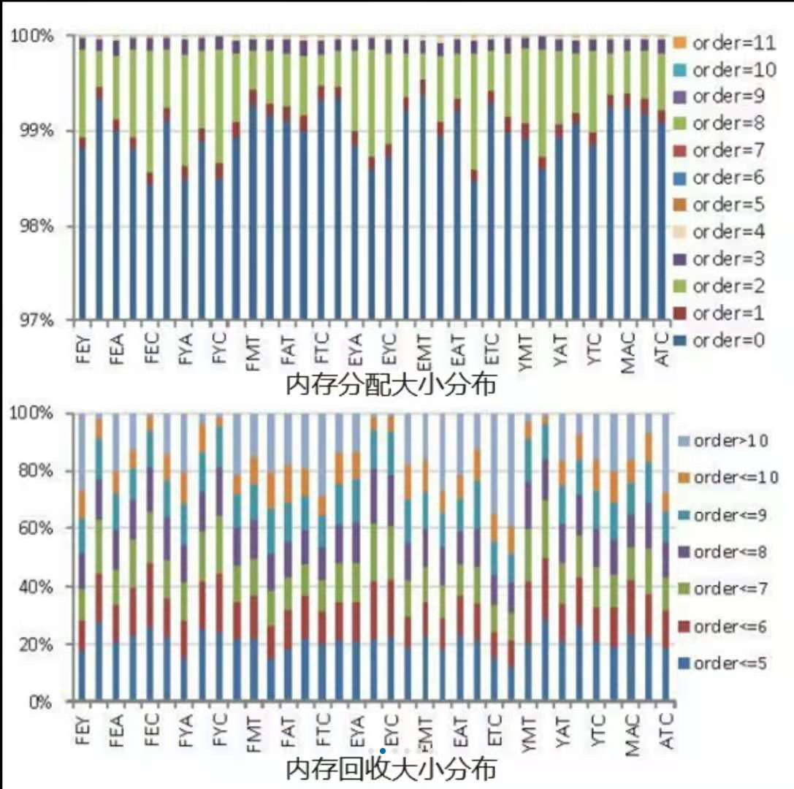
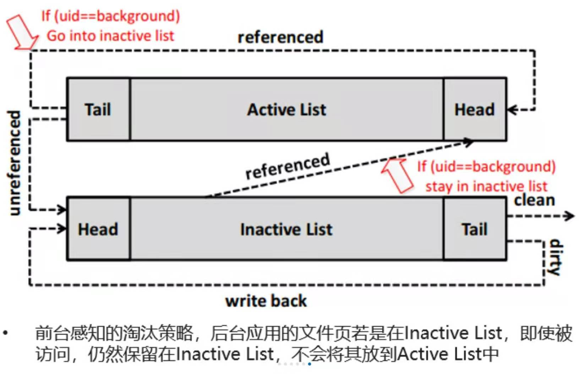

# [Acclaim: Adaptive Memory Reclaim to Improve User Experience in Android Systems]()

## 背景和问题：
在安卓负载下，linux的内存回收策略不再高效。实验观察到性能下降的两个主要原因是：1.被交换到UFS的数据被再次读取，而由于闪存访问速度远慢与内存，读延迟明显增加（page-refault），2.当内存压力大时，kswapd进程会主动淘汰一些冷的数据页到UFS（Direct reclaim）。Direct reclaim开销大的原始在于页分配必须等待Direct reclaim完成。

**问题在于**，

**研究动机：**
8个后台的情况下，Page cache中的页面在被回收释放后，有31%的页面会被再次访问，触发pagefault异常；其中前台应用产生的page fault占比高达37%；

图  page refault占比

Direct reclaim占所有内存回收的0.8%，每当发生Direct reclaim时，多达1024个脏页需要被写回闪存，严重增加page fault处理时延。

图  Direct reclaim占比

**重要观察：**
1. 后台应用会持续消耗空闲内存，并且产生不可移动的匿名页（位于active anon page list），导致前台应用的文件页被逐出，而这些文件页在之后又会被访问

图  后台应用持续运行并占用内存

2. 99%的分配大小是1个page；而80%的回收大小大于32个pages

图  回收粒度远大于分配粒度

**挑战：**
Direct reclaim与refault是一个矛盾体；若回收的粒度过大，会使得refault的概率增大；若回收的粒度过小，free page将会很快耗尽，从而触发direct reclaim

## 设计：

图  LWP

图  PAE

**设计思想：**

1. 前台感知的淘汰策略，后台应用的文件页若是在Inactive List，即使被访问，仍然保留在Inactive List，不会将其放到Active List中

2. 轻量级预测器，动态减小逐出粒度

## 实验平台：

Huawei P9 smartphone with an ARM’s Cortex-A72 CPU, 32GB internal memory and 3GB RAM, running Android 7.0 on Linux kernel version 4.1.18
